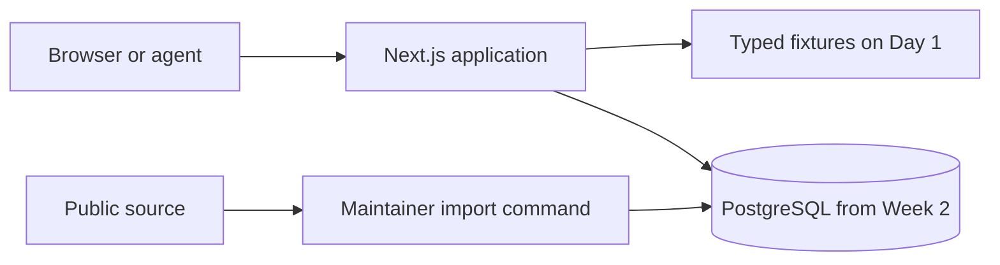
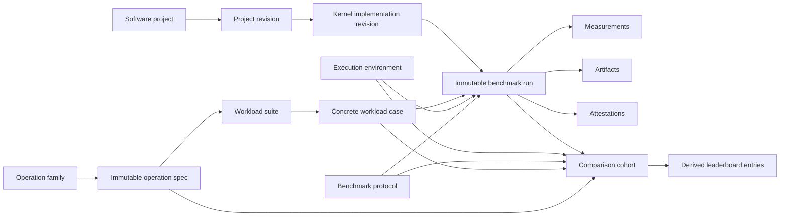
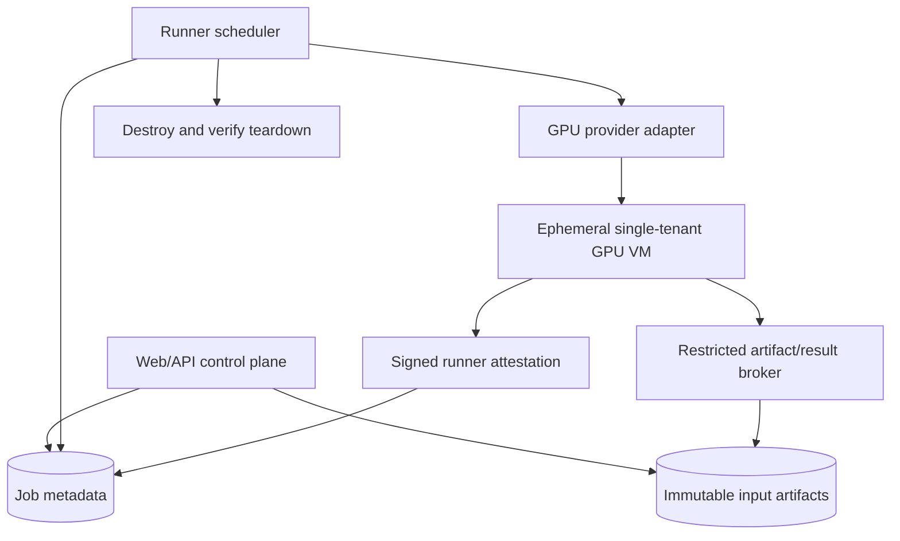
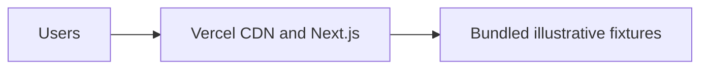
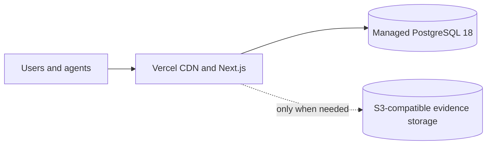

# KernelIndex Engineering Design Specification

**Status:** Implementation-ready design  
**Design version:** 3.1  
**Research date:** 2026-08-13; dependency pins re-verified against live registries 2026-08-14  
**Revision focus:** engineer-first dark interface, faster launch, compact architecture, lower LOC, and implementation audit  
**Target repository:** `SamMausberg/KernelIndex`  
**Product:** `kernelindex.com`  
**Primary promise:** **Find the fastest verified GPU kernel for your exact workload.**

> KernelIndex is the public performance index for GPU software. It resolves an exact workload to the fastest currently known compatible implementation, with source, license, environment, benchmark protocol, raw evidence, and an explicit trust level. It also indexes end-to-end serving configurations without pretending that kernel and serving measurements are interchangeable.

This document is the source of truth for product semantics, repository structure, data architecture, implementation sequencing, and operational constraints. It plans the complete platform, but it does not require the complete platform before the website is useful or public.

**Reading path:** use Sections 0, 6, 7, 16, 22, and 27 to scaffold and ship; Sections 8 through 15 define the catalog and resolver; Sections 17 through 21 define trust, security, and operations. GitHub's document outline is the canonical table of contents.

## 0. Operating strategy: publish value before infrastructure

### 0.1 Launch targets

KernelIndex should be public on the first focused build day and useful to a CUDA engineer by the end of Week 2. The schedule is front-loaded toward visible product value.

| Milestone | Target | User-visible outcome | New infrastructure |
|---|---:|---|---|
| Live design canvas | Day 1 | Production URL plus homepage, search, operation, implementation, and run pages rendered from explicit fixtures | Next.js and Vercel only |
| Coherent product shell | Days 2 to 5 | Finished dark visual system, responsive core journey, all evidence states, concise methodology | None |
| Evidence-backed alpha | End of Week 2 | First real SOL records, PostgreSQL-backed pages, exact source/protocol/environment evidence | Managed PostgreSQL |
| Useful public resolver | End of Week 4 | Exact and compatible search, honest ranking, compare, and 25 to 50 curated records | Existing stack |
| API and contribution beta | End of Week 6 | OpenAPI, export, CLI preview, GitHub sign-in, claims, submissions, and corrections | Auth only |
| Agent and source expansion | Weeks 7 to 9 | Second importer, API keys, MCP, and first serving vertical slice | Worker or object storage only if proven necessary |
| Production beta | Weeks 10 to 12 | Security, accessibility, operations, corpus quality, and a measured launch feedback loop | Existing stack |
| Controlled verification | Demand-gated | Isolated GPU reruns, private benchmarking, monitoring, and certification | Separate runner security domain |

Calendar dates do not override quality gates. Evidence semantics, provenance, and comparison integrity cannot be weakened to hit a week number.

### 0.2 Build one complete path first

The first product is one complete journey:

```text
query
-> ranked exact and compatible results
-> operation semantics
-> implementation usability
-> immutable benchmark evidence
-> source, install, and machine-readable output
```

The Day 1 application needs only:

```text
/
/search
/operations/[slug]
/implementations/[slug]
/runs/[id]
/docs
```

Add `/records`, `/compare`, `/submit`, `/contributors`, and `/serving` when their first real use case is implemented. A disabled or empty navigation item makes the product feel less finished, not more ambitious.

### 0.3 Founder workflow

The repository should make visual work the fastest thing to do after the scaffold is deployed.

1. Scaffold and deploy the smallest production application.
2. Add realistic typed fixtures for exact, compatible, unverified, tied, disputed, stale, missing-license, and no-result states.
3. Design the real pages against those fixtures in the deployed preview.
4. Freeze information hierarchy and public view contracts, not colors or component internals.
5. Add PostgreSQL behind the existing server-side read functions.
6. Replace illustrative records with real imported evidence without rewriting the pages.

The founder owns the visual language, information density, typography, page composition, and final interaction quality. Backend structure must serve those pages rather than forcing database-shaped UI.

### 0.4 Minimum-code rules

Use these rules unless a measured problem justifies an exception:

- start with one application package;
- add a workspace package only when there is a second consumer or a deployment/trust boundary;
- add a process only when work must outlive a request or execute under a different trust model;
- use React Server Components for public reads and client components only for interaction;
- use URL search parameters as public state;
- use native forms, tables, links, buttons, and disclosure elements before adding abstractions;
- call server-side use cases directly rather than making internal HTTP requests;
- use one Zod schema per external boundary and infer TypeScript types from it;
- store source-specific payloads as immutable JSONB or artifacts instead of creating one table per upstream field;
- generate OpenAPI and clients rather than maintaining parallel request types;
- run imports manually or from GitHub Actions before operating a persistent worker;
- add object storage only when real evidence is too large for Git, upstream links, or PostgreSQL;
- extract repeated code only after two real uses reveal the stable abstraction;
- delete wrappers that merely rename Next.js, Drizzle, `fetch`, or PostgreSQL APIs.

### 0.5 What speed must not remove

Low LOC is not permission to weaken the product. These remain first-class from the first real record:

- exact operation and workload identity;
- source revision and license state;
- benchmark protocol and execution environment;
- correctness thresholds and result status;
- immutable evidence and provenance;
- explicit comparison eligibility;
- trust and deployability as separate dimensions;
- an explanation for every rank, exclusion, and near match.

## 1. Executive decisions

1. **Launch one Next.js application on Day 1.** Do not create shared packages, a database, auth, a worker, object storage, or an API service before the visible product needs them.
2. **Use pnpm workspaces without Turborepo initially.** `pnpm --filter` and recursive scripts are sufficient. Add a task runner only after CI or local build measurements justify it.
3. **Do not use Bazel for the web/data plane.** Reconsider it only inside the future GPU runner if hermetic multi-toolchain builds become a measured problem.
4. **Make dark mode the launch product, not a theme toggle.** Use semantic tokens so a light palette can be added later without changing components.
5. **Design the site as a technical reference, not a dashboard or marketing page.** Use near-black surfaces, precise typography, visible provenance, long scrollable pages, compact tables, and restrained interaction.
6. **Keep catalog code inside `apps/web` through at least Week 6.** Extract `packages/catalog` only when a worker or second server deployable becomes a real consumer.
7. **Keep the API inside the Next.js deployment.** Hono may be mounted as a library when the public API ships; it is not a separate service or package by default.
8. **Model a rich domain with a compact physical schema.** Preserve semantic identity and evidence rigor in typed manifests while using JSONB for non-query-critical detail and a small set of indexed relational columns.
9. **Make benchmark runs append-only and content-addressed.** Corrections supersede prior records and never rewrite history.
10. **Rank only inside explicit comparison cohorts.** Hardware name or operation label alone never establishes comparability.
11. **Keep performance, trust, compatibility, deployability, and license state independent.** The fastest reported result may differ from the fastest verified or usable result.
12. **Use PostgreSQL for catalog data, search, ranking views, simple quotas, and early job state.** Add a dedicated search engine, cache, or queue only after measured pressure.
13. **Run early imports as idempotent commands or scheduled GitHub Actions.** Add Graphile Worker only when asynchronous submissions, retries, or notification fan-out make a persistent worker worthwhile.
14. **Do not execute arbitrary submitted GPU code in the web/data plane.** Future execution belongs in an ephemeral, network-restricted runner account with signed inputs and outputs.
15. **Expose the same resolver semantics through web, REST, export, CLI, and MCP.** Agents must never scrape HTML or receive a weaker explanation than human users.
16. **Treat serving as a separate resolver surface.** It reuses provenance, environment, measurement semantics, source policy, and presentation primitives but never shares a run table, comparison key, or universal score with individual kernels.
17. **Prefer deletion over speculative abstraction.** A package requires two consumers or a hard boundary; a reusable component requires two real uses; a service requires independent lifecycle, trust, or scaling needs.

## 2. Product definition

### 2.1 Core user jobs

A kernel engineer should be able to answer:

- What is the fastest publicly evidenced implementation for this exact operation, shape, dtype, layout, GPU, and integration target?
- Which result was reproduced by KernelIndex rather than merely reported?
- Which implementation can I legally and practically deploy?
- How was it timed, what tolerance passed, and what exact software and hardware produced the number?
- Does the implementation support my framework, CUDA version, architecture, and tensor layout?
- What changed since the prior record, and when was the record last tested?
- What is the source code, package, symbol, build command, and minimal integration example?

A serving engineer should be able to answer:

- Which serving stack and configuration maximizes output throughput under my TTFT, TPOT, error-rate, memory, topology, and cost constraints?
- Are two published serving numbers based on the same model revision, tokenizer, quantization, request distribution, and load generator?
- Which configuration is reproducible, deployable, and still current?

An AI agent should be able to provide a structured workload and receive:

- an exact winner if exact comparable evidence exists;
- a deployable winner under a policy;
- compatible alternatives;
- near matches with every mismatch enumerated;
- code and installation instructions;
- evidence and confidence metadata;
- a stable identifier and machine-readable reason for every decision.

### 2.2 Product invariants

These are non-negotiable:

1. **No false equivalence.** Names are aliases, not semantic identity.
2. **No false precision.** A single aggregate latency does not imply statistical confidence.
3. **No hidden methodology.** Every ranked measurement links to a protocol and environment.
4. **No unverifiable superlatives.** Use “fastest currently known in this cohort as of `<timestamp>`,” never “fastest possible.”
5. **No license laundering.** Linking, indexing, redistribution, and deployment rights are distinct.
6. **No mutable evidence.** A published benchmark run is append-only.
7. **No HTML-only facts.** Anything visible in the UI is available through a stable data interface.
8. **No opaque ranking.** Every result exposes eligibility, cohort, primary metric, tie policy, exclusions, and source.
9. **No universal serving winner.** Serving ranking always names a workload and objective or SLA.
10. **No trust badge by popularity.** Likes, downloads, and reputation do not confer verification.

### 2.3 Full product surface

The target platform includes:

- public search and faceted exploration;
- operation, workload, implementation, project, run, contributor, hardware, and serving-stack pages;
- exact workload resolution;
- comparison and performance-surface visualization;
- GitHub login and project ownership claims;
- manifest, repository, and artifact submissions;
- corrections, disputes, moderation, and transparent review history;
- contributor records and profiles;
- API keys, OpenAPI, SDK, CLI, MCP, and public exports;
- follows and record-beaten notifications;
- private workloads, regression monitoring, and organization spaces;
- controlled verification runners;
- certification, sponsored benchmark programs, and bounties;
- eventually, a marketplace layer for optimization work;
- coverage-gap discovery and bounties for workloads with demand but no adequate implementation;
- composed serving evidence that can eventually show which kernel revisions a serving configuration actually invoked, when instrumentation makes that claim defensible.

Features are sequenced, not removed. The sequence is chosen to keep early code and infrastructure small while preserving the final architecture.

## 3. Research synthesis and positioning

The reviewed ecosystem already contains strong components, but no reviewed project combines exact semantic identity, cross-source evidence, deployability, historical records, and an agent resolver.

| Project | Public strength | KernelIndex relationship | Important boundary |
|---|---|---|---|
| NVIDIA SOL-ExecBench | Real B200 execution, production-derived problems, a public leaderboard, formal Definition, Workload, Solution, and Trace schemas | Import definitions, concrete workloads, solution metadata, traces, source-native scores, and provenance | Preserve SOL protocol and leaderboard cohorts. Do not compare SOL timings to unrelated methods |
| Hugging Face Kernel Hub | First-class kernel repositories, versioned builds, loader compatibility, metadata, source and license information, trusted publishers | Treat as a package and distribution source; ingest repository SHA, metadata, build variants, installability, and upstream links | Trusted publisher status is not benchmark verification |
| GPU MODE kernelboard, reference-kernels, and triton-index | Community competitions, problem sets, submissions, and a catalog of public Triton kernels | Import catalog and challenge metadata where official machine-readable access and terms permit | Respect source-specific licenses. The reference-kernels license is not equivalent to a conventional permissive software license |
| FlashInfer-Bench and FlashInfer Trace | Real-world LLM kernel traces, a benchmark workflow, and a formal trace dataset | Import trace definitions, workload distributions, implementations, and compatible benchmark artifacts | Keep its protocol and data lineage visible |
| CUTLASS and CUTLASS Profiler | Large vendor-maintained implementation space and a profiler that emits detailed operation and performance information | Accept profiler result bundles tied to exact CUTLASS revision, command, GPU, and environment | A local profiler output is reported or reproducible evidence until independently rerun |
| KernelBench | Standardized tasks and evaluation tooling for AI-generated kernels | Index benchmark definitions and qualifying artifacts when environment and evidence are complete | KernelBench explicitly does not endorse individual generated kernels or results |
| NVIDIA AIPerf | Current NVIDIA serving benchmark tooling, request metrics, server telemetry, and structured exports across multiple serving stacks | Use as the canonical first serving import format | GenAI-Perf is being phased out; preserve old imports but prefer AIPerf for new records |
| vLLM, SGLang, TensorRT-LLM benchmark tools | Native stack-specific load generation and JSON result output | Add source adapters and map them to KernelIndex serving schemas | Source-native outputs are not automatically comparable across tools |
| MLPerf Inference | Standardized system-level benchmark suites and rules | Link and import qualifying public results where useful | It is a benchmark program, not a kernel package resolver |

### 3.1 The defensible wedge

KernelIndex should not compete by hosting more code than Hugging Face or by running a better single contest than NVIDIA or GPU MODE. Its defensible layer is the **identity and evidence graph**:

- exact semantic operation specifications;
- exact concrete workload identity;
- explicit protocol and environment comparability;
- immutable run history;
- source and artifact provenance;
- deployability and compatibility policy;
- cross-source reconciliation;
- a deterministic resolver used by humans, frameworks, and agents;
- verified records accumulated across hardware and software generations.

The public website is the user interface over this graph. The graph and resolver are the platform.

### 3.2 Product language

Use precise claims:

- “Fastest KernelIndex-verified implementation currently known for this exact workload.”
- “Fastest open-source deployable result in this comparison cohort.”
- “Reported by `<source>`; not independently rerun.”
- “No exact evidence exists. Showing nearest compatible results with mismatches.”
- “Statistical tie under this protocol’s resolution policy.”

Never use:

- “fastest kernel” without a workload and cohort;
- “verified” to mean merely imported;
- “open source” when the license is unknown or source is unavailable;
- “works on B200” based only on architecture-level compatibility;
- “best serving stack” without workload and SLA.

## 4. Scope and sequencing

Section 22 is the execution plan. This section defines release boundaries so speed does not pull later infrastructure into the critical path.

| Release | Target | Must be true at exit | Explicitly absent unless already justified |
|---|---:|---|---|
| A: live design canvas | Day 1 | one production URL, PR previews, six public routes, realistic labeled fixtures, coherent shell, no secrets | database, Docker, auth, worker, API, shared packages |
| B: coherent product shell | Week 1 | complete desktop/mobile search-to-evidence journey, difficult evidence states, design lab, source/install/compare actions | charts, component explorer, client data layer, account UI |
| C: evidence-backed alpha | Week 2 | PostgreSQL-backed reads, canonical digests, explicit SOL importer, one gold record, 10 to 20 reviewed real records | public illustrative performance claims, generic importer framework |
| D: useful resolver | Week 4 | exact/compatible matching, mismatch explanations, defensible ranks/ties/history, compare, 25 to 50 strong records | community write path, synthetic global leaderboard |
| E: API and contribution beta | Week 6 | nine-route API, OpenAPI/export, CLI preview, GitHub identity, claims/submissions/corrections, audit trail | separate API service, speculative organization platform |
| F: source, agent, and serving expansion | Weeks 7 to 9 | second importer, scheduled ingestion, MCP, first typed serving resolver | worker or object store without demonstrated jobs/artifact volume |
| G: production beta | Weeks 10 to 12 | security, accessibility, recovery, corpus/legal review, runbooks, measured launch loop | hostile public code execution, marketplace settlement |

### 4.1 Deferred behind explicit boundaries

These features remain planned but do not enter the web/data trust boundary prematurely:

- arbitrary code execution;
- controlled GPU verification;
- private workloads and results;
- regression monitoring and certification;
- paid organization controls;
- bounties and marketplace settlement;
- dedicated search infrastructure;
- multi-region active-active deployment.

Each requires a separate acceptance gate, threat model, and cost model.

## 5. Architecture

### 5.1 System shape

KernelIndex begins as a single deployable modular monolith:



The web application owns:

- public pages;
- page-oriented catalog reads;
- canonical schemas and policy;
- PostgreSQL access;
- early import commands;
- the public API when it ships;
- authentication and contribution flows when they ship.

This is deliberate. Splitting these responsibilities before a second deployable needs them adds interfaces without reducing risk.

### 5.2 Internal module boundaries

Use folders, imports, and tests rather than packages to enforce the first boundaries:

```text
apps/web/src/
  app/                 # routes and route handlers
  components/          # small visual primitives and domain presentation
  features/            # page-specific composition and client interaction
  server/
    catalog/            # page reads and resolver use cases
    db/                 # connection, schema, migrations, transactions
    identity/           # canonicalization and digests
    import/             # source-specific import commands
    policy/             # comparison, trust, deployability, authorization
  data/fixtures/        # clearly illustrative typed fixtures
  schemas/              # external Zod boundaries and generated JSON Schema
```

Rules:

- `app` may call `server/catalog` and presentation code;
- `server/catalog` may call `db`, `identity`, and `policy`;
- import code may call canonical validation and publication transactions;
- presentation code never imports database modules;
- fixtures implement the same read-result types as PostgreSQL reads;
- no module calls the local REST API from the server.

### 5.3 Extraction triggers

Extract a workspace package only when one of these is true:

| Extraction | Trigger |
|---|---|
| `packages/catalog` | a worker or second server deployable needs canonicalization, publication, ranking, or authorization logic |
| `packages/sdk` | CLI and MCP both consume the generated public API client |
| `packages/ui` | a second separately built frontend uses the same stable components |
| `apps/worker` | jobs need durable retries, concurrency control, or execution beyond request lifetime |
| `apps/mcp` | MCP is deployed independently rather than served through an existing process |
| `runner/` | hostile code must execute under a separate cloud account and trust boundary |

Moving files between folders inside one repository is cheaper than maintaining premature package boundaries.

### 5.4 Infrastructure by milestone

| Capability | Initial implementation | Add a new system only when |
|---|---|---|
| Hosting | Vercel web deployment | runtime, region, cost, or portability requirements fail |
| Catalog | fixtures, then managed PostgreSQL | PostgreSQL cannot satisfy a measured requirement |
| Search | PostgreSQL FTS, trigram, filters, and ranking views | relevance or latency misses a documented SLO at real scale |
| Cache | framework/CDN caching and PostgreSQL (in place since 2026-08-15, extended 2026-08-18: unstable_cache over the catalog seam; ISR on home/run/implementation/operation pages — operation workload/cohort selection is a client island over the CDN-cached /operations/[slug]/data route, so search params never make the page dynamic; CDN-cached /suggest and /records/data routes with the ledger slimmed to the LedgerModel projection; one in-process ledger memo shared by every reads.ts caller; hover-intent prefetch in quiet-link instead of viewport prefetch; functions pinned to pdx1 beside the database) | a dedicated cache system is needed beyond the framework layers |
| Imports | local command or GitHub Actions | retries, concurrency, or review workflows need durable jobs |
| Queue | PostgreSQL row state, then Graphile Worker | a persistent worker has real jobs |
| Artifacts | upstream immutable links, small DB metadata, reviewed Git files | durable binaries or large logs require S3-compatible storage |
| Auth | none, then Better Auth with GitHub | organization SSO or enterprise policy creates a real need |
| API | Hono mounted inside Next.js | independent scaling or trust boundaries require a separate service |
| Analytics | structured server logs and minimal first-party events | product questions cannot be answered from the minimal event set |

### 5.5 Scale and split triggers

Do not split on hypothetical traffic. Split only with measurements and an owner for the new boundary.

Examples:

- add a dedicated search service after PostgreSQL search repeatedly misses the p95 target on representative production queries;
- add Redis only after a concrete cache, rate-limit, or coordination requirement cannot be met safely with current systems;
- add a worker after at least one job requires retries or outlives a request;
- add object storage after actual evidence size, retention, or immutability requires it;
- split the API after web and API deployment lifecycles materially conflict;
- add Turborepo after recursive pnpm and CI builds become measurably slow or difficult to order.

### 5.6 Future verification boundary

The future runner is never an extension of the web worker. It is a separate security domain with:

- separate cloud account/project and credentials;
- ephemeral hosts;
- no inbound network path from untrusted code;
- default-deny egress;
- signed job manifests and result bundles;
- immutable images and harness revisions;
- strict CPU, memory, GPU, wall-time, disk, and artifact limits;
- a one-way publication path after validation.

## 6. Repository design

### 6.1 Day 1 repository

Create only what is used:

```text
KernelIndex/
  .github/workflows/ci.yml
  apps/
    web/
      src/
        app/
        components/
        data/fixtures/
        features/
        lib/
      package.json
      next.config.ts
      postcss.config.mjs
      tsconfig.json
  docs/
    adr/
    ENGINEERING_DESIGN.md
  .editorconfig
  .gitattributes
  .gitignore
  .node-version
  AGENTS.md
  LICENSE
  README.md
  biome.json
  package.json
  pnpm-lock.yaml
  pnpm-workspace.yaml
```

Do not create empty `api`, `worker`, `db`, `core`, `contracts`, `importers`, `cli`, `mcp`, `sdk`, or `ui` packages.

### 6.2 Week 2 additions

Add real catalog code inside the web application:

```text
apps/web/
  drizzle/
  scripts/
    import-sol.ts
    seed.ts
  src/
    schemas/
    server/
      catalog/
      db/
      identity/
      import/
      policy/
```

Keep migrations as SQL files. Keep source-specific snapshots outside production source code unless a reviewed snapshot is intentionally committed as test data.

### 6.3 Week 5 and later additions

```text
apps/
  cli/                  # Week 5, separately distributed
  mcp/                  # Week 8, only if independently deployed
  worker/               # demand-gated by durable work
packages/
  sdk/                  # only when CLI and MCP share generated client code
  catalog/              # only when web and worker share server logic
registry/
  schemas/
  examples/
  submissions/          # optional Git-reviewed contribution path
runner/                 # separate future trust domain
```

The directory tree is an outcome of implemented features, not a checklist to scaffold.

### 6.4 Dependency direction

When later packages exist, use this direction:

```text
web, worker, maintainer scripts -> catalog -> database driver
cli, mcp -> generated sdk -> public REST API
runner control plane -> signed runner protocol
runner guest -> no import path to the web/data plane
```

Forbidden dependencies:

- UI code importing database schema objects;
- CLI or MCP importing server runtime modules;
- web server code calling its own API over HTTP;
- importers writing tables outside the publication transaction;
- runner guest code importing secrets, provider clients, or catalog credentials.

### 6.5 Repository conventions

- TypeScript strict mode everywhere.
- ESM by default.
- Lowercase kebab-case filenames except framework-required names.
- Public IDs and digests are opaque; slugs are mutable aliases.
- Domain comments explain invariants, not syntax.
- No `utils.ts` dumping ground. Name modules after the concept they own.
- One root lockfile and one root formatter/linter configuration.
- Dependencies live in the application/package that imports them.
- Generated files are clearly marked and never edited by hand.
- SQL migrations are forward-only after production publication.
- Tests sit near pure logic; integration fixtures remain small and reviewed.

### 6.6 Bazel decision

Bazel is unnecessary for the website and data plane. pnpm workspaces, Next.js, SQL migrations, and ordinary CI already provide the required build graph with less configuration.

Reconsider Bazel only for the runner when all are true:

- multiple CUDA/C++/Python toolchains must be reproduced hermetically;
- remote cache or remote execution would materially reduce build cost;
- build provenance is part of certification;
- the runner has enough sustained complexity to justify dedicated ownership.

Until then, a containerized runner image plus explicit compiler/toolkit manifests is simpler.

## 7. Technology and dependency specification

### 7.1 Verified bootstrap baseline

Pin exact versions in the lockfile and project manifests. This table is a bootstrap snapshot verified against live registries on 2026-08-14, not permission to auto-upgrade without CI.

| Tool | Baseline | Reason |
|---|---:|---|
| Node.js | 24.19.0 LTS | production LTS runtime with native TypeScript type stripping for simple scripts |
| Corepack | 0.35.0 | current package-manager shim; avoids stale bundled-signature failures |
| pnpm | 11.21.0 | workspace and deterministic dependency management |
| Next.js | 16.2.12 | security-patched Active LTS line (2026-07-25 patch); selected over the 16.3.x feature line for launch stability |
| React / React DOM | 19.2.8 | version paired with the selected Next.js line |
| TypeScript | 6.0.3 | newest stable 6.x; compiler API compatible with Next.js 16.2 |
| Tailwind CSS | 4.3.3 | small local visual system without a component framework |
| Biome | 2.5.8 | one formatter and linter instead of ESLint plus Prettier |
| PostgreSQL | 18.6 | supported current major and patch line |
| Vitest | 4.1.10 | add when canonical and ranking logic begins |
| Hono | 4.13.2 | add only when the external REST API ships |

TypeScript 7 is intentionally excluded from the bootstrap (7.0.2 is the npm `latest` tag as of 2026-08-14). The 7.0 package does not expose the JavaScript compiler API used by Next.js 16.2 stable, so a superficially newer pin can break `next build`. Revisit it only after the selected stable Next.js line officially supports it and a clean-clone build passes.

**Reality note (2026-08-16).** Production moved off the bootstrap's 16.2 line to Next.js 16.3.1 in the Week 10 hardening pass (commit `cdfcd60`), with `pnpm check` and the full test suite green on the new line. The table above remains the historical bootstrap snapshot. A pnpm `minimumReleaseAge` floor now enforces §7.5's cooldown (2 days at first, raised to 7 once the deliberately fresh pins age past the floor; see `pnpm-workspace.yaml`).

### 7.2 Day 1 dependencies

The web application should initially depend on only:

```text
next
react
react-dom
clsx
```

Development dependencies:

```text
typescript
@types/node
@types/react
@types/react-dom
tailwindcss
@tailwindcss/postcss
```

Biome lives at the workspace root. Use one local `cn()` helper backed by `clsx`. Add `tailwind-merge` only after real class-override conflicts appear. Do not add a variant framework until variants are genuinely hard to reason about.

### 7.3 Adoption schedule

| Stage | Add | Why |
|---|---|---|
| First nontrivial pure logic | `vitest` | canonicalization, matching, ranking, and importer tests |
| PostgreSQL in Week 2 | `drizzle-orm`, `postgres`, `drizzle-kit`, `zod`, `yaml`, `canonicalize`, `spdx-expression-parse`, `spdx-license-list` | schema, transactions, manifests, digests, and license normalization |
| Search UI complexity | no new client library by default | URL parameters and server rendering remain the source of state |
| Browser journeys in Week 4 | `@playwright/test`; add `@axe-core/playwright` with the accessibility suite | search, detail, compare, no-result, keyboard, and accessibility acceptance tests |
| API in Week 5 | `hono`, `@hono/zod-openapi`, `@scalar/hono-api-reference`, `openapi-typescript`, `openapi-fetch` | compact routing, one schema boundary, generated reference and client |
| Auth in Week 6 | `better-auth` and only the selected GitHub/session/API-key plugins or adapter | identity without a separate auth service or custom session framework |
| CLI in Week 5 | Node `parseArgs` first | avoid a command framework until help/subcommands become unwieldy |
| Durable jobs | `graphile-worker` | only after retries or request-independent work exist |
| Large durable artifacts | `@aws-sdk/client-s3` | only after actual artifact volume requires object storage |
| Observability | OpenTelemetry packages selected for the deployed runtime | only after production services and questions exist |

When adopting a fast-moving package, pin the exact version selected by the clean-clone integration test and record only non-obvious compatibility constraints in an ADR.

Prefer platform primitives before dependencies:

- `URL`, `URLSearchParams`, `Request`, `Response`, `fetch`, `AbortController`, and Web Streams for HTTP and parsing;
- `crypto`, `structuredClone`, and standard encoders for identity and data handling;
- `Intl` for dates, durations, numbers, and units;
- `node:util` `parseArgs` for the first CLI;
- native forms, tables, `<details>`, `<dialog>`, and the Popover API for ordinary interaction;
- CSS grid, sticky positioning, container queries, and overflow before layout or table packages.

A dependency is justified when it removes more product code and risk than it adds. Novelty, convenience in one file, or a planned future feature is not sufficient.

### 7.4 Deliberately excluded at launch

Do not install these by default:

- Turborepo, Nx, or Bazel for the initial web workspace;
- Storybook;
- a component library or full design system package;
- TanStack Query, Redux, Zustand, or another global client state store;
- a generic data-grid package;
- a charting library before a real performance surface requires one;
- React Hook Form before submission forms become complex enough to justify it;
- Redis;
- Elasticsearch, OpenSearch, Meilisearch, or Typesense;
- a separate API framework deployment;
- GraphQL;
- tRPC;
- an ORM repository layer on top of Drizzle;
- Docker as a prerequisite for the first web deployment;
- `tsx` merely to run simple erasable TypeScript under Node 24.

### 7.5 Dependency and supply-chain policy

- Commit `pnpm-lock.yaml`.
- Use exact direct dependency versions for the bootstrap and deployed applications.
- Use pnpm's lifecycle-script allowlist rather than blanket script execution.
- Set a minimum release age after the first successful deploy, with narrowly reviewed exceptions for urgent security patches.
- Run dependency updates through Renovate or Dependabot only after CI is green on a clean clone.
- Review release notes for framework, auth, database, build, and runner dependencies.
- Generate an SBOM for releases before paid or runner capabilities launch.
- Pin GitHub Actions to current stable majors in the simple initial workflow, then to reviewed commit SHAs before privileged workflows or outside contributions.
- Remove unused dependencies immediately; do not keep them for planned features.

## 8. Domain model

### 8.1 Model the evidence, not the webpage

The central mistake to avoid is a single `kernels` table with columns such as `name`, `gpu`, `shape`, and `latency`. That schema cannot represent semantic variants, multiple workloads, revisions, protocols, environments, replications, or license state without contradictions.

KernelIndex uses immutable specifications and event-like runs:



### 8.2 Operation family

An `OperationFamily` is a human navigation concept such as:

- RMSNorm;
- GEMM;
- paged attention decode;
- rotary position embedding;
- grouped MoE GEMM;
- top-k sampling.

It is not sufficient for comparison. It contains:

- stable ID;
- canonical slug;
- display name;
- aliases and source-specific names;
- taxonomy parents and tags;
- description and educational documentation;
- mutable editorial metadata.

### 8.3 Operation specification

An `OperationSpec` is an immutable semantic contract. It defines what an implementation computes independently of any particular shape.

Required semantic dimensions include:

- named inputs and outputs in deterministic order;
- scalar parameters;
- symbolic axes and constraints;
- tensor rank, logical shape expressions, dtype families, strides, layout, alignment, and device expectations;
- broadcasting behavior;
- quantization representation, scale granularity, zero points, rounding, saturation, and accumulator type;
- optional outputs and saved intermediates;
- mutation, aliasing, and destination-passing behavior;
- deterministic or nondeterministic behavior;
- mask, causal, padding, indexing, and boundary semantics;
- numerical reference or normative equations;
- valid input domain;
- output tolerance policy or a reference to workload-specific tolerances;
- backward/gradient semantics where applicable;
- semantic version and content digest;
- source-definition mappings.

An operation spec is changed only by creating another immutable version. Metadata corrections that do not alter semantics can supersede display metadata without altering the digest-bearing body.

### 8.4 Operation relations

Do not auto-merge operations by name. Store reviewed relations:

| Relation | Meaning | Ranking consequence |
|---|---|---|
| `exactly_equivalent` | Same observable computation for the constrained domain | Results may be reconciled after protocol/workload checks |
| `equivalent_under_constraints` | Equivalent only when listed predicates hold | Resolver may match when request satisfies predicates |
| `implements_subset` | Source definition handles a subset of the canonical domain | Eligible only inside that subset |
| `approximately_equivalent` | Different numerical or algorithmic semantics with stated error behavior | Never place in exact leaderboard; show as alternative |
| `derived_from` | One spec was normalized from another source | Provenance only |
| `supersedes` | New spec corrects or replaces prior spec | Prior records remain historical |
| `unknown` | Possible relationship awaiting review | No cross-source comparison |

Every relation records reviewer, rationale, timestamp, source evidence, and optional machine-checkable predicates.

### 8.5 Workload suite and concrete case

A `WorkloadSuite` is an ordered set or generator definition. A `WorkloadCase` is one exact benchmarkable configuration.

A concrete case must capture:

- bindings for every variable axis;
- concrete input and output shapes;
- dtypes and accumulator dtype;
- layout, strides, alignment, storage offset, and contiguity;
- scalar values;
- input generation method, random distribution, seed, bounds, sparsity, and correlations;
- external tensor artifact digests where real data is used;
- aliasing relationships;
- batch, sequence, head, expert, and other domain parameters;
- correctness tolerance, matched-ratio rule, error cap, NaN/Inf policy, and stochastic policy;
- case weight only when the suite defines a legitimate aggregate;
- canonical digest.

A query containing symbolic dimensions such as `[B,S,48,128]` is a **shape pattern**, not an exact workload. The UI can show observed performance surfaces and implementations that cover the pattern, but it must not claim one exact winner until all relevant variables are bound.

### 8.6 Software project and revision

A `SoftwareProject` represents the upstream unit a maintainer can claim:

- GitHub repository;
- Hugging Face kernel repository;
- package or library;
- standalone implementation repository;
- private organization project later.

It stores mutable project-level metadata:

- name, namespace, description, homepage, repository;
- maintainers and claimed organization;
- package coordinates;
- source host identifiers;
- current activity and archival state;
- logo and presentation metadata.

A `ProjectRevision` is immutable:

- exact commit SHA or immutable source digest;
- tag as display metadata only;
- release version;
- tree or archive digest;
- declared license and concluded license;
- build-system metadata;
- publication provenance and signatures;
- source availability;
- timestamp and source snapshot.

### 8.7 Kernel implementation and revision

A logical `KernelImplementation` names a callable or dispatch family within a project. Examples include a Triton RMSNorm function, a CUTLASS GEMM configuration family, or a FlashInfer paged-attention entry point.

An `ImplementationRevision` is immutable and links:

- project revision;
- exact operation spec or constrained operation relation;
- language and DSL;
- source path, symbol, package entry point, or generated artifact;
- build recipe and compiler options;
- dependencies and their constraints;
- supported hardware architectures and products;
- supported dtypes, layouts, axis constraints, and alignment;
- framework/runtime integration;
- install recipe and minimal invocation example;
- artifact digests;
- license evidence;
- dispatcher behavior and included variants;
- upstream source and author attribution.

An implementation can dispatch among several internal kernels. KernelIndex benchmarks the public callable as submitted and may additionally index internal variants when they are independently addressable.

### 8.8 Build variant and compatibility

A `BuildVariant` describes a consumable build or source configuration:

- platform and architecture;
- Python ABI if relevant;
- framework and framework ABI;
- CUDA/ROCm/toolkit range;
- package file or container digest;
- compile flags and feature flags;
- dependency lock or SBOM;
- install command;
- build provenance.

Compatibility is represented as predicates, not a single boolean:

- architecture support;
- exact product validation;
- dtype/layout/shape domain;
- framework version range;
- toolkit/driver requirements;
- operating-system and ABI requirements;
- optional features;
- known conflicts;
- tested versus declared support.

The resolver distinguishes:

- `tested_exact`;
- `tested_compatible`;
- `declared_compatible`;
- `inferred_architecture_compatible`;
- `unknown`;
- `incompatible`.

Only the first two can support a strong deployability recommendation.

### 8.9 Benchmark protocol

A `BenchmarkProtocol` is immutable and includes every rule that can change the meaning of a timing or correctness result:

- harness and version;
- compile/JIT inclusion or exclusion;
- setup and allocation inclusion;
- destination preallocation;
- synchronization method;
- timer type and resolution;
- warmup iterations or duration;
- measured iterations, samples, batches, and repetition structure;
- cache and allocator state;
- CUDA graph capture;
- input regeneration;
- stream and concurrency model;
- device clock, power, thermal, and persistence-mode policy;
- outlier policy;
- statistic reported as primary;
- correctness reference and comparison method;
- tolerance policy;
- timeout and failure status definitions;
- baseline implementation and speedup definition;
- suite aggregation formula;
- protocol family and comparability policy;
- canonical digest.

Source-native protocols can be imported exactly. KernelIndex never silently maps two protocols to one. A reviewed `protocol_relation` may state exact equivalence, compatibility under constraints, or non-comparability.

### 8.10 Execution environment

An `ExecutionEnvironment` is an immutable snapshot:

- hardware vendor, architecture, exact SKU, form factor, memory capacity, and count;
- partition or MIG profile;
- GPU clocks, power limit, thermals, ECC state, and persistence mode where available;
- interconnect and topology;
- CPU, host memory, NUMA, storage, and network details relevant to the protocol;
- operating system and kernel;
- GPU driver and firmware;
- CUDA/ROCm runtime and toolkit;
- compiler and linker versions;
- framework, DSL, and library versions;
- container or machine image digest;
- environment variables that affect performance;
- runner pool, host class, and calibration generation;
- public redaction policy for serial numbers and private host identifiers;
- canonical digest.

Software versions remain visible even when the comparison policy allows them to differ. They are part of explaining and reproducing performance.

### 8.11 Benchmark run

A `BenchmarkRun` is an atomic, immutable event. It stores:

- run ID and content digest;
- source and source-native external ID;
- implementation revision;
- operation spec and concrete workload case for kernel runs;
- serving configuration and workload for serving runs;
- benchmark protocol;
- execution environment;
- status and structured failure code;
- started/finished timestamps;
- producer identity and runner identity;
- raw source snapshot;
- measurements;
- correctness result;
- artifact links and digests;
- attestations and signatures;
- import/parser version;
- review and publication state;
- supersession/revocation links.

Run status values must distinguish at least:

- `passed`;
- `incorrect_shape`;
- `incorrect_dtype`;
- `incorrect_numerical`;
- `compile_error`;
- `runtime_error`;
- `timeout`;
- `resource_exceeded`;
- `invalid_reference`;
- `policy_violation`;
- `suspected_reward_hack`;
- `incomplete_evidence`;
- `revoked`.

Failed runs are useful evidence and can be displayed, but only passed and eligible runs can rank.

### 8.12 Measurements

Use a controlled metric registry. A measurement contains:

- metric definition ID;
- base unit;
- statistic, such as median, mean, min, p95, p99, standard deviation, MAD, or confidence interval;
- numeric value;
- sample count;
- raw-sample artifact when available;
- derivation formula and input metrics for derived values;
- censoring or missing-data state;
- measurement-level warnings.

Store exact integral quantities in base units where possible:

- latency in integer nanoseconds;
- bytes in integer bytes;
- counts as integers;
- rates and ratios as double precision with source representation retained;
- high-precision source values as decimal strings in manifests when hashing matters.

Do not build an unrestricted entity-attribute-value system. `metric_definitions` is curated and versioned.

### 8.13 Artifacts and attestations

An `Artifact` is content-addressed and stored outside PostgreSQL when nontrivial in size. Types include:

- raw benchmark samples;
- logs;
- source snapshot;
- build recipe;
- compiler output;
- binary;
- package;
- container digest reference;
- profiler trace;
- Nsight report;
- environment snapshot;
- safetensors input;
- SBOM;
- benchmark manifest;
- screenshot or source-native report only as supplementary evidence.

Metadata includes digest, media type, size, storage location, visibility, license, source, retention, and malware-scan state.

An `Attestation` records a signed statement such as:

- source ownership;
- build provenance;
- runner execution;
- artifact integrity;
- reviewer approval;
- independent replication;
- vulnerability or revocation notice.

Use existing in-toto/SLSA and Sigstore formats where practical instead of inventing a signature envelope.

### 8.14 Trust is derived, not typed by submitters

Underlying evidence facts:

- source claim exists;
- immutable source revision is available;
- operation/workload/protocol/environment are complete;
- code and build recipe are available;
- raw samples/logs are available;
- artifact digests validate;
- KernelIndex controlled rerun passed;
- count of independent trusted runner replications;
- record is not revoked or superseded;
- review state and unresolved disputes.

Derived public badges:

| Badge | Minimum meaning |
|---|---|
| `Reported` | A traceable source claims the result and KernelIndex preserved the source snapshot |
| `Reproducible` | Code or executable artifact, exact revision, workload, protocol, environment, and evidence needed for a competent rerun are available and structurally validated |
| `KernelIndex Verified` | A controlled KernelIndex runner produced a passing result under an approved protocol |
| `Independently Replicated` | At least two approved, independent runner identities reproduced an eligible result under the replication policy |

Rules:

- A submitter cannot select a trust badge.
- Hugging Face trusted-publisher status is recorded as source trust, not benchmark verification.
- A badge can be suspended by a dispute or revoked by evidence, while the historical state remains auditable.
- Independent runners must satisfy an explicit independence policy. Two runs on the same underlying host under two accounts do not count.

### 8.15 Deployability is separate from trust

Expose a deployability checklist, not a misleading blended number:

- source available;
- exact revision pinned;
- concluded license known;
- license satisfies the requester’s policy;
- build/install recipe present;
- build artifact or reproducible build available;
- target hardware tested;
- requested framework/API integration tested;
- maintenance state acceptable;
- no known blocking security advisory;
- required dependencies available;
- example invocation passes validation.

Product bands use policy:

- **Fastest verified:** highest-trust eligible performance result, regardless of source availability.
- **Fastest deployable:** fastest result satisfying a selected deployability policy.
- **Fastest open-source:** fastest result with public source and a policy-approved SPDX expression.
- **Fastest reported:** fastest eligible source-native report, clearly labeled.

### 8.16 Serving domain

Serving is not represented as a giant kernel operation. Reuse project, source, artifact, protocol, environment, trust, and policy concepts, but keep typed serving entities and serving-run storage. This avoids a kernel run row full of nullable serving fields and avoids pretending the two benchmark classes share one comparison key.

`ModelRevision`:

- model repository and exact revision;
- weight artifact digests;
- tokenizer and exact revision/digest;
- architecture and config digest;
- parameter count;
- context limit;
- modality;
- license and access conditions.

`ServingStackRevision`:

- stack project and exact commit/package/container digest;
- backend composition;
- build flags and dependencies;
- API protocol;
- source/license/provenance.

`ServingConfiguration`:

- dtype and quantization method;
- tensor, pipeline, data, context, and expert parallelism;
- attention backend;
- KV-cache dtype and capacity;
- max sequence length, batch, and token limits;
- scheduler settings;
- chunked prefill;
- prefix caching;
- speculative decoding model and parameters;
- graph compilation/capture settings;
- memory utilization target;
- disaggregation and routing configuration;
- every backend-specific option that can materially affect results;
- canonical digest.

`ServingWorkload`:

- dataset or trace digest;
- prompt and output token distributions;
- tokenizer behavior;
- sampling parameters and EOS policy;
- streaming state;
- concurrency schedule or arrival process;
- request rate and burst model;
- warmup and duration/request count;
- multi-turn/session behavior;
- LoRA/adapters;
- cache-hit distribution;
- SLA constraints;
- client/network placement;
- canonical digest.

Serving metrics include:

- request throughput;
- input and output token throughput;
- TTFT, TTST, TPOT, ITL, inter-chunk latency, and end-to-end latency distributions;
- goodput under explicit SLOs;
- error and timeout rate;
- queue depth and batch efficiency;
- KV-cache use and hit rate;
- GPU/CPU/memory/network utilization;
- energy and cost where methodology is complete.

There is no default universal serving score. The resolver ranks by a requested objective subject to constraints, or returns a Pareto frontier.


## 9. Canonical manifests, identity, and schema evolution

### 9.1 One envelope for every public object

Registry and API objects use a Kubernetes-like envelope without copying Kubernetes machinery:

```yaml
apiVersion: kernelindex.dev/v1alpha1
kind: OperationSpec
metadata:
  name: rmsnorm
  title: RMSNorm
  labels:
    domain: normalization
  sourceRefs: []
spec: {}
```

Rules:

- `apiVersion` selects a published schema version.
- `kind` selects one strict Zod schema.
- `metadata` contains human-facing, source, and editorial fields.
- `spec` contains the digest-bearing semantic body.
- schemas reject unknown fields by default;
- every quantity has an explicit canonical unit;
- YAML is accepted for authoring, but YAML text is never an identity;
- JSON is accepted everywhere and is the API representation;
- manifests may reference large artifacts only by immutable URI plus digest;
- no executable expression language is accepted from untrusted manifests;
- symbolic shape expressions use a deliberately tiny validated grammar.

Initial public kinds:

- `OperationSpec`;
- `OperationRelation`;
- `WorkloadSuite`;
- `WorkloadCase`;
- `SoftwareProject`;
- `ImplementationRevision`;
- `BuildVariant`;
- `BenchmarkProtocol`;
- `ExecutionEnvironment`;
- `BenchmarkRun`;
- `ModelRevision` (added in Week 9: §8.16 and §10.1 define the entity and
  its table, and serving cohorts hinge on model identity — a digest-bearing
  entity needs a canonical kind);
- `ServingStackRevision`;
- `ServingConfiguration`;
- `ServingWorkload`;
- `ServingRun`;
- `Attestation`.

Do not expose one giant union schema in the UI. Each contribution flow edits a focused kind and composes related objects behind the scenes.

### 9.2 Canonicalization and digests

Canonical identity algorithm:

1. Parse YAML or JSON with duplicate-key rejection, custom tags disabled, bounded aliases, bounded nesting, and bounded document size.
2. Validate using the strict schema for `apiVersion` and `kind`.
3. Convert accepted authoring conveniences to canonical values, such as `0.008 ms` to integer nanoseconds. Reject ambiguous conversions.
4. Normalize enums, Unicode, finite numbers, ordered tensor arguments, and set-like lists according to the schema. Preserve semantically ordered lists.
5. Construct the identity body from `{apiVersion, kind, spec}`. Editorial metadata is intentionally excluded unless a field affects semantics.
6. Serialize the identity body using RFC 8785 JSON Canonicalization Scheme.
7. Hash canonical UTF-8 bytes with SHA-256.
8. Store `specDigest = "sha256:<hex>"`, the canonical JSON, original authoring document, parser version, and schema version.

Use separate digests for:

- semantic spec;
- complete manifest including provenance metadata;
- source tree or archive;
- build artifact;
- input data artifact;
- raw benchmark samples;
- importer source snapshot.

Never infer equality from title, slug, filename, repository URL, version tag, or an upstream mutable ID.

### 9.3 IDs and URLs

- PostgreSQL UUIDv7 is the database and public object ID.
- Immutable objects keep the same ID forever and never receive in-place semantic edits.
- Human URLs use a stable slug plus short ID suffix when collision is possible.
- API references use UUID or content digest, not a slug.
- Source-native IDs are stored in `external_identifiers(source_id, namespace, value)` with a unique constraint.
- A corrected object points to `supersedesId`; old URLs continue to resolve with a visible superseded state.
- Deletion is reserved for unlawful or dangerous content. Ordinary mistakes are retracted or superseded, preserving the audit trail.

Example URLs:

```text
/operations/rmsnorm
/operations/rmsnorm/specs/rmsnorm-h4096-bf16~018f...
/implementations/flashinfer-rmsnorm/revisions/018f...
/runs/018f...
/serve/vllm/llama-3-8b-h100~018f...
/compare?run=...&run=...
```

### 9.4 Compact operation example

```yaml
apiVersion: kernelindex.dev/v1alpha1
kind: OperationSpec
metadata:
  name: rmsnorm-h4096
  title: RMSNorm, hidden size 4096
spec:
  family: rmsnorm
  axes:
    tokens: { role: variable, type: integer, minimum: 1 }
    hidden: { role: constant, type: integer, value: 4096 }
  inputs:
    - name: input
      tensor:
        shape: [tokens, hidden]
        dtype: bf16
        layout: row_major
    - name: weight
      tensor:
        shape: [hidden]
        dtype: bf16
        layout: contiguous
    - name: epsilon
      scalar: { dtype: fp32 }
  outputs:
    - name: output
      tensor:
        shape: [tokens, hidden]
        dtype: bf16
        layout: row_major
  semantics:
    expression: "output = cast_bf16(input * rsqrt(mean(cast_fp32(input)^2, axis=-1) + epsilon) * weight)"
    mutation: none
    determinism: deterministic
  reference:
    language: python
    artifact:
      uri: registry://references/rmsnorm-h4096/reference.py
      digest: sha256:...
```

The expression is documentation, not an evaluator. The referenced implementation, constraints, and tests are normative until a richer formally checked operation language is justified.

### 9.5 Compact workload example

```yaml
apiVersion: kernelindex.dev/v1alpha1
kind: WorkloadCase
metadata:
  name: rmsnorm-h4096-tokens-2048
spec:
  operationSpecDigest: sha256:...
  axes: { tokens: 2048 }
  tensors:
    input:
      shape: [2048, 4096]
      dtype: bf16
      strides: [4096, 1]
      alignmentBytes: 16
      data:
        generator: normal
        seed: 230485
        parameters: { mean: 0.0, stddev: 1.0 }
    weight:
      shape: [4096]
      dtype: bf16
      strides: [1]
      alignmentBytes: 16
      data:
        generator: normal
        seed: 230486
        parameters: { mean: 1.0, stddev: 0.1 }
  scalars:
    epsilon: { dtype: fp32, value: 0.000001 }
  correctness:
    comparator: elementwise_close
    maxAbsoluteError: 0.01
    maxRelativeError: 0.01
    requiredMatchedRatio: 0.99
    nanPolicy: reject
    infinityPolicy: exact_match
```

### 9.6 Compact implementation example

```yaml
apiVersion: kernelindex.dev/v1alpha1
kind: ImplementationRevision
metadata:
  name: example-rmsnorm-triton
  authors:
    - github: example
  sourceRefs:
    - url: https://github.com/example/kernels/tree/0123456789abcdef/rmsnorm
spec:
  projectRevision:
    repository: https://github.com/example/kernels
    commit: 0123456789abcdef0123456789abcdef01234567
    treeDigest: sha256:...
  operation:
    specDigest: sha256:...
  callable:
    language: triton
    path: kernels/rmsnorm.py
    symbol: rmsnorm
    interface: pytorch
  support:
    hardwareArchitectures: [sm_100]
    productsTested: [NVIDIA_B200_SXM]
    axes: ["tokens >= 1", "hidden == 4096"]
    dtypes: [bf16]
    layouts: [row_major]
  buildVariants:
    - name: source
      install:
        kind: git
        repository: https://github.com/example/kernels
        commit: 0123456789abcdef0123456789abcdef01234567
      requirements:
        python: ">=3.12,<3.14"
        torch: ">=2.8,<2.10"
        cudaToolkit: ">=13.0,<13.2"
  licensing:
    declared: Apache-2.0
    concluded: Apache-2.0
    evidence:
      path: LICENSE
      digest: sha256:...
```

### 9.7 Benchmark run example

```yaml
apiVersion: kernelindex.dev/v1alpha1
kind: BenchmarkRun
metadata:
  name: example-rmsnorm-b200-2026-08-13
spec:
  implementationRevisionId: 018f...
  workloadCaseId: 018f...
  protocolId: 018f...
  environmentId: 018f...
  status: passed
  correctness:
    comparator: elementwise_close
    maximumAbsoluteError: 0.0042
    maximumRelativeError: 0.0081
    matchedRatio: 1.0
  timing:
    primaryStatistic: median
    samples: 200
    latencyNs:
      median: 7810
      p05: 7760
      p95: 7920
      minimum: 7730
      maximum: 8150
      mad: 31
      confidence95: [7788, 7841]
    rawSamples:
      uri: s3://kernelindex-public/runs/018f/samples.json.zst
      digest: sha256:...
  evidence:
    logs: { uri: s3://..., digest: sha256:... }
    harness: { repository: https://github.com/..., commit: 0123... }
  submittedBy: 018f...
  observedAt: 2026-08-13T17:00:00Z
```

### 9.8 Schema evolution rules

- `v1alpha1` may add optional fields, but must not silently change interpretation.
- Any incompatible semantic change creates `v1alpha2` or `v1beta1` and a deterministic migration command.
- Old API versions remain readable for a documented support window.
- Database storage uses the current normalized representation plus original canonical payload and schema version.
- Migrations never recompute an old digest under new rules. They create a migrated object linked to its origin.
- Every schema release includes JSON Schema, OpenAPI components where applicable, canonicalization vectors, examples, invalid examples, and a changelog.
- Import adapters declare the schema version they emit.
- CLI validation consumes generated JSON Schema and canonical test vectors; it does not import server runtime code.

## 10. PostgreSQL data design

### 10.1 Physical schema principle

The domain model is intentionally richer than the first physical schema. Do not create one table for every conceptual noun. Store stable identity, joins, authorization, filters, ranking fields, and immutable evidence relationally. Store bounded, schema-validated detail in canonical JSONB manifests.

The initial public catalog needs twelve tables:

| Table | Purpose | Important indexed fields |
|---|---|---|
| `operations` | versioned operation semantics and family | `slug`, `family`, `semantic_digest`, `search_vector` |
| `operation_aliases` | source and human aliases | normalized alias, `operation_id` |
| `workloads` | concrete axis/input/tolerance binding for an operation | `operation_id`, `workload_digest`, common shape/dtype columns |
| `projects` | upstream software project or library | `slug`, canonical URL, normalized name, license state |
| `implementations` | immutable implementation revision and usable build metadata | `operation_id`, `project_id`, revision, language, framework, architectures, `implementation_digest` |
| `benchmark_runs` | append-only correctness and performance observation | implementation, workload, comparison key, hardware, status, trust facts, primary latency, `run_digest` |
| `measurements` | typed secondary and statistical measurements | `run_id`, metric key, statistic |
| `artifacts` | immutable logs, source bundles, manifests, reports, attestations | content digest, kind, storage location |
| `run_artifacts` | artifact role on a run | `run_id`, `artifact_id`, role |
| `sources` | source system and ingestion policy | source slug and kind |
| `source_links` | external identity and provenance link for any public entity | source, entity kind/id, external ID |
| `source_snapshots` | immutable fetched or supplied source observation | source, digest, observed/fetched times |

Better Auth owns its authentication tables when auth ships. Add `claims`, `submissions`, `submission_events`, and `api_keys` only with the contribution feature.

When serving ships in Week 9, reuse `projects`, `sources`, `source_links`, `source_snapshots`, and `artifacts`, but add dedicated `model_revisions`, `serving_stack_revisions`, `serving_configurations`, `serving_workloads`, `serving_runs`, `serving_measurements`, and `serving_run_artifacts`. Do not overload kernel `benchmark_runs`: its required implementation/workload identity and comparison key are intentionally kernel-specific. Dedicated serving rows reduce nullable columns, conditional joins, and policy branches while preserving shared provenance and artifact code.

### 10.2 Representative table shape

The exact SQL belongs in migrations, but these are the intended boundaries.

`operations`:

```text
id uuid primary key
slug text unique
family text
name text
schema_version text
semantic_digest text unique
manifest jsonb
search_vector tsvector
created_at timestamptz
supersedes_id uuid null
```

`workloads`:

```text
id uuid primary key
operation_id uuid references operations
workload_digest text unique
schema_version text
manifest jsonb
shape_summary text
dtypes text[]
layout_keys text[]
created_at timestamptz
```

`implementations`:

```text
id uuid primary key
project_id uuid references projects
operation_id uuid references operations
slug text
implementation_digest text unique
source_revision text
language text
framework text null
target_architectures text[]
license_expression text null
source_available boolean
installable boolean
manifest jsonb
created_at timestamptz
supersedes_id uuid null
```

`benchmark_runs` intentionally denormalizes the fields used in the hottest filters and rankings:

```text
id uuid primary key
run_digest text unique
implementation_id uuid references implementations
workload_id uuid references workloads
source_id uuid references sources
status text
observed_at timestamptz
published_at timestamptz null
hardware_vendor text
hardware_model text
hardware_architecture text
driver_major integer null
cuda_major integer null
protocol_key text
environment_key text
correctness_key text
comparison_key text
primary_metric text
primary_value numeric null
primary_unit text null
sample_count integer null
uncertainty_low numeric null
uncertainty_high numeric null
reported boolean
reproduced_by_kernelindex boolean
independent_replication_count integer default 0
source_available boolean
installable boolean
license_expression text null
manifest jsonb
supersedes_id uuid null
retracted_at timestamptz null
retraction_reason jsonb null
```

The complete protocol, environment, correctness, source observation, and trust inputs remain in the immutable run manifest. The normalized columns are projections used for filtering, ranking, policy, and display.

### 10.3 Relational columns versus JSONB

Use typed columns for:

- identity and digests;
- foreign keys;
- authorization and lifecycle state;
- comparison cohort keys;
- common filters;
- primary ranking values and uncertainty;
- timestamps;
- facts used to derive trust or deployability.

Use validated JSONB for:

- canonical manifests;
- complete tensor axes, inputs, outputs, layouts, and constraints;
- full protocol and environment snapshots;
- source-specific fields;
- secondary compatibility predicates;
- original import payload metadata;
- bounded extension objects with explicit schema versions.

Do not use EAV. Do not hide latency, hardware, publication status, operation identity, workload identity, or license state only inside JSONB.

### 10.4 Derived values, not duplicated policy

Trust, deployability, comparison eligibility, and labels are derived from immutable facts. Store materialized projections only when they improve a measured read path, and always retain the inputs and policy version that produced them.

Useful database views or materialized views may include:

```text
published_run_candidates
kernel_comparison_cohorts
current_kernel_records
search_documents
source_freshness
project_statistics
```

These are disposable and rebuildable. Canonical rows never depend on them.

### 10.5 Constraints

- Every digest matches `^sha256:[0-9a-f]{64}$`.
- Digest-bearing canonical rows cannot have identity fields updated.
- A published passed run references one operation through its implementation, one workload, one source, and at least one primary measurement.
- An implementation and workload must resolve to the same operation semantic digest.
- Failed or retracted runs are never ranking-eligible.
- Numeric measurements reject NaN, infinity, negative latency, and invalid units.
- Source identity is unique on `(source_id, entity_kind, external_id)`.
- One current public slug resolves to one entity, but historical slugs may redirect.
- A superseding row cannot create a cycle.
- A public run cannot depend on a private artifact without a public redacted alternative.
- Publication transactions validate the canonical manifest again inside the transaction.

### 10.6 Indexes

Begin with:

- unique B-tree indexes on digests, slugs, and source identities;
- B-tree indexes on every foreign key;
- partial indexes on published, passed, unretracted runs;
- composite index on `(comparison_key, primary_metric, primary_value)` for eligible runs;
- composite indexes for common hardware, operation, framework, language, and license filters;
- GIN index on generated search vectors;
- trigram indexes on operation names, aliases, project names, and implementation slugs;
- time index on source snapshots and published runs.

Do not add broad JSONB GIN indexes or BRIN indexes until a real query and representative volume justify them. High-volume queries ship with `EXPLAIN (ANALYZE, BUFFERS)` evidence.

### 10.7 Append-only evidence and corrections

`benchmark_runs`, `measurements`, `artifacts`, `source_snapshots`, and audit events are append-only after publication.

A correction:

1. creates a new canonical row or run;
2. links it with `supersedes_id`;
3. records the reason and actor;
4. marks invalid evidence retracted without deleting it;
5. recomputes affected derived records;
6. preserves the prior URL and history.

Never overwrite a latency because an upstream page changed.

### 10.8 Publication transaction

One publication transaction:

1. locks the draft or import candidate;
2. revalidates schema, authorization, source policy, and digests;
3. resolves canonical references idempotently;
4. inserts missing immutable objects;
5. inserts provenance and artifact links;
6. publishes the run and audit event;
7. records a small recomputation request in PostgreSQL if needed;
8. commits;
9. revalidates affected web caches after commit.

Before a worker exists, the command performs bounded derived recomputation immediately after commit or through a separate explicit maintenance command. Do not introduce Graphile Worker merely to satisfy this sequence.

**Reality note (2026-08-20).** Steps 2–6 are implemented set-based: one
chunked existence query and one chunked multi-row insert per entity type
(`catalog/publication.ts`, shared helpers reused by serving publication),
after per-row awaits made multi-thousand-run bundles take hours over a
remote link. Contract, ordering, and idempotency are unchanged; a 1,200-run
wave publishes in seconds.

### 10.9 Private data and retention

Public reads can initially use a narrowly scoped application role. Enable row-level security before private organizations or private benchmark suites launch.

- public catalog metadata and provenance are retained indefinitely unless legal removal is required;
- raw evidence follows source license and storage policy;
- source snapshots retain digest, headers, timestamps, parser version, and provenance even when large bodies expire;
- drafts are visible only to their creator, authorized organization members, and moderators;
- artifact access is authorized before issuing a short-lived URL;
- migration credentials are unavailable to the application;
- account deletion removes or anonymizes personal fields while preserving public contribution history according to contribution terms.

## 11. Comparability, records, and ranking

### 11.1 A result is not globally sortable

A benchmark result is comparable only inside a declared cohort. KernelIndex never offers a database-wide `ORDER BY latency` as a record claim.

Kernel strict-cohort identity contains:

```text
operation semantic digest
+ concrete workload digest
+ benchmark protocol equivalence key
+ execution environment equivalence key
+ correctness policy key
+ measurement definition key
```

The implementation is intentionally not part of the cohort because implementations are what the cohort compares.

A source-native cohort additionally includes source, benchmark/problem ID, benchmark version, and source scoring rules.

A serving cohort contains:

```text
model revision and tokenizer
+ serving workload/trace digest
+ request protocol and streaming semantics
+ hardware topology
+ benchmark harness and placement
+ quality policy
+ metric definition set
```

Configuration and stack revision are compared within it.

### 11.2 Comparison profiles

Every result view states one profile:

| Profile | Meaning | Cross-source use |
|---|---|---|
| `source_native` | Same upstream competition or harness version | Never mixed with another source’s rank |
| `strict_exact` | Exact semantic, workload, protocol, environment, and correctness cohort | Strong record claim |
| `controlled_equivalent` | KernelIndex-controlled protocol with an approved environment equivalence policy and calibration | Strong claim with disclosed normalization |
| `compatible_workload` | Same operation with a request-compatible but non-identical workload or environment | Discovery only, no exact record |
| `reported` | Publisher-provided number lacking sufficient comparable evidence | Isolated report |

The default result page shows strict exact first, then clearly separated compatible and reported evidence.

### 11.3 Environment equivalence

Exact hardware naming includes vendor, product, form factor, memory capacity, architecture, partition/MIG state, visible device count, interconnect topology where relevant, and relevant clock/power policy.

Two environments can share a controlled equivalence key only when a versioned protocol explicitly permits differences and one of these is true:

- the difference is proven non-material for the metric;
- runner calibration sentinels remain inside the protocol threshold;
- a normalization method is published, validated, and applied with uncertainty.

Driver, CUDA, compiler, framework, and library changes remain visible. They do not automatically invalidate comparison, but the cohort policy must say which changes are allowed. A UI warning appears whenever exact environment fingerprints differ.

### 11.4 Eligibility pipeline

For a kernel run to enter a strict performance record:

1. Object and referenced artifacts are public.
2. Run status is `passed`.
3. Correctness satisfies the workload policy.
4. Operation relation is exact for this workload domain.
5. Protocol and environment satisfy the selected comparison profile.
6. Primary metric has sufficient samples and required raw or signed evidence.
7. Run is not retracted, disputed with a blocking status, stale beyond a protocol rule, or produced by a banned runner.
8. Implementation identity and source revision are immutable.
9. Trust level meets the page’s selected minimum.
10. Any record-specific availability or deployability filter is applied separately.

Eligibility returns structured reason codes. The UI and API explain exclusions such as `WORKLOAD_MISMATCH`, `PROTOCOL_INCOMPARABLE`, `MISSING_RAW_SAMPLES`, or `LICENSE_UNKNOWN`.

### 11.5 Primary kernel ranking

Inside an eligible cohort:

1. Minimize median device latency in integer nanoseconds unless the protocol defines another primary statistic.
2. The protocol declares the primary statistic, confidence method and level, calibration noise floor, and minimum practically meaningful relative effect.
3. Prefer interleaved paired samples. Use paired bootstrap inference for paired samples and an independent bootstrap for independent samples.
4. Compute a confidence interval for the candidate-to-candidate latency difference, not merely two unrelated intervals around point estimates.
5. Declare a strict winner only when the difference interval lies entirely on the winner's side of zero and the relative effect exceeds the larger of the protocol's minimum effect and measured noise floor.
6. Otherwise display a shared rank. Sort tied rows deterministically by higher trust, newer successful replication, and stable ID for presentation only, never as a hidden performance tiebreaker.
7. Store and show sample count, median, MAD, p05, p95, the declared confidence interval, and the policy version.
8. A source-native report without the required samples may rank only inside a clearly labeled reported-only cohort; it cannot receive a strict KernelIndex statistical winner claim.
9. Do not use stars, author reputation, recency, sponsorship, or contributor identity to alter performance rank.
10. Keep raw reported values alongside canonical units and conversion provenance.

Ranking code and SQL are frozen by policy version and tested with published vectors covering ties, noise-floor boundaries, missing samples, unit conversion, retractions, and deterministic ordering.

The page may derive:

- speedup versus a named baseline run;
- effective bandwidth or throughput when dimensions and formula are complete;
- distance from a protocol-specific roofline;
- energy per operation when measured properly.

Derived metrics never replace the protocol’s primary measurement without a new metric definition.

### 11.6 Record labels

Use exact labels:

- **Fastest KernelIndex Verified:** best eligible controlled run in the exact cohort.
- **Fastest Independently Replicated:** best run replicated by at least two approved runner identities under the policy.
- **Fastest Publicly Reported:** best source-native or reported result, shown only inside its named protocol.
- **Fastest Open-Source Deployable:** best exact-cohort result whose implementation passes the selected deployment policy.
- **Best Known Compatible:** best evidence for a compatible but non-identical request, never shortened to “fastest.”

Every badge links to the policy and shows the cohort fingerprint.

### 11.7 Suite rankings

A suite score exists only when the suite publishes:

- a closed case list and version;
- case weights or aggregation rule;
- missing-case policy;
- baseline selection;
- score formula;
- numerical precision and tie rule.

Recommended KernelIndex suite score:

- require complete coverage of all required cases;
- compute per-case speedup against a frozen baseline revision measured under the same protocol;
- aggregate with the weighted geometric mean;
- publish every component result;
- never compare scores across suite versions.

Do not average raw latency across heterogeneous shapes. Do not fill missing cases with a neutral value.

### 11.8 Deployability ranking

Deployability is a filter and explanation layer, not a hidden multiplier.

A deployment policy can require:

- SPDX-approved license allowlist;
- source availability;
- installable build variant;
- compatible framework/toolkit/ABI;
- exact or compatible hardware validation;
- maintained revision freshness;
- no unresolved security advisory above threshold;
- complete attribution and notice obligations;
- deterministic invocation example;
- no forbidden runtime network dependency.

Return both `eligible: boolean` and a reason vector. Users and organizations can save their own policy.

### 11.9 Serving ranking

There is no single “best serving stack.” The resolver accepts an objective and constraints, for example:

```text
maximize output_tokens_per_second
subject to p99_ttft_ms <= 150
and p99_tpot_ms <= 35
and error_rate <= 0.001
and quality_policy == exact_model
and gpu_count <= 8
```

Without an objective, return the Pareto frontier across throughput, TTFT, TPOT, cost, energy, and quality-compatible metrics. A named preset such as `interactive_chat`, `offline_batch`, or `long_context` expands to visible constraints and never hides them.

Serving comparisons must separate:

- open-loop and closed-loop load generation;
- streaming and non-streaming;
- request rate and concurrency;
- prompt/output distributions;
- cache-hit behavior;
- speculative decoding and quality acceptance;
- single-node and distributed topology;
- client colocated versus remote network measurements.

### 11.10 Record history

Every time derived ranking changes, append a `record_event` containing:

- cohort;
- prior and new leader;
- ranking policy version;
- cause, such as new run, retraction, replication, or policy migration;
- timestamp;
- snapshot of the visible metric and uncertainty;
- recomputation job ID.

This supports “record beaten” notifications, historical charts, auditability, and contributor attribution without mutating old claims.

Add the `record_events` table in Week 4 when record history first becomes public. Before then, current records are derived on demand and KernelIndex makes no historical-record claim. Add mutation audit tables with the first authenticated write path in Week 6; do not pre-create either subsystem in the twelve-table Week 2 catalog.

## 12. Search, matching, and resolution

### 12.1 Search modes

KernelIndex supports four explicit modes:

1. **Browse:** operation, project, hardware, contributor, model, or stack discovery.
2. **Exact kernel resolve:** complete operation and workload request with deployment constraints.
3. **Pattern search:** symbolic or partial shapes, returning coverage and observed points.
4. **Serving resolve:** model/workload/objective/constraint query returning a Pareto set or ranked result.

One search box can route to these modes, but the result page states which mode was inferred and lets the user correct it.

### 12.2 Query syntax

Plain text works. Power users and agents can use deterministic filters:

```text
rmsnorm gpu:B200 dtype:bf16 shape:[2048,4096] framework:pytorch trust:verified
paged-attention arch:sm_100 kv_dtype:fp8 license:permissive installable:true
serve model:meta-llama/Llama-3.1-8B gpu:H100 x8 objective:goodput p99_ttft:<150ms
```

Initial filter vocabulary:

```text
op, family, shape, axis, dtype, accum, layout
vendor, gpu, arch, memory, count, topology
language, framework, package, project, author
cuda, driver, compiler, torch, triton
trust, protocol, source, verified_after
license, source_available, installable, maintained
model, quantization, stack, backend
concurrency, request_rate, prompt_tokens, output_tokens
objective, metric, percentile, constraint
```

Unknown filters produce a correction hint, not silent free text.

### 12.3 Query parsing

The parser is deterministic:

1. tokenize quoted strings, brackets, comparison operators, units, and `key:value` fields;
2. resolve aliases from curated tables;
3. parse hardware, dtypes, shapes, versions, and units;
4. build a typed `SearchIntent` or return field-level parse errors;
5. use remaining terms for full-text relevance;
6. generate an explainable SQL query;
7. record only privacy-safe aggregate query telemetry.

An optional language-model assistant may later translate natural language into the typed query object, but the server must validate it and the LLM can never alter comparability or rank.

### 12.4 Search document

Each public entity has a generated `search_documents` row containing:

- entity type and ID;
- title and normalized title;
- aliases;
- operation and taxonomy terms;
- project/package/repository identifiers;
- hardware/dtype/framework/language tokens;
- contributor names;
- concise searchable description;
- generated `tsvector` with weighted fields;
- popularity and quality signals used only after semantic/filter match;
- publication and freshness state.

Relevance order:

1. exact ID, digest, package coordinate, repository, or slug;
2. exact normalized name or alias;
3. exact structured facet match;
4. prefix and full-text match;
5. trigram typo match;
6. editorial quality and evidence completeness;
7. popularity only as a weak final signal.

Performance rank never affects general search enough to hide semantically exact matches.

### 12.5 Structured workload matching

Workload matching compares a typed request against support predicates and observed cases.

Return one of:

- `exact_observed`: exact case has evidence;
- `exact_supported_unobserved`: implementation declares or proves support, but no exact measurement exists;
- `compatible_observed`: a nearby or constraint-compatible case exists;
- `partial_pattern_match`: request leaves variables unbound;
- `incompatible`;
- `unknown`.

For compatible or partial matches, return a machine-readable mismatch vector:

```json
{
  "match": "compatible_observed",
  "differences": [
    {"field": "axes.tokens", "requested": 2048, "observed": 1024},
    {"field": "environment.cudaToolkit", "requested": "13.1", "observed": "13.0"}
  ]
}
```

Never interpolate a latency by default. A future performance model must be labeled predicted, expose validation error, and remain separate from measured records.

### 12.6 Kernel resolver request

```http
POST /api/v1/resolve/kernel
{
  "operation": {
    "family": "rmsnorm",
    "axes": {"tokens": 2048, "hidden": 4096},
    "inputs": {
      "input": {"dtype": "bf16", "layout": "row_major"},
      "weight": {"dtype": "bf16"}
    }
  },
  "environment": {
    "hardwareProduct": "NVIDIA_B200_SXM",
    "framework": {"name": "pytorch", "version": "2.9"},
    "cudaToolkit": "13.1"
  },
  "policy": {
    "minimumTrust": "reproducible",
    "sourceRequired": true,
    "installableRequired": true,
    "allowedLicenses": ["Apache-2.0", "BSD-3-Clause", "MIT"]
  },
  "limit": 10
}
```

Response shape:

```json
{
  "mode": "exact",
  "cohort": {"digest": "sha256:...", "comparisonProfile": "strict_exact"},
  "bestVerified": {"implementation": {}, "run": {}, "why": []},
  "bestDeployable": {"implementation": {}, "run": {}, "why": []},
  "alternatives": [],
  "nearMatches": [],
  "unresolvedFields": [],
  "generatedAt": "2026-08-13T17:00:00Z",
  "policyVersion": "ranking/1"
}
```

Every returned candidate includes `whyEligible`, `whyRanked`, `compatibility`, `trust`, `license`, `installation`, `evidence`, and `caveats`.

### 12.7 Serving resolver request

```http
POST /api/v1/resolve/serving
{
  "modelRevision": "sha256:...",
  "workload": {
    "promptTokens": {"distribution": "trace", "artifactDigest": "sha256:..."},
    "outputTokens": {"distribution": "trace", "artifactDigest": "sha256:..."},
    "streaming": true,
    "requestRatePerSecond": 100
  },
  "hardware": {"product": "NVIDIA_H100_SXM_80GB", "countMaximum": 8},
  "objective": {"maximize": "output_token_throughput"},
  "constraints": [
    {"metric": "ttft_ms", "percentile": 99, "operator": "<=", "value": 150},
    {"metric": "error_rate", "operator": "<=", "value": 0.001}
  ]
}
```

### 12.8 Search service extraction trigger

Keep PostgreSQL search until one or more measured thresholds hold for a sustained period:

- p95 public search latency exceeds 250 ms after indexing and query optimization;
- search traffic materially harms transactional database SLOs;
- corpus reaches a scale where typo, prefix, and faceting requirements cannot meet SLOs;
- multilingual or advanced ranking needs exceed PostgreSQL capabilities;
- operational analysis shows a dedicated index lowers total complexity.

If extraction occurs, PostgreSQL remains authoritative. Publish an outbox/change stream into the index, carry source row versions, and provide a rebuild command. Never dual-write from request handlers.

## 13. Public API, CLI, SDK, MCP, and notifications

### 13.1 API principles

- REST/JSON is the canonical machine interface.
- OpenAPI is emitted from the same runtime schemas used by route validation.
- Public pages call server use cases directly; they do not call the local API over HTTP.
- Every response uses stable IDs, immutable digests, canonical units, and absolute timestamps.
- Ranked responses include policy version, cohort identity, exclusions, ties/uncertainty, and generation time.
- Exact resolution never silently becomes a near match.
- Bulk export prevents dependence on the website or SDK.
- One bounded `include` parameter is preferable to many thin CRUD routes.

### 13.2 First public API: nine routes

Mount Hono inside the Next.js deployment at `/api/v1` when the API ships.

```text
GET  /api/v1/search
POST /api/v1/resolve/kernel
GET  /api/v1/operations/{id-or-slug}
GET  /api/v1/implementations/{id-or-slug}
GET  /api/v1/runs/{id-or-digest}
GET  /api/v1/records
POST /api/v1/compare
GET  /api/v1/openapi.json
GET  /api/v1/exports/catalog.jsonl.zst
```

Use bounded includes such as `include=workloads,currentRecords` or `include=artifacts,source`. Reject unknown or excessive includes. The export route redirects to or streams a versioned immutable export; it never rebuilds the catalog during an ordinary request.

Add endpoint groups only with their product feature:

```text
Week 6: /me, /claims, /submissions, /corrections, /api-keys
Week 9: /resolve/serving, /serving-configurations, /serving-runs
Later: private organizations, webhooks, runner jobs, paid entitlements
```

Do not expose a table-shaped endpoint for every database relation.

**Reality note (2026-08-20).** With the corpus at ~20k records, six
corpus-enumeration GET routes shipped so agents can page and filter instead
of guessing slugs: `/runs` (keyset-paged; operation/hardware/source/status/
since filters), `/operations`, `/hardware`, `/models`, `/coverage`, and
`/sources` (`server/api/catalog-routes.ts` over `catalog/api-reads.ts`,
threaded through the SDK, `ki runs|hardware|models`, and the
`list_runs`/`list_hardware`/`list_models` MCP tools). These are coverage
listings over the same read seam — kernel and serving stay separate columns,
never a shared ranking.

### 13.3 Search and resolver response shape

A kernel resolution response contains:

```text
request interpretation
exact match status
selected comparison profile and policy version
fastest eligible result
fastest deployable result
other eligible results
compatible and near matches
explicit mismatch/exclusion reasons
evidence freshness and generation timestamp
stable links and digests
```

The web page, CLI, and MCP render this same semantic result rather than reimplementing ranking logic.

### 13.4 Pagination and consistency

Use cursor pagination for mutable feeds. The opaque cursor binds:

- sort values and stable ID tie-breaker;
- normalized filter hash;
- API version;
- cohort or catalog snapshot version;
- an integrity check.

Reject a cursor reused with different filters. Exact record responses include a snapshot/version so multi-page clients do not observe a shifting cohort.

### 13.5 Errors

Return RFC 9457 Problem Details with a stable KernelIndex code:

```json
{
  "type": "https://kernelindex.com/problems/workload-incomplete",
  "title": "The workload is not exact",
  "status": 422,
  "code": "WORKLOAD_INCOMPLETE",
  "detail": "Axis 'tokens' is unbound.",
  "instance": "/api/v1/resolve/kernel",
  "errors": [{"path": ["operation", "axes", "tokens"], "code": "required"}],
  "requestId": "018f..."
}
```

Never expose stack traces, SQL, internal paths, credentials, or private source URLs.

### 13.6 Authentication and authorization

Public reads require no account. Week 6 adds GitHub OAuth through Better Auth, secure HTTP-only sessions, and reauthentication for sensitive actions.

API keys have:

- a visible prefix and high-entropy secret;
- hash-only storage;
- user or organization owner;
- explicit scopes and optional project restrictions;
- expiry, revocation, last-use time, quota, and audit events.

Initial scopes should remain small:

```text
catalog:read
submissions:read
submissions:write
projects:claim
projects:write
artifacts:read
```

Centralize authorization in `apps/web/src/server/catalog/policy/authorization.ts`. Do not scatter global `isAdmin` checks across routes.

### 13.7 Rate limits and caching

Avoid Redis initially.

- CDN/gateway limits anonymous abuse.
- PostgreSQL or the gateway tracks API-key quotas.
- Strict limits apply to auth, source fetch, claims, validation, compare, export, and signed-artifact URLs.
- Body size, filter count, include count, response rows, archive size, and concurrency are bounded.
- Immutable digest resources use long public caching with `immutable`.
- search and record views use short caching keyed by normalized query and catalog snapshot.
- authenticated and private responses default to `private, no-store`.
- strong ETags derive from object or snapshot identity, not per-request body hashing.

### 13.8 CLI sequence

Binary: `ki`. Package: `@kernelindex/cli`.

Use Node's `node:util.parseArgs` first. Add a CLI framework only if nested help, completion, or command composition becomes meaningfully hard.

**Week 5:**

```text
ki search <query>
ki resolve kernel --manifest request.yaml
ki show operation|implementation|run <id>
ki compare run <id> <id> [...]
ki manifest validate <path>
ki manifest digest <path>
```

**Week 6:**

```text
ki manifest init <kind>
ki submit <path>
ki auth status
ki auth logout
ki api-key use <name>
```

Add browser/device login only when a secure flow is implemented. Add serving commands in Week 9 and exports/completions when users need them.

CLI behavior:

- readable tables by default;
- stable `--json` and `--jsonl` with no decorative output;
- meaningful exit codes and `--quiet`;
- no truncated units or digests in machine output;
- local validation from generated JSON Schema and canonical vectors;
- credentials stored through operating-system facilities when available.

### 13.9 Generated client and SDK extraction

Generation flow:

```text
runtime Zod/OpenAPI schemas
-> OpenAPI JSON
-> generated TypeScript paths/client
-> thin ergonomic wrapper
```

The CLI initially keeps generated client code inside `apps/cli`. Create `packages/sdk` only when the independently deployed MCP server becomes a second consumer. Generated files are overwritten; the wrapper owns auth, cursor iteration, typed errors, abort signals, and safe retries.

Do not publish an npm SDK before the API contract is stable enough to support it.

### 13.10 MCP

Week 8 creates `apps/mcp` only if agent access is being deployed. It is a thin transport over the generated SDK.

Initial tools:

```text
search_catalog
resolve_kernel
get_operation
get_implementation
get_benchmark_evidence
compare_runs
validate_manifest
get_manifest_schema
```

Responses include digests, trust facts, compatibility, evidence links, and caveats. Initial MCP tools are read-only and never run submitted code.

### 13.11 Notifications and webhooks

Email or in-product notifications are enough for the first contribution beta. Add signed, retryable webhooks only after team or agent demand exists.

Potential events:

- a watched record changes;
- an exact result appears;
- evidence is superseded or retracted;
- a project claim or submission changes state;
- an API key or security event occurs;
- an importer becomes stale.

Webhook delivery must be SSRF-safe, at-least-once, signed, replay-resistant, deduplicable by event ID, and auditable.

## 14. Import, normalization, and source reconciliation

### 14.1 First importer: explicit before generic

The first SOL importer should be ordinary, readable functions under:

```text
apps/web/src/server/import/sol/
  discover.ts
  fetch.ts
  parse.ts
  normalize.ts
  reconcile.ts
  publish.ts
  types.ts
```

A command composes them:

```text
discover -> fetch immutable snapshot -> parse -> normalize -> reconcile -> review -> publish -> derive
```

Do not design a generic adapter framework from one source. After a second real importer exists, extract only the common control flow and lifecycle types that both implementations actually share.

### 14.2 Import command contract

Every importer command supports:

```text
--dry-run
--source-revision <revision>
--snapshot <path-or-approved-url>
--resume <cursor-or-run-id>
--limit <count>
--output <review-report>
--publish
```

Dry-run prints or writes:

- discovered and parsed counts;
- normalized canonical objects and digests;
- identity matches and ambiguities;
- validation failures;
- proposed inserts, supersessions, and retractions;
- source/license warnings;
- the exact publication plan.

Publication is idempotent and uses the transaction in Section 10.8.

### 14.3 Immutable source snapshots

A source snapshot records:

```text
source identity
requested locator
resolved immutable locator/revision
observed_at and fetched_at
HTTP or repository metadata
content digest
media type and size
parser name/version
storage reference or bounded inline payload
terms/license notes
```

Never parse directly from a mutable URL and discard the fetched bytes or digest. For Git sources, prefer commit SHAs. For APIs, retain response identity, ETag/Last-Modified where available, and the body digest.

### 14.4 Idempotency and reconciliation

Use unique source identity `(source, entity_kind, external_id)` plus canonical digests.

Reconciliation order:

1. exact prior source identity;
2. exact canonical digest;
3. explicit upstream relationship;
4. deterministic alias mapping;
5. high-confidence proposed match requiring review;
6. new canonical object.

Names alone never merge operation semantics or implementations. Ambiguous identity becomes a review candidate, not an automatic overwrite.

### 14.5 SOL mapping

Map official SOL concepts directly where possible:

| SOL | KernelIndex |
|---|---|
| Definition | operation semantic manifest |
| Workload | concrete workload manifest |
| Solution | implementation revision and build metadata |
| Trace | immutable benchmark run plus measurements/evidence |
| evaluation status | correctness/runtime status |
| environment | run environment manifest |

Preserve the source-native problem/solution/trace identity and score. Source-native rankings remain separate from strict cross-source comparisons.

### 14.6 Source expansion order

Prioritize sources by structured evidence and user utility, not brand count.
The 2026-08-14 source vetting (licenses and data formats verified per source;
see `docs/source-policy.md`) reordered the queue around what actually
publishes structured, redistributable results:

| Priority | Source | Status | Use |
|---:|---|---|---|
| 1 | NVIDIA SOL-ExecBench (public leaderboard API only — never the HF dataset, whose license forbids redistribution) | active | full vertical slice; all leaderboard kernels, B200, `model:` workload provenance tags |
| 2 | GPU MODE KernelBot (`GPUMODE/kernelbot-data`, reciprocity license permits redistribution with attribution) | active | per-shape timings and aggregate leaderboard scores + mirrored submission code + system info; MI300X/MI355X, B200 fleets, A100/H100/L4, 29 curated boards |
| 3 | FlashInfer-Bench (`flashinfer-ai/flashinfer-trace`, Apache-2.0) | planned | baseline library kernels, B200; near-1:1 schema match; reconcile overlap with SOL |
| 4 | Liger-Kernel committed benchmark CSVs (BSD-2) | planned | multi-GPU medians with baseline pairs; environment-incomplete, reported-only |
| 5 | papers and independent repositories | as evidence appears | reported evidence with explicit protocol limitations |
| 6 | MLPerf Inference, InferenceX; vLLM/SGLang only if bulk access opens | Phase 3 | separate serving domain (§8.16) |

Rejected for now: Artificial Analysis (no redistribution rights), HF LLM-perf
leaderboard (stale, unlicensed), PyTorch HUD ClickHouse (credential-gated),
README-only repos (DeepGEMM, FlashMLA, ThunderKittens, CUTLASS, Triton).
Hugging Face Kernel Hub publishes no structured results but remains the best
implementation/install registry for deployability metadata.

A source can contribute links and metadata without contributing comparable performance records.

### 14.7 Second importer trigger

When the second importer is implemented, a minimal common interface may be introduced:

```ts
interface ImportSource<Cursor, Discovered, Parsed> {
  sourceKey: string;
  discover(cursor: Cursor | null): AsyncIterable<Discovered>;
  fetch(item: Discovered): Promise<SourceSnapshot>;
  parse(snapshot: SourceSnapshot): Promise<Parsed[]>;
  normalize(parsed: Parsed): Promise<ImportDraft[]>;
}
```

Keep reconciliation and publication as shared use cases. Do not force source-specific discovery or parsing into a universal object model.

### 14.8 Review queue

Review is required for:

- semantic identity ambiguity;
- conflicting licenses or source ownership;
- materially incomplete environment/protocol data;
- a claimed cross-source comparison;
- suspicious or impossible performance;
- changed upstream semantics under the same external ID;
- retraction or dispute;
- an importer parser-version change that alters canonical digests.

Before an internal admin UI exists, reviewed JSON reports plus maintainer commands are sufficient.

### 14.9 Restricted network fetches

Start with one restricted fetch module, not a network service.

It must:

- accept only source-configured HTTPS hosts and Git providers;
- resolve DNS and reject loopback, private, link-local, metadata, and reserved ranges;
- revalidate every redirect target;
- cap redirects, bytes, decompression ratio, content type, and duration;
- avoid ambient credentials and cookies;
- log locator, resolved address, digest, status, and policy decision;
- never fetch an arbitrary contributor-supplied URL during a web request.

Move fetching to an isolated worker/egress environment only when untrusted submissions or volume make that boundary valuable.

### 14.10 Legal and source policy

For every source, record:

- API/repository terms and rate limits;
- license and redistribution status for code, metadata, logs, and binaries separately;
- whether KernelIndex stores, mirrors, or only links each artifact;
- attribution requirements;
- takedown/contact route;
- parser owner and review date.

Facts may be indexable while source code or artifacts remain link-only. Never infer redistribution rights from public availability.

The per-source legal record lives in `docs/source-policy.md`; it is reviewed
before a source's first import and whenever an importer's channel changes.

## 15. Source of truth, claims, submissions, and governance

### 15.1 Published source of truth

PostgreSQL is the sole source of truth for the live published catalog. The website, API, CLI, MCP, exports, and record computation all read the same canonical published rows.

Git contains reviewable inputs and outputs, not a parallel mutable database:

```text
registry/
  schemas/               # canonical JSON Schemas
  examples/              # valid and invalid examples
  submissions/           # optional PR-based contribution drafts
  snapshots/             # small deliberately reviewed source fixtures
  exports/               # generated release snapshots when useful
```

A Git merge does not become public until the same validation and publication transaction succeeds. A database edit is not accepted without provenance and an audit event.

### 15.2 Submission paths

Support two paths over one submission model:

1. web draft for ordinary contributors;
2. Git pull request containing canonical manifests for advanced or automated contributors.

Both execute the same schema validation, canonicalization, identity reconciliation, authorization, policy checks, and publication transaction. Neither path may directly edit derived rankings.

### 15.3 GitHub sign-in and project claims

A project claim requires evidence such as:

- GitHub organization/repository admin or maintainer permission;
- a repository challenge file or signed commit;
- package publisher control;
- domain/DNS proof for non-Git projects;
- maintainer review when automated proof is impossible.

Claiming a project permits metadata maintenance and official attribution. It does not allow deleting third-party evidence, rewriting benchmark history, assigning trust badges, or suppressing criticism.

### 15.4 Submission state machine

```text
draft
-> validating
-> needs_changes | ready_for_review
-> in_review
-> accepted | rejected | withdrawn
-> published
-> superseded | retracted
```

Every transition records actor, timestamp, reason, prior state, and relevant digest. Validation can be rerun without erasing prior attempts.

### 15.5 Submission experience

The web wizard should ask for evidence in the order a reviewer needs it:

1. select or define operation semantics;
2. bind the exact workload;
3. identify project, revision, implementation, and build target;
4. provide source/install/license facts;
5. identify protocol and environment;
6. provide correctness and measurement evidence;
7. preview comparison eligibility and missing facts;
8. submit for review.

Show the canonical manifest and digest before submission. Never promise ranking until comparability and policy evaluation complete.

### 15.6 Corrections and disputes

Every public object has a correction/report action. A dispute records:

- target object or claim;
- structured reason;
- supporting source/evidence;
- reporter identity or protected contact;
- moderation state and decision;
- superseding/retraction links if accepted.

Performance disagreements are resolved by evidence and protocol, not maintainer affiliation. Preserve the disputed record and decision history unless law or security requires removal.

### 15.7 Contributor profiles and reputation

Profiles show verifiable contributions:

- authored or maintained projects;
- accepted implementations and manifests;
- reproduced runs;
- importer or schema work;
- corrections and reviews;
- records held over time.

Do not create a single opaque reputation score. Display concrete history and role-specific badges. Paid sponsorship never affects evidence level or ranking.

### 15.8 Moderation roles

Use narrow roles:

```text
catalog reviewer
source/import reviewer
license/provenance reviewer
security moderator
organization/project administrator
site administrator
```

Sensitive actions require an explicit policy function and audit event. Dual review is required for retractions of high-profile records, ownership transfer, license overrides, and verification/certification decisions.

### 15.9 Bounties and marketplace later

Bounties can later attach to an exact canonical workload and acceptance protocol. Before money moves, define escrow/payment, sanctions and tax handling, IP terms, anti-collusion rules, dispute resolution, runner reproducibility, and disclosure requirements. Keep financial ranking incentives separate from evidence policy.

## 16. Product UX and information architecture

**Reality note (2026-08-21, product pass).** A design-and-policy pass landed
answer-first surfaces and consolidated the public map; where this section
disagrees, the code is current:

- **One eligibility predicate per benchmark class** backs every public count
  (`eligibleRunFilter` / `eligibleServingRuns`); the raw published corpus
  appears only as a separately labeled "indexed" figure. Kernel and serving
  counts are always stated separately.
- **"Latest" ranks by indexed time.** `ResultRow`/`RecordHolder` carry
  `indexedAt` (publish time); the ledger backend order, the homepage feed, the
  "new" marker, and the Atom feed rank by it. Record *history* stays
  observation-ordered (§11.10 unchanged).
- **Answer slots (§16.6/§16.7).** Resolved search and the operation records
  island lead with a two-slot answer: fastest known, and — when it differs —
  the fastest row passing §11.8 deployability, with the delta and install
  command. Kernel pages state the deployability verdict, pinned revision, and
  the GPUs actually measured (distinct from declared support).
- **The Coverage page is gone.** Its content redistributed: homepage trust
  block (per-source counts/freshness + evidence-distribution bar + zero-reruns
  statement), priority family×GPU grid on `/gpus`, full source table and
  limitations in docs `#sources`; `/coverage` permanently redirects there.
  GPU pages gained family-composition bars and a record-activity month strip.
- **`projects.kind` (library | individual | vendor)** is declared in the
  SoftwareProject manifest by each importer and backfilled by convention
  (migration 0017); the projects surface groups Libraries apart from
  Competition authors. MLPerf stacks display the submitted Software string via
  `metadata.title` (migration 0018 backfills names; identity digests exclude
  metadata).
- **Serving (§16.13) is Pareto-first**: the frontier chart leads each cohort,
  frontier rows precede a collapsed dominated tail, declared bounds read
  "benchmark constraint ≤ X, not measured", and the latency-bounds console is
  a secondary disclosure.
- **Plain language on surfaces**: "comparison group" (docs bridge it to
  cohort), "Run detail", "Other protocols", "not reported"; loading states are
  static skeleton rows, never text spinners.

**Reality note (2026-08-21, density pass).** A same-day follow-up:

- **The record staircase is the house signature** for performance results:
  `RecordSpark` (`features/records/timeline.tsx`) draws each cohort's record
  history as a row-scale stepped descent in ledger, homepage, and GPU record
  rows. Ledger rows carry two visual levels — record value, margin,
  implementation, and the spark dominate; workload, hardware, trust, and
  indexed date recede into one meta line.
- **Search starts calm**: ten lead family chips with the tail behind a native
  disclosure; the browse header states measured vs indexed-awaiting-runs
  operation counts so it can never read as disagreeing with the homepage.
- **Serving defaults to an overview** (`getServingOverview`): one row per
  model × benchmark with the best reported-throughput configuration; the
  capped cohort stream renders only after narrowing, with structured headers
  (`ServingCohortGroup.identity`) instead of a repeated dot-joined line.
  Placeholder MLPerf Software strings ("TODO", blank) fall back to the
  submitter at import (migration 0019 backfills).
- **Post-deploy warm** (`apps/web/scripts/warm.mjs`) revalidates the key
  routes after `vercel --prod`, closing the mixed-build-id ISR window.

### 16.1 Product character

KernelIndex should feel like a serious technical reference built by kernel engineers, not a generic SaaS dashboard, gaming leaderboard, or GPU marketing site.

The interface qualities are:

- **precise:** every number names its workload, unit, protocol, environment, and evidence state;
- **fast to scan:** the answer and caveats are visible before supporting detail;
- **dense but calm:** high information density without visual noise;
- **honest:** exact, compatible, reported, stale, disputed, and unknown states look different;
- **useful:** source, install, copy, compare, API, and evidence actions are immediate;
- **stable:** URLs encode the query and selected comparison context;
- **machine-aligned:** human pages expose the same concepts as the API.

The five-second scan rule: on any result or detail page, an experienced engineer should determine within five seconds:

1. what exact thing is being compared;
2. whether an exact result exists;
3. what currently ranks first;
4. whether it is usable;
5. why the claim is trustworthy or limited.

Engineer credibility is earned through proximity and directness: place the workload, commit, environment, protocol, uncertainty, license, and evidence link beside the number they qualify; expose raw manifests and logs without an account wall; make install commands and canonical IDs copyable; explain the default sort; use absolute UTC timestamps; and keep marketing claims out of technical pages.

### 16.2 Visual direction: restrained black technical reference

Launch dark-only. This is a deliberate product identity and reduces initial design/test surface. Components use semantic tokens so a light palette remains possible later.

Reference palette, adjusted during design while preserving roles:

```css
:root {
  color-scheme: dark;
  --canvas: #060607;
  --surface: #0b0b0d;
  --surface-raised: #101013;
  --surface-inset: #08080a;
  --text: #f2f2f1;
  --text-muted: #a5a5aa;
  --text-subtle: #717178;
  --border: #222227;
  --border-strong: #34343b;
  --accent: #79a8ff;
  --accent-soft: #17223a;
  --success: #6fcf97;
  --warning: #e3b85b;
  --danger: #ef7d7d;
  --info: #8cb4ff;
}
```

Rules:

- uninterrupted near-black canvas with only slight surface separation;
- one restrained cool accent for links, focus, selected controls, and primary action;
- semantic status colors appear sparingly and always with text/icon labels;
- 1 px hairline boundaries instead of floating card shadows;
- 4 to 8 px radii, not rounded pills around every element;
- no gradients, glow, glassmorphism, parallax, decorative GPU renders, fake terminal windows, or animated background grids;
- no large marketing illustrations above the data;
- no excessive badge colors;
- no pure white on pure black for large reading areas if the selected contrast feels harsh;
- a simple print stylesheet for run dossiers, methodology, and comparison exports so citations remain legible on white without printing a black canvas.

Use one sans family and one monospace family. Prefer `next/font` with a professional open typeface such as Geist, or a system stack if avoiding font assets. Monospace is for code, shapes, digests, versions, IDs, commands, and aligned metrics, not prose.

Typography:

```text
page title:       28 to 36 px, 600 weight, tight line height
section title:    18 to 22 px, 600 weight
body:             14 to 16 px, 1.5 to 1.65 line height
metadata:         12 to 13 px
metrics:          tabular numerals, 13 to 18 px depending on hierarchy
code/digests:     12 to 14 px monospace
```

Animation is functional only: focus, disclosure, copy confirmation, and modest route-state transitions around 120 to 180 ms. Respect reduced motion.

### 16.3 Page geometry and density

Use two content widths:

```text
reading pages: approximately 72rem
comparison/data pages: approximately 96rem
```

A detail page uses one vertical document with stable section anchors. Avoid hiding evidence behind many tabs. On wide screens, a quiet sticky section index can occupy the left or right rail. On small screens, it becomes an inline jump menu.

Use:

- 52 to 60 px compact result rows on desktop;
- 16 to 24 px section gaps inside dense data areas;
- 48 to 72 px gaps between major narrative sections;
- a compact 48 to 56 px header;
- sticky query/cohort context only where it prevents comparison mistakes;
- raw tables for exact values and charts as secondary views;
- horizontal overflow for genuinely wide tables, with a plain stacked summary on mobile.

A page should read as a continuous technical document. Cards are reserved for independently actionable objects, not used as the default section container.

### 16.4 Navigation

Unauthenticated header at launch:

```text
KernelIndex | Search | Records | Docs | GitHub | [search field]
```

Add `Serving`, `Contributors`, and `Submit` only when their live surfaces exist. The logo returns to search. The search field may collapse to an icon on narrow screens.

Authenticated menu later:

```text
Drafts
Projects
API keys
Notifications
Settings
Sign out
```

Do not ship a permanent left dashboard sidebar for the public catalog. It wastes width and suggests account-centric software. Public navigation is content-centric.

### 16.5 Homepage

The homepage is a search product, not a full-screen brand hero.

First viewport:

```text
KernelIndex
Find the fastest verified GPU kernel for your exact workload.
[ operation / shape / dtype / hardware / framework query field ]
[Search]
Example: RMSNorm B200 BF16 [2048,4096]
```

Directly below:

- a one-sentence evidence disclaimer: “Results are ranked only inside comparable workloads and environments.”
- two or three real example queries;
- links to query syntax, methodology, API, and the current data snapshot;
- latest verified records only after real records exist.

Lower page sections:

- recently added usable implementations;
- high-value coverage gaps;
- corpus counts separated by verified, reproducible, and reported evidence;
- source coverage and freshness;
- concise “How ranking works” with a link to full methodology;
- contribution call to submit, correct, or replicate evidence.

Avoid customer-logo strips, generic testimonials, inflated counters, “trusted by” placeholders, and long product prose before search.

### 16.6 Search interaction

Support a single text query and structured refinement without forcing either workflow.

Example:

```text
rmsnorm B200 bf16 shape=[2048,4096] framework=pytorch license=deployable
```

Behavior:

- parse recognized operation, hardware, dtype, shape, layout, framework, language, license, and trust facets;
- preserve unrecognized text rather than deleting it;
- render recognized facets as editable compact tokens after submit;
- show parse errors beside the relevant token;
- use URL parameters as the canonical state;
- preserve back/forward behavior and shareability;
- provide full keyboard navigation;
- never auto-submit on every keystroke if it creates unstable URLs or excessive work;
- show the interpreted request above results in plain language;
- provide a “copy API request” action when the API ships.

Result groups are visually and semantically separate:

1. exact comparable results;
2. compatible measured results;
3. supported but unmeasured implementations;
4. source-native or reported evidence;
5. related operations or projects.

Never place these in one undifferentiated ranking.

Entry into the corpus is effortless (2026-08-15):

- every search field suggests operations as the user types, from a compact
  inline operation index (humanized name, slug, family, run count) shipped
  with the page; selection submits `op:<slug>`, the exact resolution tier,
  and preserves any facets already typed. Move suggestions behind a server
  route only when the index outgrows a few tens of KB;
- when several operations plausibly match and none dominates (no exact
  slug/alias/model tier and no decisive fuzzy gap), the result page lists the
  matching operations as a chooser instead of guessing or failing (§12.1's
  "state the inferred mode and let the user correct it");
- the empty query browses the corpus at operation level with family scoping
  and Most indexed / Recently active / A–Z ordering;
- inside a selected result group, Recommended is default and surfaces the
  strongest available trust tier first (verified > reproducible >
  license+source > source available > no source) with the group's native
  ranked order untouched inside each tier — labeled dividers appear only
  when tiers actually differ, so a uniform-tier corpus renders as a plain
  ranked list; Newest is a presentation re-sort. Neither ever alters cohort
  rank or grouping. One-click availability chips (has source, license
  known, installable, verified) filter on single observable facts —
  "has source" is the explicit way to drop rows without mirrored code
  (2026-08-15 reality: the former Most verified / Deployable first sorts
  were subsumed by tiering + chips).

### 16.7 Result row

Use a dense row, not a large card grid. A desktop row contains:

```text
rank / status
implementation + project + revision
latency + uncertainty
hardware / dtype / shape / framework
trust and deployability facts
last tested
primary action
```

The row must expose:

- exact versus compatible;
- primary latency in a consistent unit;
- speedup only against a named valid baseline;
- evidence level;
- source availability and installability;
- license state;
- test date/freshness;
- concise caveat count;
- `Inspect`, `Install`, and `Compare` actions.

Use at most three visible badges in the primary row. Render remaining facts as quiet text. Evidence, license state, and source availability share one Trust cell — "source" rendered as an accent affordance when code is viewable on-site, never as a warning; amber is reserved for genuinely warning states (stale, retracted, mismatch). The expansion (2026-08-15 reality) is one plain-English line (why ranked / mismatches / the caveat that matters), the availability fact chips, and three actions — View source (deep link to the implementation's `#code`), Run dossier, Compare with #1; the full evidence key-values live on the run dossier, which is their canonical home.

On mobile, stack identity, metric, and key facts. Do not shrink a desktop table until it is unreadable.

### 16.8 Operation page

The page is a single scroll with anchors, not a maze of tabs.

First viewport:

- canonical operation name and aliases;
- one-sentence semantics;
- selected workload and comparison context;
- exact-result status;
- current fastest verified and fastest deployable result when they differ;
- coverage/freshness summary;
- copy canonical ID and API actions.

Sections:

```text
Overview
Exact workload
Current records
Implementations
Performance surface
Coverage gaps
Reference semantics
History and sources
```

`Overview` shows inputs, outputs, axis roles, dtype/layout rules, and constraints. `Exact workload` exposes concrete bindings and tolerance. `Current records` is the primary table. `Performance surface` locks protocol/environment before plotting across an axis. `Coverage gaps` makes missing evidence actionable.

Changing hardware, dtype, workload, or comparison profile changes a shareable URL and visibly updates the cohort fingerprint.

### 16.9 Implementation page

The first question is “Can I use this?”

First viewport:

- implementation/project/revision;
- copyable install command or explicit “no verified install recipe”;
- minimal invocation;
- language/framework;
- supported hardware and operation domain;
- source and exact revision;
- license state;
- evidence/trust summary;
- best exact results by selected hardware;
- maintenance and security state if known.

Sections:

```text
Use it
Compatibility
Performance
Build and source
Benchmark evidence
Limitations
Revision history
Provenance and contributors
```

Do not label an entire project “fastest” when one revision holds one workload record. Every claim links to its run.

### 16.10 Benchmark run page

Treat the run page as an evidence dossier. It should remain useful as a permanent citation.

First viewport:

- immutable run ID/digest;
- pass/fail/retracted/disputed state;
- exact latency and uncertainty;
- exact implementation, workload, hardware, protocol, and environment fingerprints;
- evidence level;
- current cohort rank or explicit reason it is ineligible;
- source and artifact actions.

Sections:

```text
Correctness
Measurements
Comparison cohort
Implementation and build
Workload
Protocol
Environment
Artifacts and logs
Provenance and attestations
Replications
Canonical manifest
History
```

Raw values and tables are primary. A small distribution or sample chart can supplement them. Every artifact displays digest, size, media type, role, source, and availability. Retraction/dispute banners are visible without erasing the original evidence.

### 16.11 Compare page

Allow two to eight runs or implementations.

- lock a comparison profile;
- block false winners across incomparable selections;
- show aligned semantic, workload, protocol, environment, correctness, source, license, and installation diffs;
- highlight the first material mismatch;
- compare latency and uncertainty only where eligible;
- make charts optional and limited to shared axes;
- preserve selection in the URL;
- export Markdown, CSV, and JSON.

The page must explain what would need to match before a valid winner could be declared.

### 16.12 Records page

Records are a searchable technical ledger, not a global podium.

Filters:

```text
operation
exact workload
hardware
dtype/layout
protocol profile
evidence level
deployability policy
date/current-history
```

Each row names the exact workload and environment. Historical record transitions remain accessible. No “overall fastest kernel” title is displayed across unrelated operations.

Ledger ordering (2026-08-15): newest record first by default, with Largest
improvement (margin over the displaced record), Most lead changes (count of
record transitions in the cohort — a competition measure derived from
`record_events`, explicitly not a dispute measure until the §15.6 dispute
write path exists), and operation A–Z. None of these rank cohorts against
each other by latency.

### 16.13 Serving experience

Serving remains a distinct mode because end-to-end serving performance has different objects and objectives.

The resolver begins with:

- model and tokenizer revision;
- quantization and quality constraints;
- hardware topology/budget;
- prompt and output length distribution;
- concurrency or arrival process;
- streaming semantics;
- objective and SLOs.

Results show feasible configurations first and then the Pareto frontier. Every result includes TTFT, TPOT/ITL, end-to-end latency, throughput/goodput, error rate, memory, GPU count, cost when available, exact launch configuration, harness, and caveats.

Do not create one universal serving score. Resolve an explicit objective under constraints or show the Pareto set.

### 16.14 Contributor and submission experience

Contribution pages use the same restrained visual language but may be more form-oriented.

Dashboard later contains:

- drafts requiring action;
- review comments;
- claimed projects;
- stale source/install warnings;
- watched operations/records;
- API keys and usage;
- accepted contributions and replications.

The submission preview must look like the eventual public page and show:

- interpreted semantics;
- canonical digest;
- missing facts;
- comparison eligibility;
- likely evidence label;
- legal/source warnings;
- exact changes before publication.

### 16.15 Component system and LOC budget

Do not build a general design system. Keep a small local set.

Visual primitives:

```text
Button
Badge
Input
Select
Disclosure
Dialog
CopyButton
```

Catalog presentation:

```text
EntityHeader
EvidenceStrip
ResultTable
KeyValueList
CodeBlock
StatusNotice
```

Page structure:

```text
Header
Footer
PageShell
Section
SectionNav
```

Add a component only after two real pages need the same behavior. A one-page fragment stays local unless extracting it creates a necessary server/client boundary or materially improves testing. Prefer semantic HTML plus local Tailwind classes. Avoid a generic page builder, dashboard grid, data-grid abstraction, form schema renderer, or deeply configurable “Card” component.

Implement disclosure with `<details>/<summary>`, modal behavior with `<dialog>`, lightweight menus with the Popover API, and ordinary fields with native form controls before adding a headless UI dependency. Wrap a native element only after repeated accessibility or styling behavior justifies it. Use local inline SVGs until the product has enough repeated icons to justify one tree-shakeable icon package. Use `Intl`, CSS, and browser APIs instead of date, number, animation, clipboard, or layout libraries.

A component should accept domain-ready display data. It should not fetch, rank, authorize, or know database rows. Page modules compose a small number of focused read models; they do not consume a generic entity renderer.

### 16.16 Language and status presentation

Product copy is factual and restrained.

Display names (2026-08-15): imported identifiers are humanized at the read
layer, never in stored data — identity remains the digest and slug (§2.2).
Operation names drop numeric prefixes, de-underscore, and apply a curated
technical-casing table (GEMM, FP8, RMSNorm, …); unknown tokens stay lowercase
rather than guessing. Implementation display names come from the manifest
title with the redundant operation segment removed (leaderboard titles are
"author · op"), and author handles are never re-cased. Wherever a display
name differs from the slug, the slug stays visible as the canonical ID in
expansions and detail headers. Humanized names render in the sans face;
monospace remains reserved for code, slugs, digests, and metrics.

Use:

- “Fastest verified for this exact workload”;
- “Fastest deployable under the selected policy”;
- “Compatible measured result”;
- “Reported by source; not independently reproduced”;
- “No comparable public evidence found”;
- “Excluded because CUDA major differs”;
- “Statistically tied under policy v1.”

Avoid:

- “world’s fastest” without a complete scoped qualifier;
- “blazing,” “insane,” “ultimate,” or other marketing language;
- ambiguous “verified” labels without naming who reran what;
- confidence percentages that are not statistical quantities;
- green checkmarks for unknown license or installability.

### 16.17 Responsive behavior and accessibility

Target WCAG 2.2 AA.

- full keyboard operation and visible focus;
- correct headings, landmarks, lists, forms, and native table semantics;
- no hover-only controls;
- status never communicated by color alone;
- chart data available as tables and text summaries;
- errors linked to fields and announced;
- reduced-motion support;
- skip links;
- tested at 200 percent zoom;
- touch targets at least 44 by 44 CSS px where practical;
- digest/code overflow handled without breaking layout;
- sticky behavior disabled when it obscures content on short viewports.

Responsive strategy:

- preserve the answer and primary action before secondary metadata;
- replace multi-column metadata with a key-value stack;
- use disclosures for secondary evidence, not for critical caveats;
- permit horizontal table scrolling with visible affordance;
- never hide exact units, status, or mismatch reasons on mobile.

### 16.18 Performance and machine discoverability

Public page targets at p75:

- LCP at or below 2.5 seconds;
- INP at or below 200 milliseconds;
- CLS at or below 0.1;
- initial JavaScript below 150 KiB compressed on ordinary catalog pages;
- server-rendered useful content without JavaScript;
- search p95 below 250 ms from the application region;
- ordinary exact resolver p95 below 400 ms.

Methods:

- React Server Components by default;
- no client wrapper around static evidence sections;
- URL state and native forms;
- streamed slow secondary sections;
- route-level code splitting;
- no chart bundle on pages without charts;
- raw tables before virtualization;
- bounded queries and precomputed read scalars (denormalized manifest projections on `benchmark_runs`/`implementations`; ranked reads never load JSONB);
- ledger and search interactions as client transitions over one cached model fetch, with URL state preserved and identical no-JS server rendering;
- no analytics script until a concrete product question requires it.

Machine discoverability:

- stable canonical URLs and redirects for changed slugs;
- unique metadata and sitemaps by entity class;
- canonical manifests linked as JSON alternates;
- public OpenAPI, export, CLI examples, and MCP instructions;
- `llms.txt` only if it accurately points agents to machine interfaces;
- no indexable explosion of arbitrary filter combinations;
- source and citation links prominent on imported pages.

### 16.19 Design-first implementation workflow

Use `/dev/design-lab` in development and preview environments. It renders the real shell and components with fixtures for:

- exact verified winner;
- exact reported winner;
- fastest verified versus fastest deployable divergence;
- tie and uncertainty;
- compatible mismatch;
- no result;
- unknown license;
- unavailable source/install;
- stale, disputed, superseded, and retracted evidence;
- long names, shapes, digests, and missing values;
- loading, streamed, empty, error, and permission states;
- narrow phone, tablet, standard desktop, and wide data viewport.

Guard the route from production indexing and ordinary navigation. This replaces Storybook until isolated component tooling creates more value than it costs.

Design sequence:

1. establish canvas, typography, spacing, border, focus, and accent tokens;
2. perfect header and search;
3. perfect one result row;
4. perfect operation first viewport;
5. perfect implementation usability block;
6. perfect run evidence hierarchy;
7. compose the complete journey;
8. test difficult fixture states and mobile;
9. freeze view contracts;
10. connect PostgreSQL.

### 16.20 UX acceptance journeys

A new engineer must be able to:

1. search `RMSNorm B200 BF16 2048x4096`;
2. see how the request was interpreted;
3. know whether an exact result exists;
4. distinguish verified, reproducible, source-native, and reported evidence;
5. understand why the top result ranks first;
6. see whether the fastest deployable result differs;
7. copy a valid install or source command;
8. inspect exact benchmark evidence and artifacts;
9. compare it with another implementation without false comparison;
10. share the exact URL;
11. reproduce the query through the API or CLI;
12. report a correction.

An agent must complete the same journey through API, CLI, or MCP without scraping HTML.

## 17. Controlled GPU verification architecture

### 17.1 Security boundary

Arbitrary GPU code is eventually part of the product, but never part of the web application’s trust boundary.

A container is not a sufficient isolation boundary for hostile CUDA, compiler, Python, or native-extension code. Controlled public verification uses an ephemeral single-tenant VM or dedicated instance with GPU passthrough, no co-resident customer workload, no production credentials, and destruction after the job. The runner control plane is a separate deployable and database role.

Initial verification can run only maintainer-reviewed code on manually operated hardware. Public arbitrary submission is enabled only when the isolation and abuse controls below are implemented and independently reviewed.

### 17.2 Control and data plane



The public API can enqueue work but cannot talk directly to a GPU provider. The scheduler accepts only immutable, policy-approved job manifests.

### 17.3 Runner job manifest

A signed job includes:

- job and submission IDs;
- implementation/source/build digests;
- operation and hidden/public workload suite digests;
- protocol digest;
- runner image digest;
- GPU product/topology requirement;
- maximum wall time, build time, disk, memory, process count, output bytes, and GPU reset budget;
- network and filesystem policy;
- allowed build dependencies mirrored into an internal cache;
- evidence required for success;
- nonce and expiry;
- control-plane signature.

The runner rejects mutable branches, tags without commits, unpinned containers, and jobs whose signatures or digests do not match.

### 17.4 Job lifecycle

```text
queued
-> admitted
-> provisioning
-> attesting_host
-> staging
-> network_sealed
-> building
-> correctness_public
-> correctness_hidden
-> benchmarking
-> replication_pending | packaging
-> uploading
-> completed | failed | quarantined
-> teardown
-> teardown_verified
```

Teardown is attempted for every terminal path and independently reconciled. A leaked instance is a paging event.

### 17.5 Guest isolation

Inside the ephemeral machine:

- verified read-only runner image;
- dedicated unprivileged UID for build and execution;
- root filesystem read-only except bounded scratch volumes;
- no host socket, cloud metadata, SSH, package registry, or control-plane credential;
- seccomp, AppArmor/SELinux, namespaces, cgroups, PID limits, and no new privileges where compatible with the GPU stack;
- explicit device allowlist;
- no writable shared filesystem with another job;
- bounded compiler cache scoped to the job;
- watchdog outside the untrusted process;
- GPU error/Xid monitoring and forced reset or host quarantine;
- result collection through a narrow broker or post-run volume extraction that does not expose reusable upload credentials to untrusted code.

If a required compiler cannot operate without network access, dependencies are resolved and mirrored before the network is sealed. The submission never chooses arbitrary egress.

### 17.6 Harness integrity

The trusted harness:

- lives in the signed runner image;
- is mounted read-only;
- validates its own digest;
- creates inputs outside submission-controlled code;
- randomizes seeds, allocation order, addresses where practical, and hidden case selection;
- launches submission code in a child process and fresh GPU context;
- places canaries around outputs and validates shape, dtype, aliasing, and forbidden mutation;
- controls synchronization and timing outside the callable where possible;
- records device events and host monotonic timing;
- resets process state between correctness and timed phases;
- compares outputs in a trusted process;
- retains failing inputs when policy permits;
- detects harness modification, monkey-patching, timer replacement, output caching, input fingerprint exploitation, and other reward-hack signals;
- classifies suspicious results for manual review rather than publishing a record.

For Python DSLs, execute in a fresh isolated interpreter with a minimal import surface. For native code, build and load only inside the guest. Do not permit arbitrary prebuilt host binaries unless their provenance and execution format are accepted by a separate policy.

### 17.7 Hidden workloads and anti-gaming

- Publish enough workload semantics for legitimate optimization.
- Hold back a rotating subset of concrete seeds/cases for correctness and generalization checks.
- Separate public leaderboard tuning cases from final verification cases when a competition policy requires it.
- Randomize semantically irrelevant details.
- Detect implementations that branch on known inputs, timer state, filenames, process IDs, or expected output artifacts.
- Re-run record candidates from a clean image and independent provisioning event.
- Require source disclosure for public open-source records; binary-only records are separately labeled and subject to stronger provenance.
- Preserve disqualification evidence privately and publish a reason consistent with abuse and security policy.

### 17.8 Reproducible environment

Runner image and environment record include:

- operating-system image digest;
- kernel and firmware versions;
- GPU product, architecture, memory, VBIOS, and partition state;
- driver, CUDA/ROCm, compiler, framework, and library versions;
- Python lock and package hashes;
- C/C++ toolchain and flags;
- environment variables affecting execution;
- CPU, NUMA, RAM, storage, and interconnect topology;
- clock, power, persistence, and thermal policy;
- runner/harness commits;
- SBOM and signed provenance.

Image builds are reproducible where practical and promoted through staging validation before production.

### 17.9 Calibration and noise control

Before and after a benchmark batch:

- verify GPU health, ECC, Xid history, temperature, power, and throttling state;
- run versioned sentinel kernels covering launch-bound, bandwidth-bound, and compute-bound behavior;
- compare sentinel distributions with runner control limits;
- enforce thermal stabilization and clock policy;
- isolate CPU affinity and NUMA placement;
- reject noisy or unhealthy batches;
- record calibration in the run attestation.

A `KernelIndex Verified` result requires at least one clean controlled run. A record candidate should receive clean repeated runs across separate provisioning events. `Independently Replicated` requires approved independent runner identities and policy-defined environment equivalence.

### 17.10 Provider abstraction

```ts
export interface GpuProvider {
  provision(request: ProvisionRequest): Promise<InstanceHandle>;
  attest(handle: InstanceHandle): Promise<HostAttestation>;
  stage(handle: InstanceHandle, job: SignedRunnerJob): Promise<void>;
  start(handle: InstanceHandle): Promise<ExecutionHandle>;
  collect(handle: InstanceHandle): Promise<CollectedEvidence>;
  destroy(handle: InstanceHandle): Promise<DestroyReceipt>;
}
```

Begin with one provider adapter and one hardware class. Add another provider only after protocol portability is proven. The interface must not pretend all GPU clouds support identical isolation, telemetry, networking, or lifecycle guarantees.

### 17.11 Runner trust and attestation

Runner identities have:

- owner organization;
- public key;
- approved hardware classes;
- image policy;
- protocol capability;
- review status;
- calibration history;
- incident state;
- key rotation and revocation.

Each completed run is signed over all referenced digests, measurements, timestamps, calibration, and runner identity. Use Sigstore-compatible signing and SLSA provenance for released runner artifacts where feasible. A signature proves provenance, not semantic correctness, so trust policy remains separate.

### 17.12 Cost and abuse controls

- new users submit manifests and external evidence before receiving compute;
- quotas by user, organization, hardware, and workload cost;
- record-candidate and bounty jobs receive priority;
- compilation/result cache only for identical trusted digests and never across private tenants without policy;
- reject cryptocurrency mining, unrelated workloads, persistent services, and network scanning;
- pre-authorize maximum cost before provisioning;
- kill and quarantine anomalous utilization;
- budget alerts and provider spend caps;
- manual approval for expensive distributed runs;
- no free-form shell as a public product.

## 18. Security, privacy, and abuse resistance

### 18.1 Threat model summary

| Threat | Primary control |
|---|---|
| Account takeover | GitHub OAuth, secure sessions, reauthentication, optional MFA/passkeys, audit and revocation |
| Authorization bypass | Central policy functions, deny-by-default routes, integration tests, organization/project scoping |
| CSRF | Same-site cookies, origin checks, CSRF protection where framework flow requires it, no state change on GET |
| XSS/unsafe Markdown | Sanitized restricted Markdown, no raw HTML, CSP, safe link handling, no untrusted script embeds |
| SQL injection | Parameterized Drizzle/SQL, validated sort/filter enums, no string-built predicates |
| SSRF | Dedicated egress fetcher, IP/redirect revalidation, allowlists, no cloud metadata access |
| Malicious archive/artifact | Size/decompression limits, safe extraction, malware scanning, no execution or unsafe preview |
| Dependency compromise | Lockfiles, release-age controls, install-script allowlist, provenance, update review, secretless CI |
| Secret exposure | Managed secret store, OIDC, redaction, separate roles, no secrets in browser or preview logs |
| Ranking manipulation | Immutable evidence, exact cohorts, hidden checks, replications, audit, disputes, no popularity in rank |
| Source compromise | Immutable commit/digest, signed snapshots where available, change alerts, re-verification |
| Malicious benchmark code | Separate ephemeral GPU execution plane, no production credentials, network isolation, teardown |
| Denial of service | CDN/WAF limits, quotas, bounded parsing/queries/artifacts, job backpressure, circuit breakers |
| Webhook abuse | URL verification, SSRF-safe delivery, signatures, bounded retries, disable on repeated failure |
| Private-data leakage | Row policy, signed artifact URLs, cache separation, redaction, access audits |
| Moderator abuse | Scoped roles, immutable audit events, two-person approval for high-impact actions |
| Supply-chain impersonation | Project claims, exact revisions, package/source provenance, signed release artifacts |

### 18.2 Secure defaults

- TLS only with HSTS after domain setup is stable.
- Secure, HTTP-only, same-site cookies.
- Strict Content Security Policy with nonces/hashes and no unsafe inline script exception.
- `frame-ancestors 'none'` unless an embedding feature is deliberately introduced.
- `X-Content-Type-Options: nosniff`, conservative referrer policy, and permissions policy.
- CORS deny by default. Public read API allows only required methods/headers; credentials never use wildcard origins.
- State-changing routes validate content type and origin.
- All IDs and externally supplied strings are length-bounded.
- Uploaded filenames are presentation metadata only, never filesystem paths.
- Public Markdown supports a small allowlist and safe external links.
- User avatars are proxied or served through constrained image infrastructure.
- Logs use structured redaction at the logger boundary.

### 18.3 Secrets and identities

Separate identities for:

- web read/write application;
- worker/importer;
- migration;
- object-storage signer;
- GitHub App;
- email/webhook sender;
- runner scheduler;
- each runner provider;
- observability exporter.

Use cloud workload identity/OIDC where available. Rotate long-lived third-party secrets. Never expose production credentials to preview deployments, contributor PRs, registry validation, or GPU guests.

### 18.4 Artifact handling

Artifact classes have explicit policy:

- text manifest;
- log;
- source archive;
- benchmark samples;
- safetensors/input data;
- package/wheel;
- container reference;
- binary executable;
- profiler trace.

Each class defines maximum size, accepted content type, scanner, preview method, retention, and public/private state. Browser previews are generated as inert text or images in a sandboxed path. Never directly render notebooks, SVG with active content, HTML, or arbitrary profiler files from an untrusted origin.

### 18.5 Data privacy

Collect only what the product needs:

- GitHub identity and profile fields used for attribution/login;
- email for account/security/notification purposes;
- API usage, audit, and abuse metadata;
- optional organization billing data later.

Policies:

- publish only fields the contributor deliberately exposes;
- give users export, correction, notification, and deletion controls;
- document analytics and honor opt-out where applicable;
- do not sell query history;
- do not use private workloads to train public models without explicit agreement;
- separate public contribution attribution from account-private metadata;
- establish processor agreements and regional handling before enterprise private data.

### 18.6 Security review gates

Mandatory review before enabling:

- public file uploads;
- arbitrary source fetching;
- GitHub App write permission;
- organization/private projects;
- webhooks;
- paid billing;
- public arbitrary GPU execution;
- cross-organization artifact sharing;
- binary mirroring;
- package signing/certification claims.

Each gate produces a threat model, abuse cases, data-flow diagram, rollback/kill switch, tests, and runbook.

### 18.7 Incident response

Maintain runbooks for:

- leaked credential;
- compromised account/project;
- malicious artifact;
- false record or benchmark exploit;
- source/import poisoning;
- database or object-storage exposure;
- runner escape or GPU host anomaly;
- legal takedown;
- availability incident.

Required capabilities:

- revoke keys/sessions/runner identities;
- disable a source/importer;
- quarantine artifacts;
- retract records without deleting evidence;
- place the site in read-only mode;
- disable submissions or runners independently;
- rotate webhook/signing keys;
- produce an auditable incident timeline;
- notify affected users and publish a postmortem when appropriate.

### 18.8 SECURITY.md

`SECURITY.md` states:

- supported branches/releases;
- private reporting channel;
- scope and safe-harbor expectations;
- prohibited destructive testing;
- response stages;
- disclosure coordination;
- runner-specific reporting guidance;
- acknowledgment policy.

Do not ask researchers to open public issues for exploitable findings.

## 19. Deployment and operations

### 19.1 Environments

```text
local: developer machine and Docker Compose dependencies
preview: per-PR web deployment, synthetic/redacted data, no production writes
staging: production topology with isolated data and test credentials
production: protected environment and real public/private data
runner-staging: isolated GPU validation account/project
runner-production: isolated GPU execution account/project
```

Preview deployments must not receive production database, object storage, OAuth, GitHub App, email, or runner credentials.

### 19.2 Local development by stage

**First focused day and Week 1:** no Docker is required. `pnpm dev:web` starts the complete fixture-backed product shell.

**Week 2 onward:** `docker compose up -d postgres` starts PostgreSQL 18 for integration work. MinIO, Mailpit, and an OpenTelemetry collector are optional profiles added only when their features are under development.

Provide these commands:

```text
pnpm dev:web              # fastest design loop, fixtures or configured data source
pnpm dev                  # all existing long-lived apps
pnpm db:up
pnpm db:migrate
pnpm db:seed
pnpm registry:compile
pnpm check
```

Seed data covers exact, near, missing, tied, disputed, and serving-SLO states. Fixture mode remains available after PostgreSQL arrives so UI work and browser tests do not depend on cloud services.

### 19.3 Production topology growth

**Release A/B:**



**Release C/D:**



**Release E/F:**

```mermaid
flowchart LR
    USER[Users and agents] --> VERCEL[Vercel CDN and Next.js/API]
    VERCEL --> PG[(Managed PostgreSQL 18)]
    VERCEL --> OBJ[(S3-compatible evidence storage)]
    WORKER[Persistent Graphile Worker] --> PG
    WORKER --> OBJ
    WORKER --> SOURCES[Approved upstream sources]
    OBS[Telemetry backend] <-- VERCEL
    OBS <-- WORKER
```

The web app remains deployable as a normal Node.js server/OCI image even though Vercel is the speed-path default. The worker is a standard graceful-shutdown Node process. The runner remains separate.

### 19.4 Default provider path and exit criteria

Use this default unless cost, region, or compatibility testing reveals a concrete blocker:

| Capability | Default | Why now | Exit criterion |
|---|---|---|---|
| Next.js web and previews | Vercel | fastest production and pull-request preview path for the single Next.js application | move only for cost, runtime limits, regional, or compliance needs |
| PostgreSQL | Neon PostgreSQL 18 | fast provisioning, branches, pooled/direct URLs, standard Postgres protocol | move if worker behavior, extensions, scale, cost, or recovery requirements are not met |
| Persistent worker | Railway or equivalent container host | simple long-lived Node process without introducing Kubernetes | move if throughput, networking, compliance, or consolidated hosting justifies it |
| Evidence storage | Cloudflare R2 or equivalent S3 store | S3 compatibility and public-artifact economics | move if lifecycle, locking, region, or egress requirements demand it |
| DNS/CDN | Vercel initially; Cloudflare DNS optional | no extra day-one setup | consolidate when WAF, DNS policy, or artifact CDN needs it |

Do not provision the worker or object store before their adoption weeks. Keep provider adapters narrow: PostgreSQL URLs, S3 API, standard OAuth/webhooks, OTLP, and ordinary Node deployment.

### 19.5 Database connections

- Web uses a bounded pool or provider pooler suitable for horizontally scaled instances.
- Worker and migrations use direct connections where advisory locks/listen-notify semantics require them.
- Set statement, lock, and idle transaction timeouts.
- Tag `application_name` by service and environment.
- Never run long imports in a request transaction.
- Use separate read replicas only after observed read load justifies replica-lag complexity.

### 19.6 Migrations

- SQL migrations are generated, reviewed, and committed.
- Production migration is a separate protected deployment step, never implicit in web startup.
- Take/verify a recoverable backup before destructive or high-risk migrations.
- Use expand-and-contract changes for zero-downtime deploys.
- Add indexes concurrently where PostgreSQL permits it.
- Backfill in resumable batches through the worker.
- Enforce application compatibility across the deploy window.
- Test every migration from the latest production schema snapshot and from a fresh database.
- Keep a documented rollback or forward-fix plan.

### 19.7 Deploy sequences

**Fixture-only first deploy:**

1. push the scaffold to `main`;
2. import `apps/web` into Vercel;
3. verify the inferred pnpm workspace, build command, lockfile, and `apps/web` root directory;
4. attach `kernelindex.com` after the generated deployment is healthy;
5. run homepage, search-route, metadata, 404, responsive, and keyboard smoke tests;
6. enable required branch checks and verify one PR preview;
7. publish no unlabeled synthetic performance claim.

**Database-backed deploy:**

1. CI runs format, lint, typecheck, unit/integration tests, and production build;
2. staging/preview database migration test;
3. protected production migration job;
4. deploy web version compatible with old/new schema;
5. run read-path, resolver, API, and evidence-page smoke tests;
6. verify error rate, latency, and database metrics;
7. promote or roll back.

**Worker-enabled deploy:**

1. deploy schema-compatible worker with recurring schedules paused;
2. deploy web/API;
3. run importer/job canaries;
4. enable schedules gradually;
5. verify queue age, retries, source rate limits, and idempotency;
6. attach release provenance and execute forward-fix/rollback runbook on failure.

### 19.8 Backups and disaster recovery

Minimum production policy:

- continuous WAL/PITR with at most five-minute recovery point objective;
- daily backup retained independently of the primary service;
- object-storage versioning for canonical evidence;
- infrastructure and schema definitions in Git;
- quarterly restore rehearsal into an isolated environment;
- documented four-hour recovery time objective for the initial public service;
- inventory of external dependencies and bootstrap order;
- backup encryption and restore-access audit.

A backup that has not been restored in a test is not considered verified.

### 19.9 Availability and service objectives

Initial objectives:

- public catalog/API monthly availability: 99.9 percent;
- authenticated mutation availability: 99.5 percent;
- no acknowledged benchmark evidence loss;
- search p95 below 250 ms and exact resolver p95 below 400 ms under ordinary load;
- 99 percent of routine import jobs complete within their source freshness interval;
- critical security revocation propagates within five minutes;
- queue age, not raw queue length, is the primary worker health signal.

These are objectives, not contractual SLAs. Publish paid SLAs only after operational history supports them.

### 19.10 Scheduled operations

Graphile Worker recurring tasks:

- source discovery and freshness checks;
- stale URL/package validation;
- ranking/search recomputation;
- notification delivery;
- webhook retries;
- artifact retention and orphan audit;
- API key expiry notices;
- materialized view refresh where used;
- data-quality checks;
- export generation;
- backup/restore verification reminders;
- runner resource reconciliation later.

Every recurring task is idempotent, has a concurrency key, records outcome metrics, and can be replayed from an administrative command.

### 19.11 Cost controls

- CDN-cache immutable public metadata and artifacts.
- Compress JSONL and sample artifacts with Zstandard.
- Store summaries in PostgreSQL, raw samples in object storage.
- Set object lifecycle tiers for cold profiler traces.
- Bound search/export responses.
- Prefer incremental imports and conditional HTTP fetches.
- Tag cloud resources by environment, source, and runner job.
- Establish monthly budgets and anomaly alerts before public GPU execution.
- Track cost per exact resolve, imported source object, stored run, and verified GPU run.

## 20. Observability, data quality, and product measurement

### 20.1 Telemetry model

Every request/job carries:

- request/job ID;
- trace ID;
- environment and release;
- authenticated actor ID only where needed and safely handled;
- route/task/source name;
- canonical object IDs, never secret tokens;
- duration and result code;
- retry/attempt count;
- safe error classification.

Use OpenTelemetry for traces/metrics and Pino for structured logs. Sample successful high-volume reads while retaining all errors, mutations, moderation actions, and runner lifecycle events according to policy.

### 20.2 Service metrics

Web/API:

- request rate, error rate, and duration by route/status;
- cache hit ratio;
- resolver eligibility reason distribution;
- search zero-result and parse-error rate;
- database query latency and pool saturation;
- signed artifact URL failures;
- auth and API-key failures without storing secrets.

Worker/importers:

- queue age and throughput;
- task attempts/failures/dead letters;
- source fetch status, bytes, and latency;
- parse and normalization failure rate;
- drafts requiring review;
- source freshness lag;
- recomputation duration and affected cohorts.

Runner later:

- provisioning/teardown success and duration;
- leaked resource count;
- build/correctness/benchmark failure classes;
- GPU health and calibration rejection rate;
- cost per run;
- suspicious/reward-hack rate;
- replication agreement.

### 20.3 Data-quality invariants

Run continuously:

- every published run resolves all immutable references;
- every leaderboard entry points to an eligible unretracted run;
- every record label can be reproduced from ranking code;
- no strict cohort contains conflicting operation/workload digests;
- no public page exposes a private artifact;
- source-native results retain source and benchmark version;
- installable results have a non-empty tested build variant;
- license badge never claims permissive when concluded license is unknown;
- canonical digest recomputation matches stored digest;
- supersession graph is acyclic;
- all public source links have freshness state;
- every derived table is reproducible from canonical data.

Failures page the team only when user trust or security is affected; lesser issues open a tracked data-quality case.

### 20.4 Product north-star and supporting metrics

Primary product metric:

> Exact useful resolution rate: the percentage of valid resolver requests that return at least one exact, evidence-backed, policy-compatible implementation or serving configuration.

Supporting metrics:

- exact workload coverage by operation/hardware/dtype;
- deployable exact coverage;
- verified and independently replicated coverage;
- median time from source publication to indexed result;
- median submission review time;
- reproducibility success rate;
- installation link health;
- repeat API/CLI/MCP usage;
- saved/watch subscriptions and record-change engagement;
- number of distinct projects/contributors with accepted evidence;
- percentage of searches with explicit unresolved fields;
- correction and dispute resolution time.

Avoid using total kernel count, page views, or GitHub stars as the primary indicator. They can grow while the resolver remains useless.

### 20.5 Privacy-conscious analytics

Use first-party or privacy-preserving analytics. Record structured product events such as `search_submitted`, `resolver_exact_returned`, `evidence_opened`, and `install_copied`, with coarse technical facets and no raw private query payload when it may contain proprietary workloads. Document retention and opt-out behavior.

### 20.6 Operational dashboards

Minimum dashboards:

- public service health;
- PostgreSQL capacity and slow queries;
- worker queues and source freshness;
- search/resolver quality;
- submissions/review backlog;
- data-quality invariants;
- artifact storage and egress;
- security/auth anomalies;
- GPU runner fleet and spend later.

Each alert links to a runbook and has a clear owner, severity, and user impact.

## 21. Testing, CI, and release engineering

### 21.1 Test the trust boundary, not every line equally

Highest-value pure tests:

- canonicalization and digest vectors;
- schema parsing and invalid manifests;
- exact/compatible workload matching;
- comparison-key construction;
- trust and deployability derivation;
- eligibility, ranking, uncertainty, and ties;
- authorization truth tables;
- submission state transitions;
- source reconciliation and retraction rules.

Useful properties:

- YAML formatting and object key order do not change canonical digests;
- ordered fields do change identity when order is semantic;
- exact equivalence is reflexive, symmetric, and transitive under a policy that claims equivalence;
- adding an ineligible run cannot change the leader;
- a slower eligible point cannot outrank a faster point outside the tie policy;
- parse, canonicalize, serialize, and parse remain stable;
- parser work is bounded for hostile/deep input.

### 21.2 Test layers by milestone

| Stage | Required tests |
|---|---|
| Day 1 | production build and one route smoke test |
| Week 1 | component behavior, keyboard flow, fixture state snapshots where useful |
| Week 2 | canonical unit tests, PostgreSQL migration/integration tests, SOL golden snapshot |
| Week 3 | parser, matching, and search tests |
| Week 4 | ranking, tie, cohort, compare, and critical Playwright journeys |
| Week 5 | OpenAPI validation, route contract tests, CLI JSON output tests |
| Week 6 | auth, authorization, claims, submission state, and IDOR tests |
| Week 7 onward | importer drift/idempotency, scheduled-job recovery, MCP contract, serving policy |
| Runner | isolated escape, resource, harness, timing, and reward-hack suite |

Do not install every test tool on Day 1. Add Vitest with the first important pure logic and Playwright with the first stable critical journey.

### 21.3 Database and importer tests

Against PostgreSQL 18:

- migrate from empty and one representative prior snapshot;
- verify constraints and append-only behavior;
- test concurrent idempotent publication;
- verify ranking/search query plans on representative data;
- test permission/RLS policy when private data ships;
- execute backup/restore smoke tests before production beta.

Each importer has checked-in small source snapshots covering:

- successful parse and normalization;
- upstream schema drift;
- missing/ambiguous identity;
- duplicate re-import;
- changed source record;
- quarantine and recovery;
- parser-version changes that alter output.

### 21.4 Browser and accessibility tests

Critical Playwright journeys:

- homepage search to exact result;
- compatible/no-result explanation;
- operation to implementation to evidence;
- compare with an incomparable selection;
- copy install/source/API actions;
- mobile layout and keyboard flow;
- contribution flow when it ships.

Automated accessibility checks supplement, not replace, manual keyboard, zoom, and screen-reader review of the critical pages.

### 21.5 Initial CI

Day 1 uses one secret-free job:

```text
install with frozen lockfile
Biome check
Next route type generation and TypeScript check
production build
```

Add PostgreSQL, Vitest, Playwright, OpenAPI, importer, and security jobs only with their features. Keep an aggregate required check so branch protection cannot be bypassed by workflow renaming or path-filter mistakes.

Use current stable `actions/checkout@v6`, `actions/setup-node@v6`, and `pnpm/action-setup@v4` in the basic workflow. Before outside contributions or privileged credentials, pin actions to reviewed full commit SHAs.

### 21.6 Pull requests and branch protection

- protected `main`;
- no force push;
- required checks and resolved review conversations;
- CODEOWNERS for policy, schema, auth, imports, and runner boundaries once contributors exist;
- schema changes include migration, examples, and compatibility note;
- importer changes include source fixtures;
- ranking changes include before/after cohort fixtures;
- UI changes include preview URL and screenshots when useful;
- generated files are regenerated and drift-checked;
- squash merge with a meaningful message.

Untrusted pull requests never receive production secrets or write-capable credentials.

### 21.7 Release model

Web:

- continuously deployable from `main`;
- release identity is Git commit plus deployment ID;
- database changes are backward compatible across the active rollout;
- production migration and deployment use concurrency locks;
- preview deployments use fixture data or isolated preview databases.

API:

- URL major version `/api/v1`;
- additive changes inside a major;
- OpenAPI snapshot diff in CI;
- deprecation and migration notice before removal.

CLI/SDK/MCP:

- semantic versions only after public distribution;
- Changesets only when more than one publishable package makes them useful;
- checksums and provenance for releases;
- a documented API compatibility range.

### 21.8 Feature flags

Use a small typed server-side module backed by environment variables for global kill switches and PostgreSQL for targeted rollout. Do not adopt a feature-flag SaaS initially.

Potential flags:

```text
submissions_enabled
project_claims_enabled
serving_catalog_enabled
mcp_enabled
private_projects_enabled
runner_submissions_enabled
runner_auto_publish_enabled
```

Flags have owners, review dates, and cannot weaken authorization.

## 22. Week-by-week implementation sequence and acceptance gates

This sequence is optimized for a solo founder using strong AI coding assistance. Every week ends with a deployable product. Acceptance gates matter more than dates.

### 22.1 First focused day: scaffold and deploy

**Build:**

1. add the engineering specification and minimal repository policy files;
2. pin Node, pnpm, Next.js, React, TypeScript, Tailwind, and Biome;
3. create one pnpm workspace and one `apps/web` application;
4. remove generated demo content;
5. add the root scripts and CI workflow;
6. run a clean production build;
7. push and connect `apps/web` to Vercel;
8. verify the production URL and PR previews;
9. add the six public routes and a tiny fixture module;
10. begin visual work on the live preview.

**Do not build:** PostgreSQL, Docker, auth, worker, object storage, API, CLI, Storybook, or shared packages.

**Gate:** a clean clone installs, checks, builds, and deploys with no secrets. The site has a coherent black shell and no dead navigation.

### 22.2 Week 1: perfect the public product shell

**Build:**

- semantic visual tokens and typography;
- compact header and search-first homepage;
- exact search results, operation, implementation, run, and docs pages from fixtures;
- dense result rows and evidence hierarchy;
- responsive/mobile behavior;
- preview-only design lab;
- all difficult evidence, license, mismatch, stale, dispute, loading, empty, and error states;
- concise methodology and illustrative-data labeling.

**Gate:** a CUDA engineer can complete the entire search-to-evidence journey and understand every state without backend services. Core pages remain useful without client JavaScript.

### 22.3 Week 2: canonical identity, PostgreSQL, and first real evidence

**Build:**

- PostgreSQL 18 project and local container for database work;
- committed SQL migrations for the twelve initial catalog tables;
- Zod manifests, JSON Schema output, RFC 8785 canonicalization, and digest vectors;
- server-side page reads behind the Week 1 contracts;
- explicit SOL importer with dry-run and publication modes;
- one gold-standard SOL operation/workload/implementation/run;
- 10 to 20 reviewed real records;
- source, license, correctness, protocol, environment, and artifact evidence pages.

**Gate:** public performance claims come from real immutable records. Fixture mode remains available for design/tests but cannot be enabled silently in production.

**Week 2 implementation notes (2026-08-14).** Reality adjustments made during the build, each preserving the §0.5 invariants:

- The public SOL-ExecBench leaderboard publishes per-submission suite-mean latency and SOL-Score, not per-case traces. The `WorkloadSuite` kind (§9.1) therefore shipped in Week 2; leaderboard records import as suite-scoped, source-native, `Reported` runs with raw source metrics preserved. Per-case Trace files import via `import:sol --snapshot` — the path built for the §22.15 gold record. See ADR 0002. **2026-08-16: the founder decided not to run benchmarks himself; §22.15 is dropped, the `--snapshot` path stays for any future verification source, and the corpus remains Reported-tier until one exists.**
- SOL definitions use derived axes (`expr`, e.g. `head_dim // 2`); operation specs gained a `derived` axis role with a tiny validated expression grammar.
- Operation specs gained `determinism: unspecified` for sources that do not state determinism; imports never claim more than the source does.
- Benchmark protocols allow unknown methodology fields to stay absent (e.g. `compileIncluded`), because guessing methodology is worse than stating it is unpublished.

**Week 0–2 closure (2026-08-14).** Deployed: Vercel project `kernel-index` (root directory `apps/web`, Node 24.x) serving `kernelindex.com` from Neon PostgreSQL with `CATALOG_BACKEND=postgres` set explicitly; the environment boundary now hard-fails a production deployment that does not select postgres, satisfying the §22.3 gate. Previews use fixtures without database credentials (§27.7). The published catalog was replicated to production from the local append-only catalog after the SOL leaderboard API began returning 500s; identical rows, digests, and snapshots. The preview-only design lab (§16.19) exists at `/dev/design-lab` and returns 404 in production. The last open Week 2 item was the §22.15 gold record; it was dropped on 2026-08-16 (the founder runs no benchmarks), closing Week 0–2 without a Verified-tier record.

### 22.4 Week 3: query parsing, search, and matching

**Build:**

- operation/hardware/dtype/shape/framework/license/trust query parser;
- PostgreSQL FTS, aliases, trigram search, and structured filters;
- exact, compatible, and near-match classification;
- mismatch explanations;
- stable URL state, pagination, and interpreted-request summary;
- source freshness and no-result guidance.

**Gate:** representative engineer queries return the correct group and never promote a near match as exact. Search p95 meets the initial target on representative data.

**Week 3 implementation notes (2026-08-14).** Shipped as specified with these reality adjustments:

- One shared deterministic parser (`lib/search-query.ts`) serves both catalog backends and the UI, so fixture mode interprets the same grammar as PostgreSQL mode. Bare tokens (`B200`, `bf16`, `[2048,4096]`, `tokens=2048`) become facets deterministically; unknown filters return correction hints; range operators are rejected explicitly rather than half-supported.
- Operation resolution runs as one explainable SQL query: whole-phrase slug/alias/family exact tiers (400/300/200) above weighted FTS rank and per-term trigram word similarity, hyphen/underscore-insensitive, acceptance threshold below which the query returns guidance plus near-miss suggestions. A single-token alias hit deliberately does not outrank full term coverage of a longer query.
- Facet semantics split per §11.4 step 10: workload/hardware/environment facets decide exact versus compatible (mismatch vectors via `catalog/match.ts`); trust/license/source/installable are policy filters that hide rows inside a group and never reclassify evidence.
- A `workload.scope` mismatch marks suite aggregates answering exact-case requests (ADR 0002 continuation).

### 22.5 Week 4: comparison integrity and useful corpus

**Build:**

- comparison-key construction and policy versioning;
- eligibility, exclusion reasons, uncertainty, and tie policy;
- fastest verified and fastest deployable views;
- record history;
- compare page and records ledger;
- 25 to 50 high-quality records across selected operation families;
- Playwright coverage of the critical public journey.

**Gate:** every displayed rank is reproducible from stored facts and policy. Incomparable runs never receive a synthetic winner.

**Week 4 implementation notes (2026-08-14).** Shipped as specified with these reality adjustments:

- `ranking-v1` (`policy/ranking.ts`) is the frozen versioned policy: eligibility returns structured reason codes (`STATUS_*`, `RETRACTED`, `SUPERSEDED`, `MISSING_PRIMARY_METRIC`); dense ranks; without paired samples the conservative tie rule is overlap of declared confidence intervals (equal values tie; source-native cohorts tie only on equal values per §11.5 rule 8). Tie chains are non-transitive; display order inside a tie is trust, recency, stable ID. Deployability is a separate reason-vector policy (`deployability-v1`).
- Ranked-surface visibility now excludes superseded runs via an anti-join on `supersedes_id` (the previous filter kept the superseded original instead of the correction).
- `record_events` (§11.10, migration 0002) is appended inside the publication transaction for touched cohorts; a one-off `sync-record-events` script backfilled catalogs published before the table existed and was removed after the backfill completed. The ledger reads events; the current holder is derived only from still-eligible runs. Retraction-cause events arrive with the Week 6 correction write path.
- `/compare` accepts up to eight runs by ID or digest, aligns cohort-identity fields (material) against context fields, names the first material mismatch, and ranks only when all selections share one cohort and are eligible. Markdown/JSON exports are copy actions rendered from the same model.
- Corpus: 48 real SOL-ExecBench records across 12 reviewed kernels (norm, GQA/MLA attention, GEMM, RoPE, SwiGLU families; top 4 correct submissions each) plus the one labeled illustrative example pending the §22.15 gold record. Playwright covers search-to-evidence, no-result/parse-error, retracted/superseded states, and comparable/incomparable compare in CI against fixtures. Since expanded (2026-08-16): 7,857 published kernel runs across 449 operations and three sources (SOL-ExecBench 705, GPU MODE KernelBot 5,215, FlashInfer-Bench 1,937), plus 722 MLPerf Inference serving runs in the separate serving tables. The 2026-08-15 10k-corpus push (§22.16) re-imported KernelBot at depth — 29 curated boards across the AMD $100K/$1.1M, NVIDIA NVFP4, PMPP v2, linear-algebra, trimul, and Helion competitions, selecting the top ~50 authors per board × runner cohort plus each leading author's personal-best progression chain, with submission source mirrored as content-addressed artifacts (docs/source-policy.md) and rendered with per-submission diffs on implementation pages.

**Weeks 5–7 reality notes (2026-08-15).** Shipped in one pass: `/api/v1`
(Hono + zod-openapi over the read seam, §13.2's nine routes, RFC 9457
problems, cursor-paginated records, authenticated cache revalidation
closing §10.8 step 9), versioned zstd JSONL exports in `registry/exports/`
committed by the scheduled workflow, `apps/cli` (`ki`) with a generated
OpenAPI client and local schema-level manifest validation plus canonical
digests, Better Auth GitHub identity with KernelIndex roles and a
centralized authorization policy, the §10.7 correction write path
(retraction with caused record-event transitions — `record_events`
uniqueness now includes `cause` — and supersession linking), the §15.4
submission model behind both the web flow and `registry/submissions` PR
path (acceptance publishes through the one transaction), minimal project
claims, the FlashInfer-Bench importer (baseline solutions/traces at a
pinned dataset revision, Apache-2.0 sources mirrored), scheduled gated
auto-publish imports with a kill switch (`.github/workflows/import.yml`),
and the §20.3 invariant checker (`check:invariants`). Deferred by decision:
API keys, webhooks, the multi-step wizard, watch notifications
(demand-gated per §13.6/§13.11/§22.9); operational procedures live in
`docs/runbook.md`.

**Product-UX simplification notes (2026-08-15).** A dedicated pass on “answer first, proof on demand,” shipped between Week 4 and Week 5:

- Display-name policy per §16.16: humanization at the read layer (`lib/names.ts`), applied in both catalog backends’ projections; suite workload summaries stopped rendering the raw suite title and leading separators.
- Search suggestions, the multi-match chooser, operation-level browse, and per-surface sort vocabularies per §16.6 and §16.12. The suggest data moved behind the CDN-cached `/suggest` route on 2026-08-15 (fetched once per session on focus); browse still rides the search model.
- Result rows dropped the hover-only action column (actions live in the disclosure), moved the cohort fact panel behind a disclosure on the search answer block, and adopted a fixed-width unit slot (`components/metric.tsx`) so digits align down mixed µs/ms columns. Ledger rows became single-line; the environment summary moved into the row expansion.
- Entrance animations fill `backwards` instead of `both`: a forwards fill left every animated wrapper a permanent stacking context, painting later content over the suggestion popup.

### 22.6 Week 5: public API and CLI preview

**Build:**

- Hono mounted at `/api/v1` inside the web deployment;
- the nine initial routes;
- generated OpenAPI and contract tests;
- versioned immutable JSONL export;
- `apps/cli` with search, resolve, show, compare, validate, and digest;
- docs with one human and one agent example per capability.

**Gate:** web and API return the same resolver decision and explanations. CLI `--json` is stable and contains no presentation noise.

### 22.7 Week 6: identity and contribution beta

**Build:**

- Better Auth with GitHub OAuth;
- centralized authorization policy;
- project claims;
- draft, validate, submit, review, accept/reject, correct, supersede, and retract flows;
- PR-based manifest submission option;
- API keys only if external users already need them;
- contributor attribution and moderation audit trail.

**Gate:** no mutation bypasses authorization or the publication transaction. A contributor can submit a complete record without understanding the physical database.

### 22.8 Week 7: second source and reconciliation

**Build:**

- one second high-value source importer;
- extraction of only proven shared import lifecycle code;
- source health/freshness reporting;
- identity ambiguity review reports;
- scheduled import through GitHub Actions;
- source disable and rollback procedures.

**Gate:** two importers remain readable and source-specific while sharing idempotent publication. Re-importing unchanged snapshots creates no duplicate public objects.

**Week 7 closure notes (2026-08-16).** The gaps left by the 2026-08-15 pass were closed: FlashInfer gained golden fixtures and pipeline tests, then published for real (1,937 runs / 190 operations into production; parser v2 accepts upstream `"Infinity"` error bounds as no-bound and reviews unknown-definition solutions as ambiguities). Source health/freshness and identity-ambiguity review became durable per §14.8's "reviewed JSON reports plus maintainer commands": each source policy declares `freshnessDays`, `scripts/report-health.ts` writes `registry/reports/source-health.json` (committed weekly by the import workflow), and `/admin` shows live per-source freshness. `import.yml` fixes: `permissions: contents: write` for the export push and the revalidate step's condition (step-level `env` is invisible to its own `if`; it now gates on `vars.SITE_ORIGIN`). `registry/submissions/` exists with CI validation of submission PRs.

### 22.9 Week 8: agent surface and durable work only where needed

**Build:**

- scoped API keys and quotas;
- `apps/mcp` with read-only resolver/evidence tools;
- extract `packages/sdk` only because CLI and MCP now share the generated client;
- add Graphile Worker only if submissions/imports need durable retries;
- add object storage only if real artifacts exceed current storage policy;
- notifications for submission and record changes.

**Gate:** an agent can resolve and inspect evidence without scraping HTML. Any new process or storage system has a demonstrated workload and runbook.

**Week 8 implementation notes (2026-08-16).** Shipped: hand-rolled scoped API keys (Better Auth 1.6.29 ships no apiKey plugin) — `api_keys`/`api_key_usage` tables (migration 0009), `ki_`-prefixed tokens stored hash-only, scopes with `catalog:read` as the first enforceable value, per-day quotas counted in PostgreSQL, a Hono middleware that intercepts only `ki_` bearers (anonymous reads stay CDN-cached and keyless), 429 `QUOTA_EXCEEDED` with Retry-After, `GET /me` introspection, `/account` management UI, and CLI `--api-key`/`KI_API_KEY`. `packages/sdk` was extracted exactly on the §13.9 trigger (CLI + MCP sharing the generated client), including the local manifest tooling both consume; a root `openapi:generate` script and a CI drift step keep `packages/sdk/openapi.json` and `registry/schemas` regeneration-clean, with the runtime `/openapi.json` info block shared as `OPENAPI_INFO`. `apps/mcp` is a stdio `McpServer` over the SDK with exactly the eight §13.10 read-only tools (manifest validation/schemas run locally against `registry/schemas`), run from the checkout, tested over `InMemoryTransport`. Notifications shipped as the minimal in-product form: `watches`/`watch_marks` (migration 0010) with a derived-on-read Changes feed on `/account` from `record_events` and the user's own submission transitions — no notifications table, no email, no webhooks, no worker (all still demand-gated). Graphile Worker and object storage were not added: no demonstrated workload.

### 22.10 Week 9: serving vertical slice

**Build:**

- serving manifests for model, stack revision, configuration, topology, request distribution, and SLO;
- dedicated serving tables and run/measurement storage, while reusing shared project, source, artifact, auth, and publication primitives;
- import one coherent serving harness/source;
- serving resolver with explicit objective and constraints;
- feasible results and Pareto display;
- serving API and CLI commands;
- no universal score and no mixing with kernel leaderboards.

**Gate:** two serving results compare only when model, workload, protocol, topology, and quality policy permit it.

**Week 9 implementation notes (2026-08-16).** Shipped as specified with these reality decisions:

- **Source: MLPerf Inference** (docs/source-policy.md) — official `summary_results.json` from the Apache-2.0 per-round repos (`v5.1`, `v6.0`, pinned commits), filtered to closed division, datacenter suite, token-throughput LLM benchmarks (722 runs, 6 reference models, 71 stacks, 130 configurations at first import; CPU-only rows skip as `no_accelerator`). Results import unmodified — never normalized per accelerator. AIPerf remains the preferred format for future harness-level sources; MLPerf was the redistributable structured corpus available now.
- **Summary-level honesty:** rows publish one measured metric (`output_token_throughput_tps`, statistic `reported`), trust tier Reported, profile source-native. The rules-declared Server/Interactive p99 TTFT/TPOT bounds ride `ServingWorkload.slo` as facts cited to `inference_policies/inference_rules.adoc`; the resolver distinguishes measured / declared / unknown per constraint and excludes unreported metrics with `METRIC_NOT_REPORTED`. Per-result log parsing (measured TTFT/TPOT distributions), power, and the open division are deferred.
- **Quality policy values:** `mlperf_closed_99` / `mlperf_closed_99_9` from the benchmark accuracy target (never model identity — `-99/-99.9` share one `ModelRevision`), with `exact_model` reserved for community submissions (§29 item 13 stays open).
- `ModelRevision` became a public kind (§9.1 note); the seven §10.1 serving tables landed as migration 0011 with the §11.1 cohort key computed inside the serving publication transaction (`serving-publication.ts`, self-contained rather than refactoring the kernel transaction). `serving_measurements` mirrors kernel `measurements` with the percentile in `statistic`.
- Surfaces: `/serving` resolver (plain GET form; feasible cohorts first, per-cohort Pareto as a static inline SVG when two axes are shared, exclusions listed with reason codes, a 30-cohort display cap that asks for narrowing), `/serving-runs/[id]` dossier with the MLPerf™ attribution line, `POST /api/v1/resolve/serving` + `/serving-runs` (+`/{id}`) + `/serving-configurations`, and `ki resolve serving` / `ki show serving-run`. URL form is `/serving-runs/[id]`; §9.3's `/serve/{stack}/…` slugs are deferred (no user value at this corpus size). `SERVING_CATALOG_ENABLED=false` is the §21.8 kill switch (nav, pages, API, sitemap).
- Identical workload semantics dedupe by digest across benchmarks (metadata is not identity), so `-99`/`-99.9` share workload rows; their cohorts still separate on quality policy.

### 22.11 Week 10: security, accessibility, and performance hardening

**Build:**

- threat-model review for auth, imports, artifacts, API, and future runner boundary;
- SSRF, parser, archive, Markdown, IDOR, and rate-limit tests;
- WCAG 2.2 AA audit of critical pages;
- browser bundle/query plan optimization;
- dependency and action pin review;
- security headers, secret rotation, and incident contacts.

**Gate:** no known critical/high issue; accessibility and Web Vitals budgets pass on representative pages.

**Week 10 implementation notes (2026-08-16).** The review record lives in `docs/hardening.md` (threat table, divergences, measurements); `SECURITY.md` covers §18.8. Shipped: §18.2 headers via `next.config.ts` (CSP retains `script-src 'unsafe-inline'` — a nonce policy would force every ISR/CDN page dynamic and Next's inline flight scripts defeat hashes; divergence recorded with compensating controls), HSTS/nosniff/referrer/permissions policies, CORS deny-by-default on `/api/v1` reads, `AUTH_SECRET` required by the production env boundary, robots disallows for private surfaces. Tests: SSRF (mocked DNS/fetch: ranges, rebinding shape, redirect revalidation, caps), hostile-YAML bounds, authorization truth table, security-header set. Accessibility: `@axe-core/playwright` budget (zero serious/critical, WCAG 2.2 AA tags) over the critical pages plus a skip link and always-on link underlines; `nested-interactive`/`target-size` are documented exceptions. Performance: `check:bundles` CI gate (brotli first-load vs 150 KiB; measured 127–138 KiB) — no query-plan changes warranted at current scale. Supply chain: every workflow action pinned to a full commit SHA; `minimumReleaseAge` deferred pending a one-time lockfile rebuild. A dedicated sign-in surface (`/signin`, session-aware nav, POST-driven Better Auth client) fixed two latent Week 6 bugs: anchor-tag GET links to POST-only auth endpoints, and drizzle-adapter schema keys that had to be plural under `usePlural`. Roles gained `owner` (⊇ `site_admin`), granted only by the maintainer CLI. Deferred with rationale in the review: reauth-for-sensitive, per-IP anonymous limits beyond the CDN, archive/Markdown/webhook controls (no surface exists).

### 22.12 Week 11: operations and launch rehearsal

**Build:**

- backups and tested restore;
- migration/deployment rollback rehearsal;
- source freshness and data-quality alerts;
- runbooks and ownership;
- corpus/legal/source review;
- final first-run examples and onboarding;
- launch rehearsal on a production-like environment.

**Gate:** the site can be restored from documented backups, a bad import can be disabled, and a bad deployment/migration has a tested recovery path.

**Week 11 implementation notes (2026-08-16).** The restore path was rehearsed end-to-end, not merely documented: `pg_dump` of production through the local compose container, restore into a scratch database, row counts identical to live production (7,857 kernel runs, 722 serving runs, 2,948 record events), and `check:invariants` green against the restore; exact commands and the outcome live in `docs/runbook.md` alongside the Neon PITR procedure. Alerting stays deliberately small — the weekly import workflow fails loudly (gates, invariants, freshness) and GitHub notifies the owner; there is no pager because there is no SLA. §7.5's `minimumReleaseAge` shipped (the Week 10 deferral), floor-limited to 2 days until the deliberately fresh pins age, with the raise date recorded in `pnpm-workspace.yaml`. The §28.5 Week-12 checklist was walked item by item and recorded in the runbook; the one open item is manual and external (GitHub OAuth production credentials).

### 22.13 Week 12: production beta

**Build:**

- final corpus review and beta snapshot;
- public methodology/version history;
- targeted launch to CUDA, Triton, serving, and agent developers;
- correction/reporting intake;
- minimal product events for search, exact resolution, evidence inspection, install copy, and no-result queries;
- next 4 to 8 week roadmap from observed demand.

**Target corpus:** 50 to 100 kernel records plus a smaller coherent serving corpus. Quality takes precedence over count.

**Gate:** a new technical user reaches a defensible answer, understands every caveat, obtains usable code when available, and reproduces the same decision through a machine interface.

**Week 12 implementation notes (2026-08-16).** Shipped in the production-readiness pass:

- **Product events (§20.5):** a `product_events` table storing event name plus coarse facets only — no cookies, no user id, no IP, no raw query text. `search_submitted` and `serving_resolved` record server-side at render time (those pages are per-request dynamic, via `after()`); `evidence_opened`, `install_copied`, and `citation_copied` arrive through a `sendBeacon` route (`/e`, allowlisted, always 204) because run dossiers are ISR/CDN-cached. `/admin` derives the §20.4 north star (exact useful resolution rate) and zero-result rate over 30 days; retention is 90 days, pruned by the weekly workflow; the policy is public in `/docs` under Privacy.
- **Correction/report intake (§15.6, §22.13):** every run and serving-run dossier carries a "Report an issue" disclosure — structured reason, bounded detail, optional evidence URL, anonymous allowed with an optional contact — into a `reports` table (per-target daily cap), reviewed on `/admin` with audited resolve/dismiss transitions; accepted reports flow through the existing retraction/supersession path.
- **Methodology version history:** `/docs` gained a Versions section (manifest `v1alpha1`, `ranking-v1`, `deployability-v1`, `serving-v1`, per-run parser provenance, git-log pointer) and a Privacy section.
- **Beyond-plan surfaces chosen by the founder:** `/coverage` (live per-source counts, snapshot freshness against declared intervals, upstream license terms, an explicit known-limitations list), "cite this record" copy actions on both dossier classes (permalink + digest + access date), `/llms.txt` plus a `/docs` Agents section (one-paste MCP config), and an Atom feed of record changes at `/records/feed.xml` advertised via `rel=alternate`.
- **Identity refinements:** `/signin` honors a validated same-site `?next=` return path and contextual CTAs carry it (signed-out watch offers a real link back); first-run guidance on `/account`; self-service account deletion that removes identity and cascades ownership rows while submissions, claims, and audit events survive with the user reference detached (migration 0012).
- The targeted launch itself and the demand-driven roadmap (§22.16) are founder actions, not code, and remain open.

### 22.14 Recommended first corpus

Hardware:

- NVIDIA B200 as the differentiating flagship;
- H100 where public evidence and usable code add meaningful coverage;
- architecture aliases remain distinct from exact product validation.

Operation order:

1. RMSNorm and fused residual/RMSNorm;
2. attention decode, prefill, and paged attention;
3. GEMM and grouped/MoE GEMM;
4. RoPE;
5. activation/gating such as SwiGLU;
6. softmax, sampling, and top-k;
7. quantization/dequantization only with explicit semantics and tolerance.

A public record is accepted only when a curator can answer:

- what exactly is computed;
- what workload was measured;
- what source revision/build ran;
- how correctness was checked;
- how timing was performed and summarized;
- what exact environment produced it;
- why comparison is valid;
- whether a user can obtain and legally deploy it;
- what evidence claim is justified.

### 22.15 Gold example

The founder's SOL result is the reference-quality acceptance fixture. It includes original SOL identities, normalized manifests, exact source revision, raw evidence, source-native score kept separate from KernelIndex comparison, correctness/tolerance, environment, installation/reproduction information, license conclusion, all public pages, and API/CLI examples.

### 22.16 Post-beta sequence

**Post-beta refinement pass (2026-08-17).** Shipped as one program: the
OpenAPI contract closed at 15 typed routes (dossier wire schemas carry the
same drift gates as the resolver; the SDK's raw-fetch bypasses are gone);
CLI gained `records`, `serving`, `export`, and `auth status` with consistent
`--json/--jsonl`, plus tests; MCP gained serving and records tools; the
export redirect became a build-time pointer import (the cwd-relative read
404'd on Vercel); source health counts serving runs. New public surfaces:
`/gpus` and `/gpus/[slug]` (hardware axis), `/implementations` (project
standing), a server-rendered workload sweep chart on operation pages
(best-per-workload traces, environment/protocol/dtype held constant — a
visualization, never a cross-cohort ranking), a record-progression timeline
in the ledger, `/badges/implementations/[slug].svg`, and `/docs/api`
rendered from the committed OpenAPI document. Identity: optional Google as
a second provider (claims stay GitHub-gated). Serving manifest kinds gained
example fixtures and a digest-chain test; `registry/submissions/` gained a
CI fixture so the PR path executes. ADR 0003 scopes the first verification
lane (design only). npm publishing of sdk/cli/mcp deliberately held until
the machine surface proves demand.

Prioritize by measured demand:

1. controlled maintainer-approved verification on one GPU/provider;
2. private workload benchmarking and regression monitoring;
3. more hardware and sources;
4. richer serving and stack-to-kernel provenance;
5. organization/private controls;
6. certification and sponsored benchmark programs;
7. arbitrary public code only after runner security gates;
8. marketplace/escrow only after governance, fraud, and legal design.

## 23. LOC and complexity budget

### 23.1 Milestone ceilings

Count hand-written production TypeScript/TSX/CSS and operational scripts. Exclude generated clients, SQL migrations, canonical manifests, source fixtures, and vendored code.

| Milestone | Target LOC | Expected shape |
|---|---:|---|
| Day 1 | 500 to 1,200 | one web app, shell, six routes, tiny fixtures |
| End of Week 1 | 2,200 to 4,000 | complete visual journey and difficult states |
| End of Week 2 | 4,500 to 7,500 | compact database, canonical logic, SOL importer |
| End of Week 4 | 8,000 to 13,500 | search, matching, ranking, compare, useful corpus |
| End of Week 6 | 11,500 to 18,000 | API, CLI preview, auth, contributions |
| End of Week 9 | 16,000 to 25,000 | second source, MCP, serving slice, optional worker |
| End of Week 12 | 19,000 to 30,000 | production beta and hardening |

These are ceilings, not goals. Crossing one triggers deletion and boundary review before adding another subsystem.

### 23.2 Likely production allocation at beta

| Area | Target LOC |
|---|---:|
| `apps/web` routes, UI, server catalog, DB, imports, API, auth | 14,000 to 21,000 |
| `apps/cli` | 600 to 1,300 |
| `apps/mcp` | 250 to 700 |
| optional `apps/worker` | 600 to 1,500 |
| optional `packages/sdk` | 250 to 700 |
| configuration and scripts | 500 to 1,000 |
| **Total** | **16,200 to 26,200** before contingency |

Serving should add roughly 2,500 to 5,000 LOC because it reuses project/source provenance, artifact, publication, API, auth, resolver-response, and page primitives even though its run and measurement tables remain typed separately. The hostile-code runner is a separate subsystem and budget.

Tests can approach production-logic LOC in identity, ranking, importers, authorization, and the runner. That is appropriate for a product whose value is trust.

### 23.3 Complexity ceilings before public runner work

- one web deployment;
- zero or one worker, only with durable jobs;
- one PostgreSQL cluster;
- zero or one object store, only with large durable artifacts;
- one repository and lockfile;
- one public REST API style;
- one validation system;
- no mandatory Redis, search cluster, message broker, Kubernetes, or service mesh;
- no internal network call between web modules;
- no distributed transaction;
- no duplicate source of published truth.

### 23.4 LOC reduction rules

- Keep catalog and importer code inside `apps/web` until a second server consumer exists.
- Generate OpenAPI and client types from runtime schemas.
- Reuse resolver/policy functions across pages and API.
- Use server rendering and URL state rather than a browser data layer and global state store.
- Use PostgreSQL for relational data, search, derived records, simple quotas, and early job state.
- Use one compact run manifest instead of many protocol/environment tables before query patterns justify them.
- Use SQL directly through Drizzle rather than repository/service wrappers for every entity.
- Expose focused read models and use cases instead of per-table CRUD.
- Make the first importer explicit; generalize after the second.
- Use native HTML and a small local component set.
- Delay charts, form frameworks, table frameworks, Storybook, task runners, SDK packages, and queues until needed.
- Use Node native TypeScript for simple scripts and `parseArgs` for the first CLI.
- Delete single-use wrappers and abstractions with one implementation.
- Prefer a repeated five-line local pattern over a 100-line generic framework when the abstraction is not stable.

### 23.5 What not to optimize away

Never reduce LOC by removing:

- provenance and immutable evidence;
- exact workload/protocol/environment capture;
- comparison eligibility and explanations;
- correctness and uncertainty;
- trust/deployability/license separation;
- authorization and audit events;
- importer golden fixtures;
- migration/restore tests;
- future runner isolation.

## 24. Business and monetization architecture

### 24.1 Public commons

Remain free and publicly accessible:

- catalog browsing;
- exact public search;
- public evidence and methodology;
- basic resolver/API quota;
- public manifests and exports;
- contributor profiles;
- records and history;
- open-source CLI/SDK schemas;
- corrections and disputes.

Charging to inspect the evidence would weaken adoption and trust.

### 24.2 Paid products

Potential products, in increasing operational complexity:

1. higher API/agent quotas and bulk change feeds;
2. team workspaces, saved policies, watchlists, and audit export;
3. private workload and implementation catalog;
4. continuous performance-regression monitoring;
5. controlled benchmark runs and independent replication;
6. scoped certification with signed evidence;
7. sponsored optimization bounties;
8. vendor/enterprise data integration and support;
9. historical analytics and compatibility-risk alerts.

### 24.3 Entitlement design

Introduce a small provider-neutral entitlement interface before billing:

```ts
interface Entitlements {
  can(actor: Actor, capability: Capability, context?: Context): Promise<Decision>;
  quota(actor: Actor, meter: Meter): Promise<Quota>;
  recordUsage(event: UsageEvent): Promise<void>;
}
```

Capabilities include private projects, API rate, export size, organization seats, webhook count, runner GPU minutes, retention, and SLA tier. All enforcement is server-side and shared across web/API/CLI/MCP.

Do not add Stripe or another billing SDK until a paid plan is ready to transact. When added, billing webhooks update an internal subscription ledger idempotently; product access never depends on a live request to the billing provider.

### 24.4 Conflict-of-interest policy

- Sponsorship never changes ranking, trust, comparability, or search exactness.
- Sponsored content is labeled and visually separate.
- Hardware vendors can fund runners or bounties but cannot suppress valid competing results.
- Certification states who paid and the exact scope.
- Paid private results remain private, but public claims require public evidence.
- Staff and reviewers disclose material conflicts on disputed records or bounty decisions.

### 24.5 Defensibility

The durable asset is the linked evidence graph:

```text
semantic workload identity
+ exact implementation revisions
+ reproducible protocols/environments
+ historical measurements
+ compatibility and deployability facts
+ trusted contributor/runner provenance
+ agent-consumable resolution
```

A larger unnormalized link directory is not defensible. A smaller corpus with trustworthy exact resolution is.

## 25. Risk register

| Risk | Impact | Mitigation and trigger |
|---|---|---|
| Operation normalization requires expert judgment | Incorrect comparisons destroy trust | Begin with narrow families, require reviewed relations, preserve source-native isolation, build semantic reviewer role |
| Exact matching produces many empty results | Users perceive low utility | Show compatible/unmeasured candidates and coverage gaps, never fake exactness; prioritize corpus by real queries |
| Public benchmark data lacks raw samples or environment detail | Weak statistical claims | Keep reported/source-native tier; reward richer submissions; controlled rerun important records |
| Importers break as sources change | Stale or wrong catalog | Immutable snapshots, golden fixtures, schema-drift alerts, quarantine, source freshness UI |
| License ambiguity | Users cannot deploy or legal exposure occurs | SPDX plus evidence, unknown-by-default, link rather than mirror, legal review before bulk database license |
| Benchmark gaming/reward hacks | False records | Immutable revisions, hidden cases, signed controlled runs, replications, dispute/retraction process |
| Untrusted GPU code escapes or abuses compute | Severe security/cost incident | Separate ephemeral single-tenant execution plane, no egress/credentials, quotas, independent security gate |
| Serving configuration space explodes | Schema/UI become unusable | Typed common fields plus versioned backend extras, objective/constraint resolver, start with a few official harnesses |
| One vendor or source dominates | Platform appears captured | Source-transparent policies, multiple protocols, open exports, conflict policy, independent replication |
| Sparse contributor adoption | Corpus remains manual | Excellent importers, web/CLI/PR paths, project claims, attribution, gap lists, bounties |
| Incumbent hub adds leaderboards | Discovery differentiation shrinks | Focus on cross-source exact semantics, evidence, history, deployability, resolver API, and controlled verification |
| Scope expansion delays useful launch | No product feedback | Phase gates and coherent B200 kernel slice; preserve future schema without building every system simultaneously |
| AI-generated implementation creates subtle security/data bugs | Trust loss | Strong invariants, tests, small modules, migration review, static analysis, staged rollout, human review of critical policy |
| PostgreSQL search eventually saturates | Latency/DB contention | Query telemetry, generated documents, clear extraction thresholds, outbox-based future index |
| Repository manifests and database drift | Conflicting truth | Authority split by object class, commit/digest projection, reconciliation checks, rebuild command |
| Data or artifact costs grow unexpectedly | Unsustainable free service | Compression, lifecycle tiers, CDN, quotas, cost per object/run metrics, budgets |
| Maintainer burnout/review bottleneck | Slow submissions | Structured review roles, automated provenance checks, reviewer tooling, scoped community credentials |
| Privacy breach in private workloads | Enterprise and legal harm | RLS, short signed URLs, separate credentials, audit, retention controls, pre-launch security review |
| Metrics encourage benchmark-only optimization | Kernels fail real use | Real traces, deployability, suite completeness, regression history, representative workload governance |

## 26. Initial architecture decision records

Create only decisions that prevent repeated architectural debate.

| ADR | Decision | Status |
|---|---|---|
| `0001-single-deployable-modular-monolith.md` | one Next.js deployable initially; folders before packages; processes only for lifecycle/trust boundaries | Accepted |
| `0002-pnpm-no-initial-task-runner.md` | pnpm workspaces and filtered scripts; no Turborepo or Bazel in the web/data plane | Accepted |
| `0003-compact-postgresql-model.md` | PostgreSQL 18, twelve initial catalog tables, canonical JSONB plus indexed projections | Accepted |
| `0004-postgresql-published-source-of-truth.md` | PostgreSQL is authoritative for live published data; Git holds schemas, reviewed inputs, and exports | Accepted |
| `0005-rfc8785-content-identity.md` | canonical JSON plus SHA-256 for semantic identity | Accepted |
| `0006-comparison-cohort-isolation.md` | unrelated protocols/environments never share an exact rank | Accepted |
| `0007-trust-performance-deployability-separation.md` | independent policy dimensions with no opaque composite score | Accepted |
| `0008-rest-openapi-and-generated-clients.md` | focused REST/JSON API with generated OpenAPI and clients | Accepted |
| `0009-postgresql-search-first.md` | FTS, trigram, structured filters, and SQL ranking before a search service | Accepted |
| `0010-append-only-evidence.md` | runs, snapshots, artifacts, measurements, and audit history are immutable after publication | Accepted |
| `0011-serving-objective-and-constraints.md` | serving uses objectives, SLO constraints, and Pareto results, not a universal score | Accepted |
| `0012-untrusted-code-separate-boundary.md` | no arbitrary code in web/worker; ephemeral isolated GPU execution later | Accepted |
| `0013-auth-and-domain-authorization.md` | Better Auth handles identity/session; KernelIndex policy functions handle domain authorization | Accepted when auth ships |
| `0014-source-and-data-licensing.md` | repository code license does not automatically license imported data/artifacts | Proposed pending legal review |
| `0015-ranking-statistics-policy.md` | exact tie/noise/uncertainty policy derived from controlled runner data | Proposed |

Template:

```markdown
# ADR NNNN: Title

- Status: proposed | accepted | superseded | rejected
- Date: YYYY-MM-DD
- Owners:
- Supersedes:

## Context
## Decision
## Alternatives considered
## Consequences
## Security and data implications
## Revisit triggers
## References
```

An ADR records a consequential boundary or invariant, not every dependency installation.

## 27. Bootstrap and build specification

### 27.1 First-day scaffold

Run from the empty repository root. This sequence creates one workspace, one application, one lockfile, and no nested Git repository.

```bash
set -euo pipefail

# Runtime.
printf '%s\n' '24.19.0' > .node-version

# Update Corepack as pnpm recommends, then let the root packageManager field
# select the exact pnpm release.
npm install --global corepack@0.35.0
corepack enable pnpm

# Root workspace files are copied from Sections 27.2 and 27.3 before generation.
mkdir -p apps docs/adr .github/workflows

# Generate one empty App Router application without a nested install or Git repository.
pnpm dlx create-next-app@16.2.12 apps/web \
  --ts \
  --tailwind \
  --app \
  --src-dir \
  --no-linter \
  --import-alias '@/*' \
  --empty \
  --use-pnpm \
  --skip-install \
  --disable-git \
  --yes

# Normalize the generated package and add only used directories.
node --input-type=module <<'NODE'
import fs from "node:fs"

const path = "apps/web/package.json"
const pkg = JSON.parse(fs.readFileSync(path, "utf8"))
pkg.name = "@kernelindex/web"
pkg.private = true
pkg.type = "module"
pkg.scripts = {
  dev: "next dev",
  build: "next build",
  start: "next start",
  typecheck: "next typegen && tsc --noEmit"
}
fs.writeFileSync(path, `${JSON.stringify(pkg, null, 2)}\n`)
NODE

mkdir -p \
  apps/web/src/components \
  apps/web/src/data/fixtures \
  apps/web/src/features \
  apps/web/src/lib

# Install once, then pin the selected application versions exactly.
pnpm install
pnpm --filter @kernelindex/web add --save-exact \
  next@16.2.12 \
  react@19.2.8 \
  react-dom@19.2.8 \
  clsx
pnpm --filter @kernelindex/web add --save-dev --save-exact \
  typescript@6.0.3 \
  @types/node@24 \
  @types/react \
  @types/react-dom \
  tailwindcss@4.3.3 \
  @tailwindcss/postcss@4.3.3

# Remove any generated app-local lockfile and merge ignore rules at the root.
rm -f apps/web/pnpm-lock.yaml apps/web/package-lock.json apps/web/yarn.lock

# Verify before the first push/deploy.
pnpm check
```

After this succeeds:

1. replace generated placeholder UI with the KernelIndex shell;
2. create the six Day 1 routes;
3. add typed illustrative fixtures and visible fixture labeling;
4. push to GitHub;
5. connect `apps/web` to Vercel;
6. verify production and preview deployments;
7. begin visual design.

### 27.2 Root `package.json`

```json
{
  "name": "kernelindex",
  "private": true,
  "type": "module",
  "packageManager": "pnpm@11.21.0",
  "engines": {
    "node": ">=24.19.0 <25",
    "pnpm": "11.21.0"
  },
  "scripts": {
    "dev": "pnpm --filter @kernelindex/web dev",
    "build": "pnpm --filter @kernelindex/web build",
    "typecheck": "pnpm --filter @kernelindex/web typecheck",
    "lint": "biome check .",
    "format": "biome check --write .",
    "check": "pnpm lint && pnpm typecheck && pnpm build"
  },
  "devDependencies": {
    "@biomejs/biome": "2.5.8"
  }
}
```

Every script must work on the day it is introduced. Do not add future `db`, `api`, `worker`, `sdk`, or `test` scripts to the first manifest.

### 27.3 Workspace and formatting

`pnpm-workspace.yaml`:

```yaml
packages:
  - "apps/*"
  - "packages/*"
```

The empty `packages/*` glob is intentional and harmless. It avoids changing the workspace declaration when the first justified package appears.

`.npmrc`:

```ini
save-exact=true
engine-strict=true
strict-peer-dependencies=true
```

After the first successful deploy, enable pnpm's minimum-release-age and lifecycle-script approval controls according to the current pnpm version. Review every build-script exception and commit the decision. Do not blindly approve all lifecycle scripts.

Minimal root `biome.json`:

```json
{
  "$schema": "https://biomejs.dev/schemas/2.5.8/schema.json",
  "vcs": {
    "enabled": true,
    "clientKind": "git",
    "useIgnoreFile": true
  },
  "formatter": {
    "enabled": true,
    "indentStyle": "space",
    "indentWidth": 2
  },
  "linter": {
    "enabled": true,
    "rules": {
      "recommended": true
    }
  },
  "javascript": {
    "formatter": {
      "quoteStyle": "double",
      "semicolons": "asNeeded"
    }
  }
}
```

Use one root `.editorconfig`. Do not install ESLint, Prettier, or duplicate app-local Biome policy.

### 27.4 Day 1 application structure

```text
apps/web/src/
  app/
    layout.tsx
    page.tsx
    search/page.tsx
    operations/[slug]/page.tsx
    implementations/[slug]/page.tsx
    runs/[id]/page.tsx
    docs/page.tsx
    error.tsx
    not-found.tsx
    globals.css
  components/
    header.tsx
    page-shell.tsx
    result-table.tsx
    evidence-strip.tsx
    key-value-list.tsx
    copy-button.tsx
  data/fixtures/
    catalog.ts
  features/
    search/
  lib/
    catalog.ts
    cn.ts
    metadata.ts
```

This is a starting layout, not a mandate to create one file per listed component before it is used.

### 27.5 Fixture/read seam

Pages call six page-oriented functions:

```ts
export async function getHomePage(): Promise<HomePageModel>
export async function getRecordsPage(): Promise<RecordsPageModel>
export async function searchCatalog(input: SearchInput): Promise<SearchPageModel>
export async function getOperationPage(slug: string): Promise<OperationPageModel | null>
export async function getImplementationPage(
  slug: string,
): Promise<ImplementationPageModel | null>
export async function getRunPage(id: string): Promise<RunPageModel | null>
```

Day 1 implementations read deterministic fixtures. Week 2 implementations call `src/server/catalog` and PostgreSQL. Pages never branch on tables or make a loopback HTTP request.

Do not introduce an interface, dependency injection container, repository base class, or generic provider registry. The function boundary is sufficient.

Fixtures cover:

- exact verified result;
- reported result;
- fastest verified and fastest deployable divergence;
- tie/uncertainty;
- compatible mismatch;
- no result;
- unknown license;
- missing source/install;
- stale, disputed, superseded, and retracted evidence;
- long and missing values;
- loading, empty, and error states.

Public fixture data is visibly labeled illustrative. Never invent numbers that appear to be real benchmark evidence.

### 27.6 Week 2 server layout and dependencies

Add inside `apps/web`:

```text
apps/web/
  drizzle/
  scripts/
    import-sol.ts
    seed.ts
  src/
    schemas/
    server/
      catalog/
      db/
      identity/
      import/sol/
      policy/
```

Add exact versions selected by a clean-clone build for:

```text
runtime: drizzle-orm, postgres, zod, yaml, canonicalize,
         spdx-expression-parse, spdx-license-list
development: drizzle-kit, vitest
```

Do not move these modules into packages. The web app is still their only runtime consumer.

Suggested application scripts once implemented:

```json
{
  "scripts": {
    "db:generate": "drizzle-kit generate",
    "db:migrate": "node scripts/migrate.ts",
    "db:seed": "node scripts/seed.ts",
    "import:sol": "node scripts/import-sol.ts",
    "test": "vitest run"
  }
}
```

Merge these fields into the existing `scripts` object. Node 24 can execute erasable TypeScript directly. Executable `.ts` scripts must use:

- ESM and explicit `.ts` relative imports;
- `import type` for type-only imports;
- no enums, namespaces, parameter properties, or other syntax requiring transformation;
- no runtime TypeScript path aliases;
- no assumption that Node reads `tsconfig.json` at runtime.

Add `tsx` only if a real script needs unsupported transformation or path resolution.

### 27.7 Environment model

Day 1 requires no secrets.

Optional initial variables:

```text
SITE_ORIGIN
RELEASE_SHA
CATALOG_BACKEND=fixtures
```

Week 2:

```text
CATALOG_BACKEND=postgres
DATABASE_URL
DATABASE_DIRECT_URL
```

Rules:

- fixture mode is deterministic and visibly labeled;
- `CATALOG_BACKEND=postgres` without a valid database URL is a startup error;
- the evidence-backed production deployment explicitly selects `postgres`;
- preview deployments may use fixtures or isolated preview databases;
- production mutation credentials never enter untrusted previews;
- environment parsing happens once through a Zod schema near the application boundary;
- deep modules receive configuration rather than reading `process.env` arbitrarily.

Later variables are added only with their systems:

```text
auth: BETTER_AUTH_SECRET, GitHub OAuth credentials
artifacts: S3 endpoint/bucket/credentials
email: provider/from/key
telemetry: OTLP endpoint/service name
worker: worker concurrency and database role
```

### 27.8 Local commands by milestone

```bash
# Day 1
pnpm install --frozen-lockfile
pnpm dev
pnpm check

# Week 2
pnpm --filter @kernelindex/web db:migrate
pnpm --filter @kernelindex/web db:seed
CATALOG_BACKEND=postgres pnpm dev
pnpm --filter @kernelindex/web import:sol -- --snapshot ./path --dry-run

# Week 4
pnpm --filter @kernelindex/web test
pnpm --filter @kernelindex/web test:e2e

# Week 5
pnpm --filter @kernelindex/web openapi:generate
pnpm --filter @kernelindex/cli build

# Week 8, only when present
pnpm --filter @kernelindex/mcp build
pnpm --filter @kernelindex/worker dev
```

CI always installs with `--frozen-lockfile`.

### 27.9 PostgreSQL local setup

Do not require Docker on Day 1. In Week 2, add a small `compose.yaml` for database work:

```yaml
services:
  postgres:
    image: postgres:18.6
    environment:
      POSTGRES_USER: kernelindex
      POSTGRES_PASSWORD: kernelindex
      POSTGRES_DB: kernelindex
    ports:
      - "127.0.0.1:5432:5432"
    volumes:
      - kernelindex-postgres:/var/lib/postgresql
    healthcheck:
      test: ["CMD-SHELL", "pg_isready -U kernelindex -d kernelindex"]
      interval: 2s
      timeout: 3s
      retries: 20

volumes:
  kernelindex-postgres:
```

The credentials above are local-development defaults only. Never reuse them in preview or production.

Use a pooled URL for web requests and a direct URL for migrations and durable workers. Use separate roles for application reads/writes, imports, worker maintenance, and migrations as those capabilities appear.

### 27.10 API, CLI, MCP, and package extraction

**Week 5:** mount Hono under `apps/web/src/app/api/v1/[[...route]]/route.ts` or the current supported equivalent. Keep schemas and use cases inside the web application. Create `apps/cli`; generated client code remains local to it.

**Week 8:** create `apps/mcp`. If CLI and MCP now share generated client behavior, extract that code into `packages/sdk`.

**Worker trigger:** create `apps/worker` only after a real job needs durable retry/concurrency. If it becomes a second consumer of publication, ranking, authorization, or canonicalization logic, extract those stable modules into `packages/catalog` at that point.

Do not extract packages merely because the final architecture diagram contains them.

### 27.11 First deployment

Vercel setup:

1. connect the GitHub repository;
2. set project root directory to `apps/web`;
3. select Node.js 24.x;
4. allow Vercel to detect pnpm from the root lockfile/packageManager field;
5. set no secrets for fixture mode;
6. verify production and PR preview URLs;
7. attach `kernelindex.com` only after smoke checks;
8. expose release SHA and runtime version in a non-sensitive diagnostics/footer surface.

Because Day 1 imports no workspace package outside `apps/web`, source access outside the root is not required initially. Enable it when the web app first imports a real shared package.

Add a Dockerfile only when a worker, self-hosted deployment, or provider portability requires it. Do not delay the first website for container infrastructure.

### 27.12 Root files by milestone

Day 1:

```text
.editorconfig
.gitattributes
.gitignore
.node-version
.npmrc
AGENTS.md
LICENSE
README.md
biome.json
package.json
pnpm-lock.yaml
pnpm-workspace.yaml
apps/web/
docs/ENGINEERING_DESIGN.md
.github/workflows/ci.yml
```

Before outside contributions:

```text
CONTRIBUTING.md
SECURITY.md
CODE_OF_CONDUCT.md
CODEOWNERS
.github/PULL_REQUEST_TEMPLATE.md
.github/ISSUE_TEMPLATE/
```

Week 2 and operations:

```text
compose.yaml
docs/adr/
docs/runbooks/
registry/schemas/
registry/examples/
```

Recommended KernelIndex-authored code license: Apache-2.0. It does not automatically apply to imported source, artifacts, benchmark data, or database content.

### 27.13 First-day GitHub Actions workflow

`.github/workflows/ci.yml`:

```yaml
name: CI

on:
  push:
    branches: [main]
  pull_request:

permissions:
  contents: read

concurrency:
  group: ci-${{ github.workflow }}-${{ github.ref }}
  cancel-in-progress: true

jobs:
  check:
    runs-on: ubuntu-24.04
    timeout-minutes: 15
    steps:
      - name: Check out repository
        uses: actions/checkout@v6
        with:
          persist-credentials: false

      - name: Install pnpm
        uses: pnpm/action-setup@v4
        with:
          version: 11.21.0
          run_install: false

      - name: Set up Node.js
        uses: actions/setup-node@v6
        with:
          node-version-file: .node-version
          cache: pnpm

      - name: Install
        run: pnpm install --frozen-lockfile

      - name: Check
        run: pnpm check
```

This workflow is intentionally small and secret-free. Add test/database/browser/security jobs with their features. Before accepting outside contributions or adding privileged credentials, pin every action to a reviewed full commit SHA.

### 27.14 Clean-clone acceptance test

Before calling the scaffold complete, verify from a new directory or CI runner:

```bash
git clone <repository-url> KernelIndex-clean
cd KernelIndex-clean
pnpm install --frozen-lockfile
pnpm check
pnpm dev
```

Also verify:

- no untracked generated lockfile appears inside `apps/web`;
- the production build needs no secret;
- fixture pages are labeled;
- all six routes render directly by URL;
- the 404 and error boundaries match the visual system;
- Vercel preview and production use the expected Node/pnpm versions;
- no script references a future package or nonexistent tool.

## 28. Definitions of done and launch checklist

### 28.1 Canonical object definition of done

- strict schema and examples exist;
- canonicalization and digest are deterministic;
- immutable storage and provenance exist;
- API and public page exist where appropriate;
- authorization and publication rules exist;
- source/import mapping is documented;
- invalid and migration fixtures exist;
- export representation exists;
- supersession/retraction behavior is tested.

### 28.2 Benchmark run definition of done

- exact implementation revision;
- exact operation and workload;
- exact protocol and environment;
- correctness policy/result;
- primary metric, unit, statistic, sample count, and uncertainty;
- source-native identity where imported;
- evidence artifacts and digests;
- author/runner/source provenance;
- trust derivation;
- cohort/eligibility explanation;
- license and deployability state for the implementation;
- no unresolved blocking dispute;
- public API and evidence page.

### 28.3 Importer definition of done

- source policy documented;
- immutable snapshot and cursor design;
- golden fixtures;
- pagination, conditional fetch, retry, and rate-limit behavior;
- schema-drift detection;
- normalization provenance;
- identity reconciliation rules;
- idempotency test;
- quarantine and replay command;
- freshness telemetry and dashboard;
- no direct canonical/leaderboard write bypass.

### 28.4 Public feature definition of done

- accessible server-rendered core flow;
- URL/API contract documented;
- loading, empty, exact, near, stale, error, and permission states;
- authorization and abuse limits;
- unit/integration/browser tests;
- logs, metrics, and alert ownership;
- cache/invalidation behavior;
- privacy and security review proportional to risk;
- rollback/kill switch;
- user-facing help and correction path.

### 28.5 Milestone launch checklists

**Live design shell, first focused day:**

- production URL and PR previews work;
- no production secrets or external service dependency;
- homepage and representative search/detail routes render;
- fixture data is explicitly illustrative;
- metadata, 404, error boundary, keyboard basics, mobile layout, and `pnpm check` pass;
- no fake verification or “fastest” claim is presented as factual.

**Evidence-backed alpha, Week 3:**

- every production metric links to exact workload, revision, protocol, environment, correctness, source, and timestamp;
- the SOL importer is idempotent and golden-tested;
- the gold example is complete;
- 10 to 20 real records pass data-quality audit;
- database migration, seed, and backup path are documented;
- fixture and PostgreSQL modes both pass browser smoke tests.

**Public kernel/API alpha, Week 6:**

Product/data:

- 25 to 50 reference-quality records;
- multiple operation families and at least two ingestion paths;
- exact and near-match UX validated with CUDA developers;
- record, trust, comparison, and deployability methodology public;
- no placeholder install commands or unlabeled synthetic metrics;
- catalog export, OpenAPI, and known-limitations page available.

Engineering/operations:

- migrations and clean restore tested;
- search/resolver performance objectives met under representative alpha load;
- source freshness and invariant checks green;
- error tracking, database dashboards, backups/PITR, and rollback path live;
- dependency and security scans reviewed;
- external script can complete the search-to-evidence journey.

**Community/agent beta, Week 9:**

- GitHub auth, claims, drafts, review, corrections, and audit trail pass authorization tests;
- no arbitrary code execution is enabled;
- recurring imports are idempotent, observable, and quarantine schema drift;
- API keys are scoped/revocable/hashed;
- CLI/SDK/MCP use public API semantics;
- source and artifact fetch paths pass SSRF/checksum tests;
- contributor and moderation policies published.

**Public platform beta, Week 12:**

- serving results have separate exact workload/objective semantics;
- accessibility, Core Web Vitals, security, legal/source, privacy, and incident audits complete;
- backup restore and rollback rehearsed;
- source coverage and known limitations are explicit;
- code/content licenses and imported-source policies are correct;
- correction, dispute, takedown, and moderation paths work;
- quick start, query syntax, API/CLI/MCP examples, schema docs, contribution guide, methodology, architecture, and operator runbooks are current.

### 28.6 Company-readiness checklist

Before selling private or certified services:

- organization tenancy and RLS penetration tests;
- data retention/deletion and audit export;
- billing/entitlement reconciliation;
- support and incident-response ownership;
- contract-defined scope and exclusions;
- vendor/security questionnaires backed by evidence;
- backup/restore and disaster-recovery evidence;
- dependency/SBOM/provenance process;
- certification wording reviewed;
- paid sponsorship conflict policy enforced;
- operational history sufficient for any promised SLA.

## 29. Decisions intentionally left open

Resolve these through ADRs using real corpus and user evidence:

1. **Public database license:** choose after reviewing imported factual fields, source terms, and desired downstream reuse. Do not prematurely claim all imported data as CC0 or ODC-By.
2. **Default deployable-license policy:** likely a conservative SPDX allowlist, but organizations need custom policies and obligations.
3. **Statistical tie/noise thresholds:** derive from real B200/H100 controlled-run distributions rather than choosing a cosmetic percentage.
4. **Exact environment equivalence:** define per protocol after measuring driver/toolchain/calibration sensitivity.
5. **Registry repository split:** keep in the monorepo initially; split only if review volume, release cadence, or permission boundaries require it.
6. **Production hosting vendors:** default to Vercel for web, Neon for PostgreSQL, Railway or an equivalent container host for the Week 8 worker, and R2 or equivalent for evidence objects. Revisit only against measured cost, runtime, region, extension, recovery, or compliance requirements.
7. **Analytics vendor:** choose only after privacy requirements and event volume are known.
8. **Public discussion system:** use GitHub links initially; do not build comments until benchmark disputes need integrated threaded evidence.
9. **Binary/package mirroring:** link first; mirror only for availability and with license/security controls.
10. **Runner provider and virtualization:** select after a security proof-of-concept on the target GPU class.
11. **Certification legal language:** scope with counsel before offering paid claims.
12. **Prediction/interpolation:** do not add until measured-data coverage and validated uncertainty models make it honest.
13. **Model-quality evaluation for serving:** schema supports it, but benchmark policy must choose tasks and acceptable equivalence before ranking quantized/speculative systems.
14. **Contributor agreement:** decide between Developer Certificate of Origin and CLA based on governance/company plans.
15. **Organization auth plugin:** retain KernelIndex-owned roles unless Better Auth’s organization API is stable and migration-safe at implementation time.

## 30. Official technical references

GPU kernel ecosystems and schemas:

- [NVIDIA SOL-ExecBench introduction](https://research.nvidia.com/benchmarks/sol-execbench/blog/introducing-sol-execbench)
- [NVIDIA SOL-ExecBench repository](https://github.com/NVIDIA/SOL-ExecBench)
- [SOL Definition schema](https://github.com/NVIDIA/SOL-ExecBench/blob/main/docs/definition.md)
- [SOL Workload schema](https://github.com/NVIDIA/SOL-ExecBench/blob/main/docs/workload.md)
- [SOL Solution schema](https://github.com/NVIDIA/SOL-ExecBench/blob/main/docs/solution.md)
- [SOL Trace schema](https://github.com/NVIDIA/SOL-ExecBench/blob/main/docs/trace.md)
- [Hugging Face Kernels and Kernel Hub documentation](https://huggingface.co/docs/kernels/index)
- [Hugging Face kernel requirements](https://huggingface.co/docs/kernels/kernel-requirements)
- [Hugging Face Hub API, including kernel repository information](https://huggingface.co/docs/huggingface_hub/en/package_reference/hf_api)
- [GPU MODE Triton Index](https://github.com/gpu-mode/triton-index)
- [FlashInfer](https://github.com/flashinfer-ai/flashinfer)
- [FlashInfer-Bench](https://github.com/flashinfer-ai/flashinfer-bench)
- [NVIDIA CUTLASS](https://github.com/NVIDIA/cutlass)
- [KernelBench](https://github.com/ScalingIntelligence/KernelBench)

Serving benchmarks:

- [NVIDIA AIPerf documentation](https://docs.nvidia.com/aiperf/)
- [NVIDIA LLM benchmarking metrics](https://docs.nvidia.com/nim/benchmarking/llm/latest/metrics.html)
- [vLLM `bench serve`](https://docs.vllm.ai/en/latest/cli/bench/serve/)
- [SGLang bench serving guide](https://docs.sglang.ai/developer_guide/bench_serving)
- [TensorRT-LLM benchmarking](https://nvidia.github.io/TensorRT-LLM/performance/perf-benchmarking.html)

Platform stack:

- [Node.js releases](https://nodejs.org/en/about/previous-releases)
- [Node.js signed distribution index](https://nodejs.org/dist/index.json)
- [Corepack documentation](https://github.com/nodejs/corepack#readme)
- [Next.js releases and security notices](https://nextjs.org/blog)
- [TypeScript project and current releases](https://www.typescriptlang.org/)
- [pnpm workspaces](https://pnpm.io/workspaces)
- [pnpm settings](https://pnpm.io/settings)
- [pnpm supply-chain controls](https://pnpm.io/supply-chain-security)
- [Next.js `create-next-app` CLI](https://nextjs.org/docs/app/api-reference/cli/create-next-app)
- [Vercel monorepo deployment](https://vercel.com/docs/monorepos)
- [Vercel supported Node.js versions](https://vercel.com/docs/functions/runtimes/node-js/node-js-versions)
- [GitHub Actions checkout](https://github.com/actions/checkout)
- [GitHub Actions setup-node](https://github.com/actions/setup-node)
- [Neon PostgreSQL](https://neon.com/docs)
- [Cloudflare R2 S3 compatibility](https://developers.cloudflare.com/r2/api/s3/api/)
- [Railway deployment documentation](https://docs.railway.com/)
- [PostgreSQL 18 documentation](https://www.postgresql.org/docs/18/)
- [PostgreSQL full-text search](https://www.postgresql.org/docs/18/textsearch.html)
- [PostgreSQL `pg_trgm`](https://www.postgresql.org/docs/18/pgtrgm.html)
- [Drizzle ORM documentation](https://orm.drizzle.team/docs/overview)
- [Graphile Worker](https://worker.graphile.org/)
- [Hono documentation](https://hono.dev/docs/)
- [Hono Zod OpenAPI](https://hono.dev/examples/zod-openapi)
- [Scalar API Reference for Hono](https://scalar.com/products/api-references/integrations/hono)
- [Better Auth documentation](https://www.better-auth.com/docs)
- [npm release records: pnpm](https://www.npmjs.com/package/pnpm), [Next.js](https://www.npmjs.com/package/next), [React](https://www.npmjs.com/package/react), and [TypeScript](https://www.npmjs.com/package/typescript)
- [npm release records: Tailwind CSS](https://www.npmjs.com/package/tailwindcss), [Biome](https://www.npmjs.com/package/@biomejs/biome), and [Vitest](https://www.npmjs.com/package/vitest)
- [npm release records: Hono](https://www.npmjs.com/package/hono), [Drizzle ORM](https://www.npmjs.com/package/drizzle-orm), [Drizzle Kit](https://www.npmjs.com/package/drizzle-kit), [Graphile Worker](https://www.npmjs.com/package/graphile-worker), and [Better Auth](https://www.npmjs.com/package/better-auth)
- [Tailwind CSS](https://tailwindcss.com/docs)
- [OpenAPI Specification](https://spec.openapis.org/oas/latest.html)
- [Model Context Protocol](https://modelcontextprotocol.io/)

Identity, licensing, and provenance:

- [RFC 8785: JSON Canonicalization Scheme](https://www.rfc-editor.org/rfc/rfc8785)
- [SPDX license expressions](https://spdx.github.io/spdx-spec/v2.3/SPDX-license-expressions/)
- [SPDX license list](https://spdx.org/licenses/)
- [npm: `canonicalize`](https://www.npmjs.com/package/canonicalize)
- [npm: `spdx-expression-parse`](https://www.npmjs.com/package/spdx-expression-parse)
- [npm: `spdx-license-list`](https://www.npmjs.com/package/spdx-license-list)
- [SLSA specification](https://slsa.dev/spec/)
- [Sigstore Cosign attestations](https://docs.sigstore.dev/cosign/attestations/)
- [RFC 9457: Problem Details for HTTP APIs](https://www.rfc-editor.org/rfc/rfc9457)
- [OpenTelemetry](https://opentelemetry.io/docs/)

Security and accessibility:

- [OWASP Application Security Verification Standard](https://owasp.org/www-project-application-security-verification-standard/)
- [OWASP Server-Side Request Forgery Prevention Cheat Sheet](https://cheatsheetseries.owasp.org/cheatsheets/Server_Side_Request_Forgery_Prevention_Cheat_Sheet.html)
- [WCAG 2.2](https://www.w3.org/TR/WCAG22/)
- [Web Vitals](https://web.dev/articles/vitals)

---

## Appendix A. Revision 3.1 implementation audit

Revision 3.1 preserves the full product vision while reducing the amount of code and infrastructure required before users receive value.

1. **One deployable first:** Day 1 is a single Next.js application in a pnpm workspace. There is no task runner, shared package, database, auth system, worker, object store, API service, or container requirement.
2. **Design begins immediately:** realistic, visibly illustrative fixtures drive the production shell and `/dev/design-lab`, so visual work starts on the first deployed URL rather than after backend completion.
3. **Dark technical reference:** the launch interface is dark-only, search-first, dense, quiet, and single-scroll. It avoids dashboard chrome, card grids, fake terminals, marketing art, and decorative animation.
4. **Server code stays local:** schemas, canonicalization, PostgreSQL access, ranking, and the first importer remain inside `apps/web` while it is their only runtime consumer.
5. **Packages require a second consumer:** `packages/sdk` appears only when CLI and MCP share generated client behavior; `packages/catalog` appears only when a worker or second server deployable shares stable catalog logic.
6. **Compact database:** the initial catalog uses twelve tables plus bounded canonical JSONB. Query-critical facts are typed columns; conceptual nouns do not automatically become tables.
7. **One published truth:** PostgreSQL is authoritative for the live catalog. Git stores schemas, examples, reviewable submissions, and reproducible exports, not a competing mutable database.
8. **Specific before generic:** the first SOL importer is explicit. A reusable importer abstraction is introduced only after a second source proves the common contract.
9. **Small machine surface:** the first public API has nine useful routes. CLI generation remains local until MCP creates a genuine SDK consumer.
10. **Verified compatible bootstrap:** the bootstrap pins Node 24.19.0, Corepack 0.35.0, pnpm 11.21.0, Next.js 16.2.12 Active LTS, React 19.2.8, TypeScript 6.0.3, Tailwind CSS 4.3.3, and Biome 2.5.8. TypeScript 7 is excluded until the selected stable Next.js line supports its native compiler path without an experimental compatibility mode.
11. **Correct CI majors:** the initial workflow uses `actions/checkout@v6`, `actions/setup-node@v6`, and `pnpm/action-setup@v4`, then moves privileged workflows to reviewed commit SHA pins.
12. **PostgreSQL 18 container path:** the local volume mounts `/var/lib/postgresql`, matching the PostgreSQL 18 official image layout rather than the pre-18 `/var/lib/postgresql/data` path.
13. **No loopback architecture:** server-rendered pages call use-case functions directly. Hono is introduced only for the public API, not as an internal hop.
14. **No speculative process:** Graphile Worker, S3 storage, email, telemetry, browser automation, charts, and dedicated search infrastructure appear only when an implemented feature or measured limit requires them.
15. **Explicit code ceiling:** the target production beta remains approximately 19,000 to 30,000 authored lines, excluding generated clients, migrations, vendored source, and imported data. Exceeding a milestone ceiling requires deletion, consolidation, or a recorded reason.
16. **Typed serving storage:** serving reuses provenance and platform primitives but receives dedicated model/configuration/workload/run/measurement tables in Week 9. Kernel benchmark rows remain strict and free of serving-only nullable fields.
17. **Defensible statistical winners:** strict records require a versioned difference interval and an effect larger than the declared noise/minimum-effect threshold. Ambiguous results share rank rather than receiving false precision.
18. **Platform-first interface:** native browser controls, Web/Node APIs, server rendering, URL state, local SVGs, and `Intl` are preferred before UI, state, date, icon, or layout dependencies.

## Final implementation directive

Put the website online immediately, then make it progressively more truthful, useful, and automated. Build KernelIndex as an evidence and resolution system, not a collection of benchmark cards. The founder should be able to perfect the visual experience against realistic typed fixtures while the same page contracts become backed by canonical PostgreSQL records and imported evidence. The strongest early product is not the one with the most subsystems. It is the one where a CUDA developer can search an exact workload, understand the best currently known result and every caveat, obtain usable code, inspect defensible evidence, and receive the same structured answer through the API or an agent.
